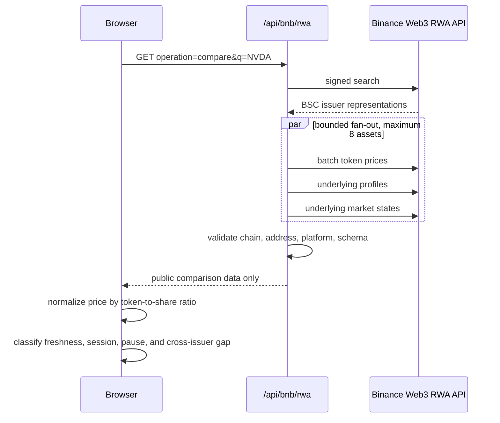

# BNB Gap Guardian architecture

**Status:** live read-only vertical slice

**Network:** BNB Smart Chain (`56`)

**Execution boundary:** no wallet, signing, approval, simulation, or broadcast

Gap Guardian compares supported BSC tokenized-stock representations without
treating different issuers as interchangeable. The first accepted ticker is
NVDA because the live Binance Web3 RWA search resolves both Ondo `NVDAon` and
bStocks `NVDAB` on chain `56`.

## Data flow



The API key and HMAC secret exist only in the server environment. The browser
receives neither signing material nor authentication headers. The public route
accepts an enumerated operation, rate-limits callers, disables caching, and
maps upstream failures to redacted errors with request IDs.

## Price model

For each representation:

```text
normalized price per share = token price / token-to-share ratio
```

For two or more issuers, the displayed gap is the symmetric difference between
the highest and lowest normalized prices:

```text
gap bps = (high - low) / ((high + low) / 2) * 10,000
```

This is an issuer-to-issuer on-chain comparison. Binance explicitly documents
its `referencePrice` as a per-share conversion derived from on-chain token
price, not an official quote from a traditional exchange. The interface repeats
that limitation and does not describe the result as an arbitrage opportunity.

## Policy order

The browser applies deterministic signals in descending severity:

1. `MARKET_PAUSED`, `MARKET_MAINTENANCE`, `ASSET_PAUSED`, `ASSET_LIMITED`, or
   `UNSUPPORTED` produces **Do not act**.
2. A token price older than 15 minutes produces **Review conditions**.
3. A non-regular, closed, or unreported underlying session produces
   **Review conditions**.
4. An issuer-normalized gap above 100 basis points produces
   **Review conditions**.
5. Otherwise the read-only signal is clear. This is not trade approval.

A closed underlying session is not mislabeled as an issuer halt: on-chain
transfers may continue, but price discovery has a different risk profile.

## Schema and identity controls

- Search terms are limited to 1-80 visible characters.
- Price requests are deduplicated and limited to 100 addresses; the comparison
  fan-out is capped at eight representations.
- Every BSC address must be a 20-byte EVM address.
- Price, profile, and market responses must repeat the searched chain, address,
  and platform. A mismatch fails the whole comparison.
- Decimal strings are parsed explicitly and timestamps must be safe integers.
- The browser independently validates the public response identity and the
  timestamp-vector length before rendering.
- No cached or invented value replaces failed live data.

## Observed production drift

On 2026-10-09, the first expanded live check found a useful documentation gap:
the bStocks NVDA market response returned `openState: true` and
`reasonCode: TRADING`, but `marketStatus: null`. It also returned null for some
market-data fields that the published schema presents as strings. The first
strict parser stopped on that response. The accepted implementation now allows
documented per-asset nullability while rendering the missing session label as
**unreported** and raising a review warning. It does not infer `regular` from
`openState`.

## Runtime surfaces

| Surface | Responsibility |
|---|---|
| `server/binanceWeb3.ts` | signing, timeouts, schema validation, identity binding, bounded aggregation |
| `api/bnb/rwa.ts` | public GET route, operation allow-list, rate limit, redacted errors |
| `src/bnb/gapGuardian.ts` | browser response validation, normalization, gap math, risk classification |
| `src/main.ts` | accessible search and comparison rendering |
| `scripts/check_bnb_rwa_api.ts` | credential-safe live acceptance evidence |

## Next boundary

The next product gate is a real, read-only exact-input BSC quote for one of the
observed representations against a supported settlement asset. Transaction
building, simulation, wallet connection, and any mainnet spend remain separate
gates and require new tests, explicit caps, decoded payload review, and owner
authorization.

## Sources

- [Binance Web3 RWA Data API](https://web3.binance.com/en/dev-docs/catalog/web3-wallet/api/rest-api/rwa-data)
- [Binance Web3 authentication](https://web3.binance.com/en/dev-docs/authentication)
- [BNB Hack: Tokenized Stocks Edition](https://www.bnbchain.org/en/hackathons/tokenized-stocks)
