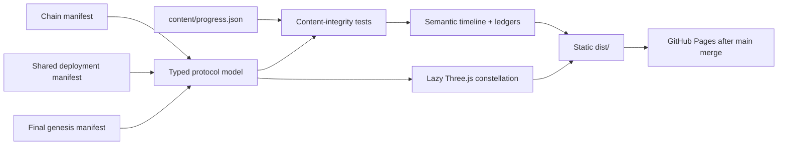

# StonkHedge build-in-public site architecture

| Field | Value |
|---|---|
| State date | 2026-09-11 |
| Runtime | Static Vite + TypeScript site |
| Interactive layer | Lazy-loaded Three.js protocol constellation |
| Editorial source | `content/progress.json` |
| On-chain source | Checked-in chain, deployment, and market manifests |
| Publishing target | Host-agnostic `dist/`; GitHub Pages workflow on `main` |

## Purpose

The site makes project progress enjoyable to explore without weakening the
repository's evidence hierarchy. It is a visual index over checked-in proof,
not a second deployment registry or a replacement for architecture and
operator records.

Every progress entry can carry:

- the target and status;
- an outcome summary and explicit remaining boundary;
- related commits;
- contract and transaction references;
- test, receipt, screenshot, or output evidence;
- media; and
- related local Markdown or manifest records.

## Data flow

Contract addresses and canonical transaction facts are imported from the
manifests at build time in `src/data/protocol.ts`. Editorial entries refer to
them by stable IDs. Tests fail if an entry points to an unknown ID, duplicates
an entry, uses a malformed on-chain identity, or links a missing repository
document.

This division lets contributors write a narrative without copying addresses
into another mutable source of truth.

## Interface layers

| Layer | Responsibility | Degraded behavior |
|---|---|---|
| Hero and metric strip | Brand, testnet status, and provenance-aware totals | Static HTML and supplied character image |
| Protocol constellation | Spatial relationships between external, shared, market, and next-phase components | Component buttons and explanatory panel remain usable without WebGL |
| Protocol Park | Layered visual route through shared deployment, market genesis, and the next gate | Three labelled milestone links remain usable with motion disabled |
| Milestone timeline | Target, outcomes, commits, evidence, media, and documents | Fully semantic articles and links |
| Contract atlas | Search/filter every deployed and external dependency address | Serverless in-browser filtering; direct explorer links |
| Transaction trail | Explain each canonical receipt and why order mattered | Serverless in-browser filtering; direct explorer links |
| Checkpoint panel | Terminal facts and the next explicit gate | Static, manifest-derived values |

Three.js is dynamically imported only when WebGL exists. That keeps the
critical evidence interface small and functional before the roughly 125 kB
compressed visualization chunk arrives.

## Accessibility and performance

- Semantic landmarks, headings, articles, buttons, labels, and dialog behavior
  support keyboard and assistive-technology navigation.
- A skip link bypasses the fixed navigation.
- Color is paired with labels; provenance is never color-only.
- `prefers-reduced-motion` stops video autoplay and collapses decorative
  animation duration.
- The renderer caps device pixel ratio and pauses expensive scene work outside
  the viewport.
- Media is local and checksum-recorded; no media request depends on a local
  download path.
- Protocol Park uses a reviewed 16-layer subset of the owner-supplied brand
  pack. Near-duplicates and layers containing visible text-extraction artefacts
  were excluded rather than inflating the shipped payload.
- The Three.js visualization is a progressive enhancement, not the only way to
  read the architecture.

## Adding a progress entry

1. Reconcile the underlying work and commit its durable evidence.
2. Update a canonical manifest if an address or transaction changed.
3. Add one entry to `content/progress.json` with truthful status and remaining
   boundary.
4. Reference contract and transaction IDs exported by
   `src/data/protocol.ts`; do not duplicate their values.
5. Add media to `public/media/` only with provenance and checksum notes.
6. Run `npm run check`, inspect desktop and mobile output, then commit the
   editorial and evidence update together.

## Publishing boundary

Pull requests build and test the site but do not publish it. A merge or direct
push to `main` triggers the Pages deployment job. Repository Pages settings
must use **GitHub Actions** as their source; the workflow does not weaken branch
protection or merge review.

The published site must retain the visible testnet and non-endorsement warning.
It must never infer “live,” “audited,” or “mainnet-ready” from a successful
build or deployment receipt.
