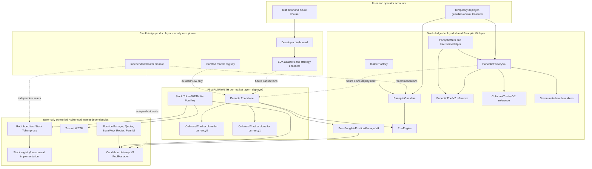
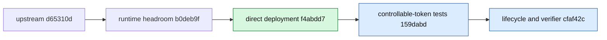
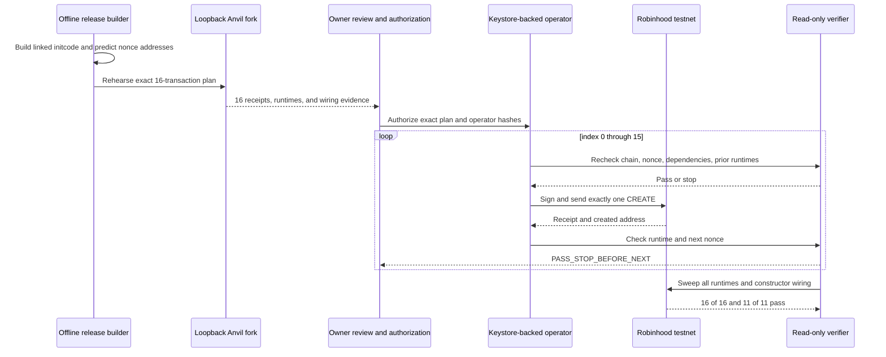
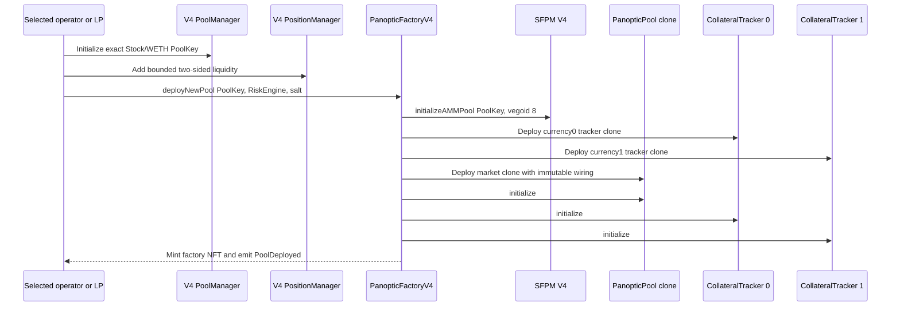

# StonkHedge Robinhood testnet system architecture

| Field | Value |
|---|---|
| State date | 2026-09-19 |
| Network | Robinhood Chain Testnet, chain ID `46630` |
| Current state | Shared Panoptic V4 infrastructure and the first PLTR/WETH per-market graph are deployed; bounded LP NFT `3903` exists; the public lifecycle is verified through index `15` (`16/29` canonical calls), including both bounded writer collateral deposits and the buyer's exact PLTR approval, and is stopped before the buyer deposit |
| Deployment source | Panoptic core commit `f4abdd7de13ea1414eb1b8f97b53ecbc448b9b8d` |
| Local issuer-failure evidence | Core commit `cfaf42c29b5c59304540e2a31e24daee4d977797` |

## 1. What exists now

StonkHedge now has a verified public-chain foundation for a valueless options
sandbox:

- Robinhood's five faucet-distributed test Stock Token proxies and their shared
  registry/beacon and implementation have been qualified;
- an existing, non-official Uniswap V4 testnet stack has been accepted for this
  bounded sandbox through exact runtime, control-state, wiring, and provenance
  checks;
- nine Panoptic logic/reference contracts and seven FactoryNFT metadata data
  slices have been deployed through an approved 16-transaction direct-CREATE
  sequence;
- every transaction, address, runtime byte length, and runtime hash has been
  reconciled with the frozen plan;
- all 11 externally observable constructor/wiring assertions pass; and
- the chain/dependency/token/deployer verifier passes with deployer nonce `16`;
- PLTR/WETH has a deterministic, unsigned, bounded genesis design; and
- its exact-head fork rehearsal passed twelve positive transitions and four
  isolated negative cases without keys, signing, or public mutation;
- the owner accepted its exact synthetic exposure for execution planning only;
  and
- a fresh nonce/deadline-bound candidate passed twelve ordered calls through
  the finalized one-step operator at canonical block `116968208`; and
- the operator now treats Uniswap's shared `nextTokenId` as a monotonic floor,
  derives the actual LP NFT ID from the canonical mint receipt, and rechecks
  that exact NFT through the remaining steps;
- public market-genesis indexes `0–3` wrapped `0.004` test ETH and established
  bounded ERC-20 plus PLTR Permit2 permissions; and
- a partial-state continuation from nonce `4` passed all nine exact-fork
  operator calls with a deliberate PLTR permission refresh and full cleanup;
- all nine continuation transactions are canonical: the exact PoolKey was
  initialized, bounded liquidity NFT `3903` was minted to the second actor,
  both permission layers were cleared, and the deterministic PanopticPool and
  two CollateralTrackers were deployed and registered; and
- fresh read-only reconciliation at block `117093052` verified the factory
  mapping, deployed code, factory-NFT ownership, full pool/tracker wiring,
  nonzero SFPM market ID, unchanged liquidity, and four zero allowances; and
- lifecycle safety tooling now binds runtime/wiring identity, Stock Token
  controls, actor balances, zero allowances, swap minimum output, and
  post-close `maxWithdraw`, while refusing the privileged deployer as buyer for
  execution preparation; and
- at block `119052230`, a dedicated unprivileged third buyer passed the full
  exact-head lifecycle and buffered withdrawal sequence on a discarded fork,
  including receipt-level interest and share-burn reconciliation; and
- the separately authorized public lifecycle now has a canonical prefix of
  indexes `0..15`: buyer funding, exact swap permissions and renewals, both
  bounded baseline swaps, exact writer deposits of `0.5 PLTR` plus
  `0.0005 WETH`, and the buyer's exact `0.25 PLTR` tracker approval. Every call
  was independently receipt/state reconciled before the next index, and no
  option leg is open.

This is now a deployed and wired Panoptic market over a functioning Uniswap V4
liquidity pool with public swap and writer-collateral evidence. “Collateral
prefix” is intentionally narrower than “validated user lifecycle”: buyer
collateral, option positions, premium/solvency observation, close, liquidation,
and withdrawal are not yet public. The currently authorized plan preserves
one-transaction execution with mandatory receipt/state review and stop on any
nonce, state, hash, or time-window mismatch.

### Milestone memory aid

```mermaid
flowchart LR
    A[Qualified external assets] --> B[Local full lifecycle proof]
    B --> C[Reviewed and simulated release]
    C --> D[16 shared contracts deployed]
    D --> E[Genesis exact-head fork rehearsal]
    E --> F[Nonce-bound operator rehearsal]
    F --> H[Four bounded setup transactions public]
    H --> I[Nine-step continuation replay]
    I --> J[Pool initialized and liquidity NFT 3903 minted]
    J --> K[Allowances zeroed and Panoptic market registered]
    K --> L[Lifecycle safety and withdrawal tooling]
    L --> M[Third-actor lifecycle and withdrawals rehearsed]
    M --> N[Public lifecycle 0..15 verified]
    N --> G[Next: buyer PLTR deposit index 16]

    classDef done fill:#d7f7df,stroke:#176b2c,color:#111;
    classDef next fill:#fff1b8,stroke:#8a6700,color:#111;
    class A,B,C,D,E,F,H,I,J,K,L,M,N done;
    class G next;
```



## 2. System boundaries

The system has five layers. Keeping them separate prevents a local test double,
third-party infrastructure, or future UI from being mistaken for issuer or
protocol authority.



Solid arrows represent deployed or protocol-defined relationships. Dotted
arrows mark the next product/market work. The UI and registry will curate what
StonkHedge presents, but the underlying Panoptic factory remains permissionless.

## 3. Repository architecture

| Repository | Current role | Important boundary |
|---|---|---|
| `vmbbz/stonkHedge` | Product control plane: plans, manifests, verification, evidence, and future app | Contains no secrets and does not silently mutate core contracts |
| `vmbbz/panoptic-v2-core` | Auditable Panoptic protocol fork and local lifecycle harness | Public deployment is tied to exact commit `f4abdd7...`; later local harness commits are not implied to be deployed |
| `vmbbz/panoptic-sdk` | Future SDK contribution lane | Standalone source build is blocked by an unpublished workspace package; the first sandbox uses exact public package `@panoptic-eng/sdk@1.0.49` with product-local adapters |

The deployed source and the later local proof form one ancestry chain:



`f4abdd7...` is the release source used to build the public deployment.
`cfaf42c...` proves additional behavior locally and is not a claim that the
test-only controllable token was deployed publicly.

## 4. External Robinhood testnet dependencies

### 4.1 Stock Token infrastructure

The five Stock Tokens are normal transferable ERC-20-shaped test assets while
the relevant token and registry policies permit an operation. They share one
registry/beacon and one implementation.

| Component | Address |
|---|---|
| Registry and beacon | `0x1dF3cA0fD30ED5eeb09eB01938f4E9c5196E6Ca5` |
| Shared Stock implementation | `0xBd14156E05c6AF28ad39aA53a2AB8eB9CDf657DA` |
| AMZN | `0x5884aD2f920c162CFBbACc88C9C51AA75eC09E02` |
| AMD | `0x71178BAc73cBeb415514eB542a8995b82669778d` |
| TSLA | `0xC9f9c86933092BbbfFF3CCb4b105A4A94bf3Bd4E` |
| PLTR | `0x1FBE1a0e43594b3455993B5dE5Fd0A7A266298d0` |
| NFLX | `0x3b8262A63d25f0477c4DDE23F83cfe22Cb768C93` |

All five were observed with 18 decimals, no global or token pause, current and
pending UI multiplier `1e18`, no scheduled multiplier activation, and positive
deployer/test-actor balances. These are time-sensitive health facts, so the
verifier must re-read them before every new public action.

Important behavior:

- raw ERC-20 balances do not automatically rebase when the UI multiplier
  changes;
- issuer pause or address blocking can stop approvals, transfers, deposits,
  withdrawals, swaps, or liquidations;
- administrative burn can reduce raw reserves held by PoolManager without
  automatically updating Panoptic's cached accounting; and
- transferability does not grant StonkHedge minting, redemption, pause, or
  compliance authority.

The controllable Stock Token under the core fork's test directory exists only
to reproduce those hazards deterministically. It is not Robinhood code and is
forbidden from chain-`46630` manifests.

### 4.2 Quote assets

| Asset | Address | Use |
|---|---|---|
| Testnet WETH | `0x33e4191705c386532ba27cBF171Db86919200B94` | Planned quote side for the first public pool |
| Faucet-style test USDC | `0xbf4479C07Dc6fdc6dAa764A0ccA06969e894275F` | Qualified test asset, but not Circle USDC and not the first-pool choice |

### 4.3 Candidate Uniswap V4 stack

Robinhood chain `46630` has no entry in Uniswap's official deployment registry.
The project therefore classifies this stack as reusable candidate
infrastructure, not an official Uniswap testnet deployment.

| Component | Address |
|---|---|
| PoolManager | `0x8366a39CC670B4001A1121B8F6A443A643e40951` |
| PositionManager | `0x58daec3116aae6D93017bAAea7749052E8a04fA7` |
| Quoter | `0x8Dc178eFB8111BB0973Dd9d722ebeFF267c98F94` |
| StateView | `0xF3334192D15450CdD385c8B70e03f9A6bD9E673b` |
| UniversalRouter | `0x8876789976dEcBfCbBbe364623C63652db8C0904` |
| Permit2 | `0x000000000022D473030F116dDEE9F6B43aC78BA3` |

The verifier pins exact runtime hashes, confirms that PositionManager points to
the expected PoolManager, checks the PoolManager owner, and requires a zero
protocol-fee controller. Any drift blocks the next phase.

### 4.4 Robinhood UniversalRouter compatibility boundary

The deployed UniversalRouter's V4 exact-input-single parameters contain the
additional `minHopPriceX36` field used by its pinned periphery revision. The
five-field tuple emitted by the published Panoptic SDK `1.0.49` reverts during
router decoding on this runtime. StonkHedge therefore keeps the SDK for PoolId
and TokenId construction but uses a small runtime-bound six-field swap adapter.
The adapter pins the router address, its exact runtime hash, V4 action bytes,
Universal Router command, and source commit. It has no RPC or execution path.

This distinction was proven operationally: the first exact-fork lifecycle
attempt reached UniversalRouter but stopped before `PoolManager.swap`; the
six-field adapter then passed all four bounded swaps in the successful
`25/25` replay. See the
[two-actor lifecycle design](../markets/2026-09-11-pltr-weth-two-actor-lifecycle-design.md).

## 5. Deployed Panoptic shared stack

### 5.1 Logic and reference contracts

| Index | Contract | Address | Runtime bytes | Purpose |
|---:|---|---|---:|---|
| 7 | `PanopticMath` | `0x45bb5b5719bB2B6cf516BE7C063B4D318890D3e7` | 3,217 | Shared option, tick, and accounting mathematics linked into other contracts |
| 8 | `InteractionHelper` | `0xDCf9936b330D6957CaD463f850D1F2B6F1eABc3A` | 7,020 | Shared token approval and interaction routines |
| 9 | `CollateralTrackerV2` | `0x41119aAd1c69dba3934D0A061d312A52B06B27DF` | 21,338 | Reference implementation cloned twice for each future market |
| 10 | `PanopticGuardian` | `0x4620fCf531A72EC24af9325dD1Fa476A59Bd7b9e` | 5,562 | Emergency lock/unlock coordination and builder/treasurer authority |
| 11 | `BuilderFactory` | `0xAa1Cc5922f41C93d09CeCbE80373B63D96cC027B` | 3,744 | Deterministic builder-wallet deployment owned by the guardian |
| 12 | `RiskEngine` | `0x3Ad134ff173dFA0a892B4116A65B76B818218585` | 22,483 | Solvency, collateral, premium, interest, liquidation, and safe-mode calculations |
| 13 | `SemiFungiblePositionManagerV4` | `0x86ef420fD3e27c3Ac896c479B19b6A840b97Bee1` | 23,608 | Registers V4 pools and represents multi-leg liquidity positions as ERC-1155 IDs |
| 14 | `PanopticPoolV2` | `0xfBA5b34cb1471605d82BBF395F244Fa41148b155` | 24,275 | Reference implementation for per-market PanopticPool clones |
| 15 | `PanopticFactoryV4` | `0x96C3291C9b0C34b007893326ee9dcA534BfcFa0c` | 20,702 | Registers initialized V4 PoolKeys and deploys each market's pool/tracker clones |

`PanopticPoolV2` has 301 bytes of raw EIP-170 headroom. The release gate
requires at least 256 bytes, leaving 45 bytes above the project margin. This was
the release-blocking issue fixed before deployment.

### 5.2 Metadata data slices

FactoryNFT metadata is too large to embed conveniently in the factory. The
release compiler packages it into seven immutable data contracts and passes
pointers to the factory constructor.

| Index | Address | Runtime bytes |
|---:|---|---:|
| 0 | `0x05449292522e3FCCD58dB4f947A94BD083d5e13d` | 24,439 |
| 1 | `0xb1820CEE1BE8b9eDdC382eE83304efBe5ceD0019` | 20,669 |
| 2 | `0xa318218fEA30EA64c223A1c8E96551c68B007656` | 20,141 |
| 3 | `0xbAD75CD571AeE30644aBe85Da20B6Fa527106c5d` | 17,266 |
| 4 | `0x1F6f1daab8b0d9605D7A880bD738aEe6Fd764107` | 23,768 |
| 5 | `0xB1D560De10Fb3733d7A5dFefED0388A2435fdaBA` | 24,482 |
| 6 | `0x19E58B3113579A02c2C266e1be0049766F333338` | 5,602 |

The exact runtime hashes for all 16 deployments live in the
[public deployment manifest](../../manifests/deployments/robinhood-testnet-direct-public-progress-2026-09-09.json).

## 6. Constructor wiring and authority

The final public reconciliation proved:

| Assertion | Live value |
|---|---|
| Guardian admin | temporary testnet deployer |
| Guardian treasurer | temporary testnet deployer |
| BuilderFactory owner | `PanopticGuardian` |
| RiskEngine guardian | `PanopticGuardian` |
| RiskEngine builder factory | `BuilderFactory` |
| RiskEngine cross buffers | `10,000,000` and `10,000,000` |
| RiskEngine vegoid | `8` |
| PanopticPool reference SFPM | deployed V4 SFPM |
| Factory NFT name | `Panoptic V2 Factory Deployer NFTs` |
| Factory NFT symbol | `PANOPTIC-NFT` |

The temporary deployer is
`0xCa60c8eF6934f8a97c6a503C4e3a46e87F5b08bD`. It deployed the shared
stack and currently holds both immutable guardian-admin and treasurer roles.
That concentration is explicitly accepted only for the valueless sandbox. A
mainnet or production-like system needs separate reviewed Safe/timelock roles
and a migration/unwind design.

The second actor is
`0x04D5A0f57Cb2e110faC9703024888cd4562B6d6f`. It is a separate test user
and future liquidity-provider account, not the deployer, protocol administrator,
issuer, or independent reviewer.

## 7. Why deployment used direct CREATE

Panoptic's preferred release process uses the singleton CREATE3 deployer at
`0x000000000000b361194cfe6312EE3210d53C15AA`. That contract was absent on
Robinhood testnet. The upstream salts are also tied to Panoptic's Safe, so a
copied upstream batch would not authorize this project.

The bounded testnet fallback was ordinary EOA CREATE:

- exact addresses were calculated from the deployer address and nonces `0–15`;
- configuration and the transaction plan were generated offline;
- the exact sender and plan were rehearsed on an Anvil fork;
- the deployer remained frozen while the nonce-bound plan was active;
- a hash-bound operator signed at most one transaction per invocation;
- every receipt, created address, runtime, and next nonce was checked before
  stopping; and
- a full 16-contract runtime and 11-assertion wiring sweep closed the sequence.



This changes deployment mechanics, not the deployed Panoptic contract logic.
Direct CREATE is acceptable for the testnet release only because the sequence
was small, valueless, deterministic, and stopped on every mismatch.

## 8. Why the first pool has no custom hook

In Uniswap V4, `hooks` is part of the PoolKey. A hook cannot be attached to an
existing pool later; a different hook address means a different pool ID.
Panoptic's V4 architecture does not require the SFPM to be the Uniswap hook.
The first local lifecycle therefore used:

- a normal PoolKey;
- `hooks = address(0)`;
- fee `3,000`; and
- tick spacing `60`.

The public market must independently freeze its own complete PoolKey. The local
`3,000/60` and 1:1 initialization are tested defaults, not automatic public
price or liquidity decisions. A custom hook remains a later product with its
own requirements, mined hook address, pool, liquidity, tests, and threat model.

## 9. How a per-market graph is created

After a selected Stock Token/WETH PoolKey is initialized in PoolManager,
`PanopticFactoryV4.deployNewPool` performs this sequence. The first public
PLTR/WETH instance completed it in transaction `0x9081…b05e`:

1. verify a nonzero RiskEngine and a nonzero initialized-pool price;
2. register the PoolKey in `SemiFungiblePositionManagerV4` using vegoid `8`;
3. derive a salt containing parts of the caller, V4 pool ID, RiskEngine, and
   caller-supplied salt;
4. clone one CollateralTracker for each PoolKey currency with immutable market
   references;
5. clone the PanopticPool reference with both trackers, RiskEngine,
   PoolManager, pool ID, and PoolKey;
6. initialize the pool and both trackers;
7. store the PoolKey/RiskEngine-to-PanopticPool mapping;
8. mint the factory NFT to the caller; and
9. emit `PoolDeployed` with the market and both tracker addresses.



Every market-creation arrow above is now canonical for PLTR/WETH. The resulting
PanopticPool is `0x042c…e586`, its PLTR and WETH trackers are `0x2146…15de`
and `0x48d0…9867`, and its SFPM market ID is `16897827167146926`. The
[final manifest](../../manifests/markets/robinhood-testnet-pltr-weth-public-genesis-2026-09-11.json)
contains the full addresses, runtime hashes, event, mapping, ownership, and
wiring evidence.

## 10. Local behavior already proven

The controllable local lane goes further than the current public genesis. It
has already proven the intended mechanics that remain gated publicly:

- no-hook V4 pool initialization, full-range liquidity, and both swap
  directions;
- factory market deployment and immutable wiring;
- ERC-4626 collateral deposits;
- single-actor short open, premium accrual, close, and withdrawal;
- separate writer/buyer matched positions, premium accrual, and clean close;
- multiplier display changes without raw-balance rebasing;
- pause, blocklist, transfer-failure, and recovery behavior;
- paused liquidation failure and recovery; and
- explicit reserve/accounting divergence after issuer administrative burn.

Post-close acceptance uses a strict `2e12` raw-unit local-test residual budget,
not literal zero. The clean replay observed only `0/1` AMM dust, zero credited
asset residual, and `531/32` PoolManager-claim deviations.

## 11. Evidence chain

| Evidence | Result |
|---|---|
| Focused inherited V4 tests | 234 executed passes, zero failures; one additional inherited source skip remains visible |
| Multicall regression | four focused and three inherited range tests pass |
| Controllable Stock Token | 16 passes, including 30 fuzz runs |
| Local Stock/Panoptic lifecycle | 14 passes |
| Clean local replay | 33 submitted transactions and 33 successful receipts |
| Direct-deployment operator | 12 unit tests pass |
| Frozen public plan | SHA-256 `8b138a56a2b284a61994b1ec60206b246a3a8e17cc56f0ec38b95590e3ed0820` |
| Frozen fork simulation | SHA-256 `8964382c7049999de814d286f229cf55f2a1d087b1b34b8443f82a11354b9910` |
| Public CREATE sequence | 16 successful canonical transactions |
| Runtime reconciliation | 16 of 16 exact byte lengths and hashes |
| Source-verification inventory | 19 of 19 direct deployments and market clones match their recorded runtime identities; nine Solidity implementations remain pending on Blockscout |
| Constructor/wiring reconciliation | 11 of 11 pass |
| Strict public verifier after deployment | pass; deployer nonce `16` |
| PLTR/WETH fresh strict preflight | `79/79` shared and `17/17` exact-plan checks at block `116510322` |
| PLTR/WETH exact-head genesis rehearsal | `12/12` positive transitions and `4/4` expected reverts |
| PLTR/WETH execution candidate | Nonces `0..11`, shared NFT counter floor `3893`, synthetic exposure, and deadlines bound at block `116968208` |
| Market one-step operator rehearsal | `12/12` ordered invocations pass; all step, lineage, state, plan, operator, and report evidence is validated; zero public sends |
| PLTR/WETH public setup | Four canonical transactions through original index `3`; actor nonce `4`; pool and market still empty |
| Partial-state continuation | Indexes `0–3` canonical; exact PoolKey initialized; liquidity `138450781996976174`; receipt-derived NFT `3903`; nonce `8` |

Primary local records:

- [public deployment and reconciliation](../deployment/2026-09-09-direct-deployment-public-progress.md);
- [contract source-verification runbook and 19-address classification](../deployment/2026-09-19-contract-source-verification.md);
- [machine-readable public manifest](../../manifests/deployments/robinhood-testnet-direct-public-progress-2026-09-09.json);
- [machine-readable contract-verification inventory](../../manifests/deployments/robinhood-testnet-contract-verification-inventory-2026-09-19.json);
- [owner-regenerated simulation](../deployment/2026-09-09-owner-regenerated-direct-deployment-simulation.md);
- [authorization boundary](../deployment/2026-09-09-direct-deployment-authorization.md);
- [chain and external dependency qualification](../chain/2026-09-08-robinhood-testnet-qualification.md);
- [core/candidate review](../review/2026-09-08-core-f4abdd7-and-v4-candidate.md);
- [owner clean-room reproduction](../review/2026-09-09-owner-clean-room-reproduction.md); and
- [local issuer-failure lifecycle](../testing/2026-09-08-controllable-stock-token-harness.md);
- [PLTR/WETH offline genesis design](../markets/2026-09-09-pltr-weth-offline-genesis-design.md); and
- [PLTR/WETH exact-head fork rehearsal](../markets/2026-09-10-pltr-weth-fork-rehearsal.md); and
- [PLTR/WETH execution candidate and one-step operator](../markets/2026-09-10-pltr-weth-execution-candidate-and-operator.md).
- [PLTR/WETH partial public genesis and continuation](../markets/2026-09-10-pltr-weth-public-continuation.md).
- [final PLTR/WETH public-genesis manifest](../../manifests/markets/robinhood-testnet-pltr-weth-public-genesis-2026-09-11.json).
- [lifecycle safety and withdrawal boundary](../markets/2026-09-12-lifecycle-safety-and-withdrawal-boundary.md).

Re-run the current external health verifier from the product repository:

```powershell
pwsh -NoProfile -File .\scripts\verify-robinhood-testnet.ps1
```

It is read-only. It proves current identity and health, not legal eligibility,
an independent audit, or transaction authorization.

## 12. Current trust and risk register

| Boundary | Current acceptance | Consequence |
|---|---|---|
| Robinhood Stock Token issuer controls | External and unavoidable | Pause, block, upgrade, multiplier, or burn can affect market liveness/accounting |
| Candidate V4 infrastructure | Exact code and wiring accepted for valueless testnet; not official | Drift or owner action can block the sandbox and must fail closed |
| Temporary deployer EOA | Holds deployer, guardian-admin, and treasurer roles | Single-key compromise controls emergency and treasury functions; forbidden for production |
| Panoptic fork | Focused tests and owner reproduction, not an external audit | Unknown inherited/composition defects remain possible |
| License | Base BUSL non-production use only | Production-like or monetized use remains blocked |
| Price/reference policy | Pool initialized at synthetic `0.001` test-WETH-per-PLTR solely for mechanism testing | Never display it as a market quote or external reference price |
| Liquidity | Only faucet-sized balances exist | This is mechanism testing, not economically meaningful depth |
| UI/SDK | Build-in-public dashboard and a minimal runtime-bound swap encoder exist; end-user trading UI does not | No first-user transaction path exists yet |

## 13. What is next

**Public market genesis is complete.** The actor consumed the separately
authorized nonce-`4..12` continuation one transaction at a time. It ended at
nonce `13` with the PoolKey initialized, liquidity NFT `3903` intact, all
allowances zero, and PanopticPool `0x042c…e586` registered with two wired
CollateralTrackers and SFPM market ID `16897827167146926`. That authorization
is closed and permits no further transaction. See the [canonical continuation
record](../markets/2026-09-10-pltr-weth-public-continuation.md), [final
machine-readable manifest](../../manifests/markets/robinhood-testnet-pltr-weth-public-genesis-2026-09-11.json),
and [market-genesis roadmap](../roadmap/2026-09-09-market-genesis.md).

For a complete address-by-address and transaction-by-transaction explanation,
including why direct-CREATE and market-genesis ordering mattered, use the
[public-genesis milestone ledger](../progress/2026-09-11-public-genesis-milestone.md).

The **two-actor public lifecycle execution** now has `16/29` canonical calls.
Indexes `0..7` funded the buyer, installed and renewed the writer's exact swap
permissions, and completed the first bounded PLTR-to-WETH baseline swap. The
next reverse swap then failed closed before signing because its deadline
margin expired; no transaction was lost or partially submitted.

The recovery architecture treats mined calls as an immutable prefix rather
than pretending an expired plan is still fresh. The second read-only qualifier
binds all eight predecessor receipts and state; the offline transformer
preserves indexes `0..7`, derives renewals from only the unexecuted swap inputs,
refreshes future deadlines, and recomputes both nonce streams. Its separately
authorized continuation has now completed indexes `8..15`: exact remaining
Permit2 renewals, the bounded WETH-to-PLTR reverse swap, and the writer's PLTR
and WETH tracker approvals/deposits, followed by the buyer's exact `0.25 PLTR`
approval to tracker0. Writer nonce is `27`, buyer nonce is `2`, and both actors
have zero open option legs.

The next boundary remains narrow:

1. preflight and execute at most index `16`, the buyer's exact PLTR tracker
   deposit, then reconcile and stop;
2. continue the authorized sequence only while every nonce, state, hash, and
   time-window condition matches;
3. do not claim the options lifecycle complete until matched open, premium
   movement, buyer-first close, writer close, and permission cleanup reconcile;
4. derive withdrawals only from the eventual public post-close state under a
   distinct plan and authorization; and
5. keep the build-in-public dashboard derived from the canonical lifecycle
   manifests so the public status cannot silently remain at an older fork-only
   milestone.

See the [receipt-bound continuation ledger](../progress/2026-09-19-lifecycle-receipt-bound-continuation.md),
[public-prefix and refresh ledger](../progress/2026-09-16-lifecycle-prefix-and-refresh.md),
[three-account lifecycle rehearsal ledger](../progress/2026-09-14-three-account-lifecycle-rehearsal.md),
and [execution-preparation ledger](../progress/2026-09-15-lifecycle-execution-preparation.md).

## 14. External references

- Robinhood network connection: <https://docs.robinhood.com/chain/connecting/>
- Robinhood deployment and Blockscout verification: <https://docs.robinhood.com/chain/deploy-smart-contracts>
- Robinhood Stock Tokens: <https://docs.robinhood.com/chain/stock-tokens/>
- Building with Stock Tokens: <https://docs.robinhood.com/chain/building-with-stock-tokens/>
- Robinhood testnet faucet: <https://faucet.testnet.chain.robinhood.com/>
- Uniswap deployment registry: <https://github.com/Uniswap/contracts/tree/main/deployments>
- Panoptic V2 core: <https://github.com/panoptic-labs/panoptic-v2-core>
