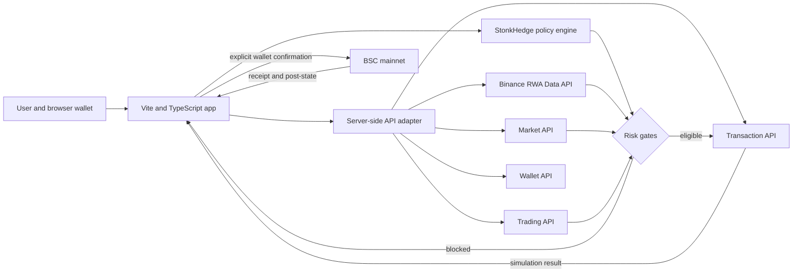

# BNB Hack: Tokenized Stocks Edition entry plan

**Decision:** GO, with a deliberately narrow spot-only product.

**Working name:** StonkHedge Gap Guardian

**Branch:** `hackathon/bnb-tokenized-stocks-2026`

**Branch point:** `8d741f7` on `feat/two-actor-lifecycle-planning`

**Planning snapshot:** 2026-10-09 08:30 UTC

**Submission lock:** 2026-10-11 12:00 UTC / 14:00 SAST

At the planning snapshot, approximately 51.5 hours remained. The official
[hackathon page](https://www.bnbchain.org/en/hackathons/tokenized-stocks) marks
the event as ongoing and requires the repository, demo, and deployed link to
remain accessible through judging.

## Current implementation status

The live simulation-only lane now completes steps 1 through 7 of the product
thesis. It resolves and compares Ondo `NVDAon` and bStocks `NVDAB`, requests a
strictly bounded `5.10 USDT` exact-input route, compiles an exact approval and
swap on the server, and submits both unsigned payloads to the Binance
Transaction API simulator. The server and browser bind chain, settlement token,
destination contract, raw amount, sender, vendor, best route, approval target,
zero native value, expected/minimum output, and the `0.5%` slippage cap.

Both issuer paths passed live negative acceptance on 2026-10-09: their exact
approval simulations succeeded and their swap simulations failed for
insufficient USDT balance at the unfunded public buyer. Both final verdicts
were `BLOCKED`. The site receives a non-executable proof card containing
selectors, SHA-256 calldata fingerprints, statuses, counts, and reasons; raw
quote IDs and calldata remain server-side.

Steps 8 and 9 remain unimplemented and unauthorized. There is no wallet
connection, approval submission, transaction signing, mainnet spend, receipt,
or post-trade proof yet. Live simulation success is evidence for a separately
reviewed wallet-confirmation milestone, not execution readiness.

## 1. Why StonkHedge fits

The event asks for a working tokenized-stock product on BNB Smart Chain. At
least one of bStocks, Ondo, or xStocks must be central; cross-asset products are
allowed; perpetuals are excluded; and the public demonstration must use BSC
mainnet with a small live amount.

StonkHedge already has three useful assets:

1. a branded, responsive Vite/TypeScript/Three.js product surface;
2. an evidence-led transaction lifecycle with explicit simulation, approval,
   signing, receipt, and post-state boundaries; and
3. detailed experience with issuer-controlled tokenized equities and the risks
   created when on-chain trading continues outside the underlying market's
   hours.

The Robinhood/Panoptic contracts are **not** portable hackathon deliverables.
They remain chain-specific, testnet-only, and subject to separate licensing and
deployment controls. For this entry we reuse the product language, safety
patterns, visual system, and evidence discipline—not Robinhood addresses,
Panoptic contracts, synthetic test prices, or prior transaction authority.

## 2. Product thesis

**StonkHedge Gap Guardian helps a user understand and safely act on the gap
between a 24/7 BSC tokenized stock and its underlying reference market.**

The initial flow is intentionally small:

1. search a ticker or company;
2. resolve its BSC token representations and issuer/platform;
3. show the on-chain price, reference price, spread, update ages,
   token-to-share ratio, market status, next open time, and any pause or
   corporate-action reason;
4. classify the proposed action as normal-hours, outside-hours, stale-data,
   paused-asset, or excessive-gap risk;
5. request a bounded spot quote for a user-entered amount;
6. display route, expected output, price impact, gas, approval requirements,
   and an explicit risk summary;
7. simulate the exact transaction;
8. permit a small BSC-mainnet wallet confirmation only after all gates pass;
9. record the quote, simulation result, transaction hash, and post-state in a
   user-visible proof card.

The product does not promise arbitrage profit, infer an official TradFi quote,
or treat tokenized shares from different issuers as equivalent. It gives the
user a compact answer to: **what am I buying, is the underlying market open,
how far has the token moved from its reference, and what will this exact
transaction do?**

## 3. Hackathon compliance boundary

| Requirement | StonkHedge implementation |
|---|---|
| Tokenized stock is central | Live BSC discovery and monitoring of at least one bStock, Ondo, or xStock; final asset selected from current API and quote results |
| Spot only | Quote, simulate, and optionally execute a bounded tokenized-stock/USDT spot swap; no option, perp, margin, or synthetic derivative |
| BSC mainnet | Chain ID `56`; read-only and simulation paths first; one deliberately small live proof only after manual approval |
| Binance Web3 API | RWA Data is mandatory; Trading and Transaction APIs form the execution path; Wallet API is used for portfolio/post-state if time permits |
| Working project | Public repository branch, deployed application, judge instructions, and a reproducible demo path |
| Developer Experience Report | Timestamped observations captured while integrating, then edited by the actual builders; never fabricated after the fact |

The event excludes people located in, resident in, or citizens of the United
States, Canada, the Netherlands, Iran, Cuba, North Korea, Crimea, Donetsk
People's Republic, Luhansk People's Republic, the United Kingdom, and Japan,
and anyone subject to sanctions. The project owner must personally confirm the
eligibility declaration during registration. South Africa is not in the
published exclusion list, but location alone is not the full declaration.

## 4. Architecture

### 4.1 Browser application

The existing Vite application supplies the brand, responsive layout, timeline,
accessible semantic fallback, and Three.js visual layer. The hackathon product
gets a dedicated route or mode; Robinhood progress records stay available but
must not be confused with BSC state.

### 4.2 Server-side Binance adapter

Binance Web3 endpoints require an API key and an HMAC secret. The secret must
never enter the browser bundle, Git history, screenshots, demo video, or public
logs. A minimal server-side adapter will:

- accept only the product's enumerated operations and validated parameters;
- build the exact raw query string once;
- sign `timestamp + method + requestPath + body` with HMAC-SHA256;
- include the required `/build` prefix in the signed path and request URL;
- use a unique nonce, a narrow receive window, timeouts, and structured error
  mapping;
- rate-limit requests and avoid logging authentication headers; and
- return only the fields the browser needs.

Local credentials belong in an ignored environment file. Hosting credentials
belong in the provider's encrypted environment settings.

### 4.3 Risk policy engine

The policy engine is deterministic and testable. A first release should block
or warn on:

- unsupported chain or token contract;
- platform/issuer mismatch;
- paused or unsupported asset status;
- stale on-chain or reference timestamps;
- missing reference price or invalid token-to-share ratio;
- configurable spread beyond the user's accepted threshold;
- quote expiry, route/asset drift, slippage beyond the cap, or changed wallet;
- failed transaction simulation;
- a transaction that differs from the simulated `chainId`, `from`, `to`,
  `value`, or calldata; and
- any requested notional above the demo cap.

Warnings must distinguish `closed` or `overnight` underlying-market status from
an issuer or asset pause. Closed does not automatically mean untradeable
on-chain; it means the user is accepting a different price-discovery regime.

### 4.4 Wallet and execution

The default product mode is read-only. Execution requires:

1. chain `56` selected in the wallet;
2. the same connected address used for quote, simulation, and send;
3. exact or tightly bounded approval, never an unlimited approval for the demo;
4. fresh quote and simulation immediately before signing;
5. a decoded confirmation panel; and
6. receipt plus post-trade balance reconciliation.

No private key is accepted by the app or stored in the repository. Browser
wallet confirmation is the only public-signing path planned for the entry.

## 5. API integration order

1. **RWA platforms and token search** — establish which supported issuer and
   BSC contract represent the requested ticker.
2. **RWA token price and underlying profile/market data** — render price,
   reference, attestation/profile facts, market state, next open, and timestamp
   freshness.
3. **Trading quote** — obtain a real route and price-impact/slippage evidence
   for an exact, capped input.
4. **Approval/build swap** — prepare only the transactions actually required by
   the selected route.
5. **Transaction simulation** — fail closed before wallet confirmation.
6. **Wallet/post-state** — reconcile balances and construct the proof card.
7. **Agentic Wallet or Wallet Skill** — integrate only after the deterministic
   user flow is reliable. It is valuable for the special prize, but it must not
   replace transparent safety gates.

The official documentation currently identifies `/build` as part of both the
request URL and signed request path. The integration tests must include the
documented invalid-signature, expired/replayed timestamp, permission, and rate
limit cases.

## 6. What we reuse and what we build

| Reuse | New work |
|---|---|
| StonkHedge name, visual system, mascot, responsive shell | BNB-specific route, navigation, disclosures, and deployment configuration |
| Three.js architecture/timeline capabilities | Live gap visualization and state badges |
| TypeScript strictness and Vitest setup | Server-side HMAC client with fixtures and redacted logs |
| Evidence-first lifecycle vocabulary | Quote/simulation/receipt proof-card schema |
| Stop-on-mismatch transaction philosophy | Browser-wallet BSC execution gate |
| Existing public docs and contributor guidance | Hackathon README, judge quickstart, DX report, demo script, submission checklist |

The Robinhood lifecycle remains in progress on its original branch. Work on
this branch must not rewrite its canonical manifests or imply that its
testnet authorizations apply to BSC.

## 7. Hour-by-hour delivery plan

The schedule is measured from the planning snapshot and deliberately reserves
submission time.

| Hours | Gate and output |
|---:|---|
| 0-1 | Owner submits hacker registration, creates a Binance Web3 developer project, and joins the builder support channel. Freeze the product thesis. |
| 1-4 | Implement and unit-test server-side signing, redaction, timeout, error mapping, and a first authenticated RWA platform/search request. Start the factual DX log. |
| 4-9 | Build ticker search, issuer/platform cards, reference/on-chain price gap, market-status states, freshness policy, and accessible loading/error UI. |
| 9-15 | Add exact-input quote path, bounded amount/slippage controls, decoded route summary, and stale-quote invalidation. |
| 15-21 | Add approval/swap transaction building and Transaction API simulation. Test changed-wallet, changed-chain, expired-quote, API error, and simulation-revert paths. |
| 21-27 | Add browser wallet connection and a disabled-by-default execution gate. Select the final demonstrable asset from live BSC liquidity rather than hard-coding a marketing favorite. |
| 27-32 | Rehearse with read-only calls and simulations; then make one owner-approved, minimal BSC-mainnet spot proof if all controls pass. Reconcile receipt and balances. |
| 32-37 | Polish the gap visualization, proof card, mobile layout, disclosures, and judge-friendly guided demo. Use Three.js only where it improves comprehension. |
| 37-41 | Complete focused tests, production build, secret scan, broken-link check, clean-clone setup, and deployed-link smoke test. |
| 41-45 | Record a concise demo of discovery, risk interpretation, quote, simulation, and the bounded proof. Keep it under four minutes. |
| 45-49 | Write the honest Developer Experience Report from the timestamped integration log, including exact docs pages, errors, latency, and redesign suggestions. |
| 49-51 | Freeze code, tag the submission commit, verify public repo/deployment/video access, complete the form, and retain a final buffer before 12:00 UTC. |

If the API key is delayed, the team should still implement the signed client,
fixtures, deterministic policy engine, and judge-visible degraded state, but a
mock-only product is not considered submission-ready. A successful live API
call and deployed judge flow are hard gates.

## 8. Testing and acceptance

### Automated

- signing vectors preserve raw encoding, query order, body bytes, and `/build`;
- secrets and authentication headers are never returned or logged;
- API schemas reject malformed/partial responses;
- spread and freshness calculations use explicit decimal handling;
- market-state policy differentiates closed, paused, restricted, and stale;
- quote identity binds chain, token addresses, amounts, route, and expiry;
- simulation failure blocks wallet send;
- UI has loading, empty, throttled, auth-failure, and stale-data states;
- existing Robinhood content and lifecycle tests continue to pass.

### Live acceptance

- authenticated RWA query returns a supported BSC token representation;
- the deployed app renders current values and source timestamps;
- a real quote can be refreshed and invalidated;
- the exact swap payload passes the Transaction API simulation;
- an owner-authorized minimal swap, if legally and technically available,
  receives a BSC mainnet receipt and reconciles balances; and
- a clean browser session can follow the judge quickstart without local secrets.

## 9. Submission package

- public repository and immutable submission commit;
- deployed URL that remains available through judging;
- `README` with a 60-second judge path, architecture, local setup, environment
  variable names, limitations, and exact API modules used;
- demo video no longer than four minutes;
- Developer Experience Report based on the actual build log;
- BSC transaction/explorer link if a safe live proof is completed;
- test output and source-attribution links; and
- plain disclosures: spot only, not investment advice, issuer/transfer
  restrictions may apply, and reference price is not represented as an
  official exchange quote.

## 10. Immediate owner actions

These cannot be completed safely by repository automation:

1. use the official **Apply as Hacker** link and personally accept the
   eligibility terms;
2. create a Binance Web3 developer project and obtain an API key and secret;
3. store the credentials locally and in the hosting provider only—never paste
   the secret into chat or commit it;
4. confirm access to a browser wallet suitable for BSC mainnet and choose a
   deliberately small maximum demo budget; and
5. keep the official submission form open well before the deadline.

## 11. Decision gates

| Gate | Pass condition | Failure response |
|---|---|---|
| Eligibility | Owner can truthfully accept jurisdiction/sanctions terms | Do not enter or use the restricted developer product |
| API access | Real authenticated RWA request succeeds | Escalate in builder channel; continue local fixtures but do not claim working integration |
| Asset selection | Supported BSC representation has usable quote/liquidity and clear status | Select another supported asset/platform; do not fabricate liquidity |
| Transaction safety | Fresh quote, bounded approval, exact simulation, decoded payload | Remain read-only; demo simulation and explain the block |
| Submission readiness | Public repo, deployment, judge path, DX report, and video are accessible | Cut optional agent/animation scope before cutting the core flow |

## 12. Source set

- [Official hackathon page, rules, dates, judging, and resources](https://www.bnbchain.org/en/hackathons/tokenized-stocks)
- [Binance Web3 API overview](https://web3.binance.com/en/dev-docs/introduction)
- [Authentication and request signing](https://web3.binance.com/en/dev-docs/authentication)
- [RWA Data API](https://web3.binance.com/en/dev-docs/catalog/web3-wallet/api/rest-api/rwa-data)
- [Agentic Wallet tokenized-securities flow](https://developers.binance.com/en/docs/products/agentic-wallet/use-cases/trading/stock-trading)
- [Binance Wallet Skills overview](https://developers.binance.com/en/docs/products/wallet-skills/overview)
