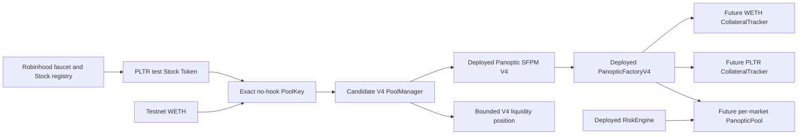

# First Robinhood testnet market selection

| Field | Value |
|---|---|
| Status | Read-only qualification passed; owner acceptance required |
| Snapshot | Block `116408992`, `2026-09-09T19:13:50Z` |
| Technical recommendation | PLTR/WETH, fee `3000`, tick spacing `60`, no hook |
| Candidate PoolId | `0xd600fd2ff936078114b72a01d3c6d31d449b7af12c24c82fb61efb7bf9c613ae` |
| Checks | `79` passed, `0` failed |
| Transactions authorized | None |

## 1. Outcome

All five Robinhood faucet Stock Tokens passed the same pinned-block eligibility
gate. Each token had the expected proxy runtime and registry wiring, was not
paused, had no scheduled multiplier change, was held by both test accounts,
and produced an uninitialized no-hook V4 PoolId with no existing Panoptic
factory mapping.

PLTR is the recommended first sandbox asset because its contract address is the
only qualified Stock Token address lower than the testnet WETH address. Uniswap
V4 requires currencies in ascending address order, so this gives the intuitive
orientation:

```text
currency0 = PLTR Stock Token
currency1 = WETH
```

This is an implementation-safety preference, not an investment opinion. It
reduces accidental inversion in price math, SDK adapters, charts, copy, and
collateral reporting. Ticker popularity, market capitalization, and real-world
investment merit were not considered.

The recommendation is not an owner decision and not transaction authorization.
The exact selection, initial price policy, exposure limits, and account roles
remain open.

## 2. Where this fits in the architecture

Market genesis connects the already deployed shared Panoptic stack to one
specific V4 liquidity venue. It creates no new Stock Token and changes no
issuer controls.



The boxes labelled “future” do not exist yet. The PoolManager, SFPM, factory,
and RiskEngine boxes are live and identity-checked. The PoolKey is derived but
uninitialized.

## 3. The exact PoolKey rule

A V4 pool is identified by five fields, not by a ticker pair:

```text
PoolKey = (
  currency0,
  currency1,
  fee,
  tickSpacing,
  hooks
)

PoolId = keccak256(abi.encode(PoolKey))
```

Changing token order, fee, tick spacing, or hook address changes the PoolId.
There is no later “attach a hook” operation: a hook change means a different
pool. The first sandbox therefore retains the core-tested candidate of fee
`3000`, tick spacing `60`, and `hooks = address(0)` until the owner explicitly
accepts that complete key.

The derived PLTR key is:

| Field | Value |
|---|---|
| `currency0` | PLTR `0x1FBE1a0e43594b3455993B5dE5Fd0A7A266298d0` |
| `currency1` | WETH `0x33e4191705c386532ba27cBF171Db86919200B94` |
| `fee` | `3000` = 0.30% |
| `tickSpacing` | `60` |
| `hooks` | `0x0000000000000000000000000000000000000000` |
| `PoolId` | `0xd600fd2ff936078114b72a01d3c6d31d449b7af12c24c82fb61efb7bf9c613ae` |

## 4. Candidate comparison

Every row uses the same fee, tick spacing, no-hook policy, and WETH address.
`slot0.sqrtPriceX96 == 0` is the observed uninitialized state.

| Stock Token | Stock is `currency0` | PoolId | V4 initialized | Panoptic market | Eligible |
|---|---:|---|---:|---|---:|
| AMZN | no | `0xe9f5eb0c...c50887b8` | no | none | yes |
| AMD | no | `0x5164b26e...ad32fe8a` | no | none | yes |
| TSLA | no | `0x199971df...88cbfa8e` | no | none | yes |
| PLTR | yes | `0xd600fd2f...f9c613ae` | no | none | yes |
| NFLX | no | `0x0d5f0b76...7988095f` | no | none | yes |

The complete addresses, PoolKeys, PoolIds, state, and blockers are in the
[market-selection manifest](../../manifests/markets/robinhood-testnet-market-selection-2026-09-09.json).

## 5. What the qualifier proves

The read-only qualifier pins the head block before reading state and fails if a
response cannot be decoded. Its `79` passing assertions cover:

- chain ID `46630` and a canonical snapshot block hash;
- six candidate V4 infrastructure runtime identities;
- PoolManager owner and fee controller plus PositionManager-to-PoolManager
  wiring;
- Stock registry, Stock implementation, and WETH runtime identities;
- WETH symbol and decimals;
- all 16 deployed Panoptic runtime identities;
- registry pause and beacon implementation state;
- both account types, gas balances, and Stock-registry block state;
- all five token proxy identities, symbol/name/decimals, registry wiring, pause
  state, multiplier state, and both Stock Token balances;
- all five derived PoolIds remaining uninitialized; and
- all five exact PoolKey/RiskEngine factory mappings remaining empty.

The RPC interface permits only:

```text
eth_chainId
eth_blockNumber
eth_getBlockByNumber
eth_getCode
eth_call
eth_getBalance
eth_getTransactionCount
```

Any attempt to use `eth_sendTransaction`, `eth_sendRawTransaction`, signing, or
wallet RPC methods is rejected before network access. The tool has no keystore
or private-key parameters.

## 6. Account and exposure boundary

At the recorded block:

| Account | Native balance | WETH | Each Stock Token | Intended boundary |
|---|---:|---:|---:|---|
| Deployer `0xCa60...08bD` | `0.00928600103 ETH` | `0` | `5` | Shared-stack admin; not the default LP |
| Second actor `0x04D5...6d6f` | `0.01 ETH` | `0` | `5` | Default test user and LP candidate |

No account can provide Stock/WETH liquidity in the observed state because both
hold zero WETH. Wrapping ETH is itself a transaction and is not authorized.
The plan must also reserve enough native ETH for gas rather than treating the
whole faucet balance as liquidity.

Using the second actor as the LP and eventual market-NFT recipient keeps the
temporary guardian/treasurer deployer separate from ordinary market activity.
That is the preferred role split, but it still needs to be encoded in the
reviewed plan.

## 7. What remains deliberately undecided

### 7.1 Asset and complete key

The owner must accept one exact Stock Token and the full PoolKey. “PLTR/WETH”
alone is incomplete because fee, tick spacing, and hook address determine a
different pool identity.

### 7.2 Initial price

The local lifecycle used `sqrtPriceX96 = 2^96`, which means a raw-unit 1:1
ratio. It must not be copied silently to public testnet. The approved policy
must say whether the price is synthetic or reference-derived and must record:

- which human-readable direction is displayed;
- decimal normalization;
- price in both directions;
- target tick and tick-spacing rounding;
- exact `sqrtPriceX96` rounding;
- source and timestamp if reference-derived; and
- maximum tolerated drift before initialization.

Because both assets are valueless faucet assets, a clearly labelled synthetic
mechanism-test price is the fastest honest route. It must never be displayed as
a live PLTR equity quote.

### 7.3 Maximum exposure and liquidity shape

The unsigned plan must cap ETH wrapped, Stock Token spent, allowances, LP
range, slippage, deadline, swaps, and collateral. It must reserve Stock Token
for the later two-actor Panoptic lifecycle and native ETH for gas.

### 7.4 Roles and ownership

The plan must name who initializes the pool, owns the V4 LP position, calls
`PanopticFactoryV4.deployNewPool`, receives the factory NFT, deposits each
collateral asset, and performs the second-user trade. One person controlling
two keys gives functional separation, not independent review.

## 8. Memory aid: PAIRS

Use **PAIRS** before every market-genesis rehearsal or public step:

- **P — Pin** the chain ID, block, code identities, and exact input hashes.
- **A — Assess** issuer pause/block/multiplier state and both account balances.
- **I — Identify** the full PoolKey, sorted currencies, PoolId, price, and role.
- **R — Reject** drift, initialized pools, existing markets, excessive
  allowances, stale deadlines, or undecodable RPC responses.
- **S — Separate** technical recommendation, owner acceptance, simulation,
  authorization, one-step execution, and post-state reconciliation.

The shorter transaction reminder is **plan → simulate → authorize → one step →
reconcile → stop**.

## 9. Reproduce the evidence

Prerequisites are Python with `eth-abi` and `eth-utils`, plus Foundry `cast` on
`PATH`. From the product repository:

```powershell
python -m pip install -r .\requirements-market-tools.txt
python -m unittest discover -s .\scripts\tests -p "test_*.py" -v
python .\scripts\qualify_robinhood_market.py --transport cast --block 116408992
```

Omit `--block` to take and pin a fresh head. The script defaults to `cast`
because that is also the transport used by the strict repository verifier.
The alternative `--transport urllib` remains available but fails closed on TLS
certificate errors.

The snapshot is historical evidence, not a forever-valid preflight. Rerun at a
fresh head immediately before plan freezing and again before every eventual
state-changing step.

## 10. Next engineering gate

After owner acceptance of the exact PLTR/WETH candidate, the next code artifact
is an offline market-plan generator plus exact price/tick and liquidity-budget
calculators. That generator remains unsigned and non-broadcasting. It will feed
a fresh fork rehearsal; only a separately reviewed authorization may later
permit one public transaction at a time.

Until then, there is no permission to wrap ETH, approve tokens, initialize the
pool, add liquidity, swap, deploy the Panoptic market, deposit collateral, or
trade.
