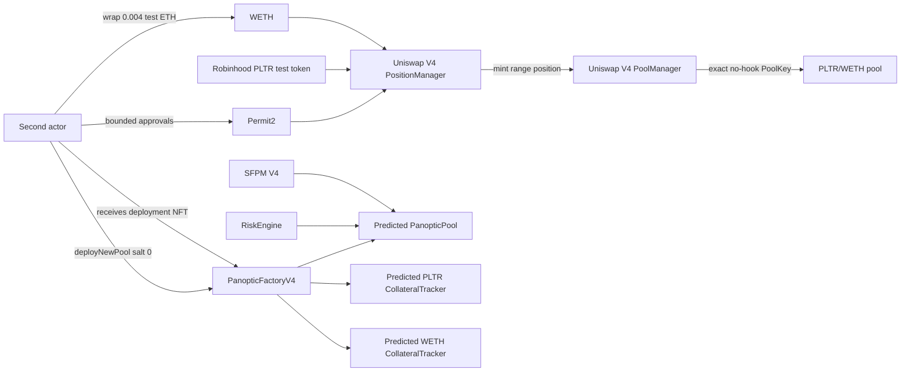

# PLTR/WETH offline market-genesis design

| Field | Value |
|---|---|
| Status | Offline design, strict preflight, and exact-head genesis fork rehearsal complete; exact exposure review required |
| Public chain state | Pool and Panoptic market were still absent at the accepted qualification snapshot |
| PoolKey | PLTR/WETH, fee `3000`, tick spacing `60`, hooks zero |
| PoolId | `0xd600fd2ff936078114b72a01d3c6d31d449b7af12c24c82fb61efb7bf9c613ae` |
| Actor | `0x04D5A0f57Cb2e110faC9703024888cd4562B6d6f` |
| Plan body SHA-256 | `6df5e96164de65659a75ad4204a8635c49c1c7c56fba73f1bcb81ec5019f8719` |
| Transactions authorized | None |

## 1. What this round achieved

The owner accepted the exact PLTR/WETH candidate and synthetic-price class for
offline testnet planning. The repository now contains a deterministic plan for
the first pool, its initial V4 liquidity, and its per-market Panoptic contracts.
It does not claim that any of those state changes have happened.

The new artifacts are:

- the [owner decision boundary](../../manifests/markets/robinhood-testnet-pltr-weth-offline-acceptance-2026-09-09.json), which keeps every broadcast permission false;
- the [offline generator](../../scripts/prepare_robinhood_market_plan.py), which
  has no RPC, private-key, keystore, signing, transaction-serialization, or
  broadcast path;
- the [unsigned rehearsal plan](../../manifests/markets/robinhood-testnet-pltr-weth-offline-plan-2026-09-09.json), containing all targets, values, calldata, calldata hashes, limits, preconditions, and postconditions; and
- ten unit tests covering the offline-capability boundary, canonical TickMath vectors, inverse price math,
  rounded liquidity budgets, manifest substitution, deterministic output,
  action decoding, ordering, and authorization closure.

This is the bridge from “we selected a PoolKey” to “we can safely rehearse the
exact mechanism.” It is not a bridge from planning to public execution.

## 2. Current live/planned boundary

At the accepted block `116408992`, `slot0.sqrtPriceX96` for the exact PoolId was
zero and `PanopticFactoryV4.getPanopticPool(PoolKey, RiskEngine)` returned the
zero address. Both accounts also held zero WETH. Therefore, at that snapshot:

```text
shared Panoptic contracts deployed        YES
PLTR/WETH PoolKey derived                  YES
owner accepted PoolKey for offline design YES
synthetic price calculated                 YES, offline
unsigned calldata calculated               YES, offline
ETH wrapped                                NO
token approvals created                    NO
V4 pool initialized                        NO
V4 liquidity NFT minted                    NO
Panoptic market registered                 NO
collateral deposited or options traded     NO
```

That snapshot is historical. The strict initial verifier subsequently proved
the same required pre-state at block `116510322`, where the full qualification
passed `79/79` and the plan-specific checks passed `17/17`. The exact-head
genesis rehearsal then passed twelve positive transitions and four isolated
negative cases. See the
[initial preflight record](./2026-09-09-pltr-weth-initial-preflight.md) and
[fork-rehearsal record](./2026-09-10-pltr-weth-fork-rehearsal.md). A future
execution candidate must still consume a fresh, explicitly pinned head.

## 3. Architecture of the planned market

The Robinhood faucet already issued the PLTR test Stock Token. StonkHedge does
not mint, upgrade, pause, unblock, or administer that token. The plan connects
the issuer-controlled test asset to the deployed V4 and Panoptic systems.



There are two different NFTs:

1. Uniswap PositionManager mints the V4 liquidity position NFT to the actor.
2. PanopticFactoryV4 mints a factory provenance/reward NFT to the caller. Its
   token ID is the predicted PanopticPool address interpreted as a `uint160`.

The second actor fills both roles for this first mechanism test. The
administrative deployer `0xCa60...08bD` is excluded from these transactions so
guardian/treasurer authority is not casually mixed with user liquidity. Two
keys controlled by the same owner remain functional role separation, not an
independent audit.

## 4. Exact synthetic price policy

Both assets use 18 decimals, so raw-unit and human-unit orientation are the
same. Currency ordering is:

```text
currency0 = PLTR
currency1 = test WETH
V4 price = currency1 / currency0
```

The offline mechanism-test target is deliberately:

```text
1 PLTR = 0.001 test WETH
1 test WETH = 1000 PLTR
```

This number is not a PLTR stock quote, does not come from Robinhood or an
oracle, and carries no economic claim. It exists only to exercise two-token
V4/Panoptic mechanics with faucet-sized balances.

The generator avoids floating point. It computes:

```text
sqrtPriceX96 = floor(sqrt(1 / 1000) * 2^96)
             = 2505414483750479311864138015
initial tick = greatest TickMath tick not above sqrtPriceX96
             = -69082
```

The realized price is
`0.00099999999999999999999999999944435...` WETH per PLTR. Its rounding
error is approximately `-5.56e-24` basis points. The eventual pre-mint
verifier permits zero state drift: the PoolId must still have this exact
`sqrtPriceX96` and tick, otherwise the liquidity step blocks.

The liquidity boundaries are calculated by taking `initialTick +/- 12000` and
rounding outward to usable multiples of tick spacing `60`:

| Value | Exact result |
|---|---:|
| Lower tick | `-81120` |
| Upper tick | `-57060` |
| Lower sqrt price | `1372363738095106011408719178` |
| Upper sqrt price | `4569822954775051489799353164` |
| Approximate relative price coverage | `0.30004x` through `3.32690x` of the initial price |

This broad first range prioritizes mechanism stability over capital efficiency.
It is still a single bounded LP position, not a production market-making
strategy.

## 5. Bounded exposure proposal

The exact exposure remains a proposal requiring a separate owner decision. It
was calculated from the actor's qualified faucet balances:

| Item | Maximum or reserve |
|---|---:|
| ETH wrapped | `0.004 ETH` |
| PLTR approved/spendable for initial LP | `2 PLTR` |
| WETH approved/spendable for initial LP | `0.002 WETH` |
| Native principal retained before gas | at least `0.006 ETH` |
| PLTR retained after maximum LP spend | at least `3 PLTR` |
| WETH retained after maximum LP spend | at least `0.002 WETH` |

The maximum liquidity that could fit those budgets is
`139849274744420378`. The design uses 99% of it,
`138450781996976174`, to leave token headroom. At the exact synthetic price,
the pinned V4 round-up formulas require:

| Currency | Expected initial transfer | Absolute maximum | Headroom |
|---|---:|---:|---:|
| PLTR / currency0 | `1.977842344644879789` | `2` | `0.022157655355120211` |
| WETH / currency1 | `0.00198` | `0.002` | `0.00002` |

This headroom is not permission for price drift. The strict precondition is
still exact price and zero active liquidity. The maxima are a final on-chain
fail-safe against an unexpected delta, and the operator must stop if the state
changes.

## 6. Why the permission ladder has two layers

PositionManager pays PoolManager through Permit2. Consequently, an ERC-20
allowance to PositionManager alone is insufficient. The actor must provide:

```text
PLTR/WETH ERC-20 allowance
        actor -> Permit2

Permit2 allowance
        actor + token -> PositionManager, amount, expiry
```

Both layers are bounded. The design never uses `uint256.max`, `uint160.max`, or
an unlimited expiry. After the liquidity receipt and post-state reconcile, the
plan explicitly zeros both Permit2 allowances and both ERC-20 allowances.

The encoded Permit2 expiry and PositionManager deadline are anchored to the
historical qualification timestamp and are labelled rehearsal-only. This is
intentional: the committed artifact must not be silently reused for a public
send. A future execution candidate needs fresh accepted timestamps and a fresh
pending nonce.

## 7. Twelve-step unsigned rehearsal sequence

Every step has `nonce = null` and `authorizedForBroadcast = false`.

| # | Actor intent | Why it is separate |
|---:|---|---|
| 0 | Wrap `0.004 ETH` into WETH | Establish quote inventory while retaining gas principal |
| 1 | Approve at most `2 PLTR` to Permit2 | First PLTR permission layer |
| 2 | Approve at most `0.002 WETH` to Permit2 | First WETH permission layer |
| 3 | Permit2 approves bounded PLTR to PositionManager | Second PLTR permission layer with expiry |
| 4 | Permit2 approves bounded WETH to PositionManager | Second WETH permission layer with expiry |
| 5 | Initialize exact PoolKey in PoolManager | Must revert loudly on duplicate/drift |
| 6 | Mint the bounded V4 range position | Produces liquidity and the actor-owned LP NFT |
| 7 | Zero PLTR Permit2 allowance | Remove PositionManager spending authority |
| 8 | Zero WETH Permit2 allowance | Remove PositionManager spending authority |
| 9 | Zero PLTR ERC-20 allowance | Remove Permit2 token authority |
| 10 | Zero WETH ERC-20 allowance | Remove Permit2 token authority |
| 11 | Register the Panoptic market with salt `0` | Deploy pool/trackers and mint factory NFT to actor |

Pool initialization deliberately calls `PoolManager.initialize` directly.
The deployed PositionManager also exposes an initialization helper, but that
helper catches an initialization failure and returns a sentinel tick. A direct
PoolManager call gives the one-step operator an unambiguous revert if another
party initialized the PoolId first. PositionManager remains the correct path
for the NFT liquidity position because its payment flow uses the deployed
Permit2 integration.

## 8. Deterministic Panoptic provenance

With the accepted actor and factory salt `0`, PanopticFactoryV4 constructs this
source-defined salt:

```text
0x04d5a0f57cb2e110fac9d3c6d31d443ad134ff17000000000000000000000000
```

The pinned `ClonesWithImmutableArgs` CREATE3/CREATE2 formulas predict:

| Contract | Predicted address |
|---|---|
| PanopticPool | `0x042c0d9c497d62a85b3410f2773cfa748d18e586` |
| PLTR CollateralTracker | `0x2146295437da444638a4cf80900a9e2d3b1315de` |
| WETH CollateralTracker | `0x48d0e86df893b6032ebe9f14ac0eaa23a7949867` |

The pool address depends on the factory, actor-derived salt, PoolId fragment,
RiskEngine fragment, and user salt. The tracker addresses also bind the exact
reference implementation and immutable arguments. A fork verifier must prove
all three addresses are empty before registration, then reconcile the
`PoolDeployed` event, factory mapping, runtime identity, immutable wiring, and
NFT ownership afterward.

This per-market CREATE3 path is inside the already deployed PanopticFactoryV4.
It is unrelated to the missing singleton that forced the earlier 16 shared
contracts to use sequential EOA `CREATE` transactions.

## 9. Validation performed

The product tests pass `10/10`:

```powershell
python -m unittest scripts.tests.test_prepare_robinhood_market_plan -v
```

The critical results were also cross-checked in Solidity against the pinned
source libraries:

- exact V4 TickMath tick/sqrt values;
- V4 SqrtPriceMath round-up token deltas;
- PositionManager `MINT_POSITION + CLOSE_CURRENCY + CLOSE_CURRENCY` calldata;
- direct PoolManager initialization calldata;
- PanopticFactoryV4 deployment calldata; and
- CREATE3 PanopticPool plus CREATE2 CollateralTracker predictions.

The effective mint calldata hash is
`0xf0f5e954f85716e5352c47281bcb67330a3512589cdff636a6c3574abcb3cc78`.
All twelve full calldata blobs and hashes live in the machine-readable plan;
this document intentionally avoids duplicating them.

## 10. What remains before any public transaction

The strict read-only market verifier and exact-head local genesis rehearsal are
now implemented and passing. Before that rehearsal can mature into execution,
all of these gates must pass:

1. owner accepts the exact `0.004 ETH`, `2 PLTR`, `0.002 WETH`, tick range,
   liquidity, and salt proposal;
2. a fresh qualification pins chain, head hash, all runtime identities, Stock
   Token controls, balances, allowances, `nextTokenId`, PoolId state, factory
   mapping, and predicted-address emptiness;
3. fresh execution timestamps and actor pending nonce replace the historical
   rehearsal clock and null nonces;
4. a fork of that exact execution-candidate head repeats the twelve positive
   transitions and required negative gates without source or state drift;
5. a separate one-step market operator binds the execution-plan hash and
   decodes the selected intent before prompting for the encrypted keystore;
6. the owner gives a new hash-bound testnet-only authorization; and
7. execution proceeds one transaction at a time with receipt and post-state
   reconciliation, stopping on any mismatch.

Later progress: gates 1–5 were completed for execution planning on 2026-09-10,
including a `12/12` exact-fork rehearsal through the finalized one-step
operator. Gate 6 remains absent, and the time-bound candidate must be freshly
regenerated and replayed after review before authorization is considered. See
the [execution-candidate/operator record](./2026-09-10-pltr-weth-execution-candidate-and-operator.md).

Swaps, collateral deposits, option positions, premium observation, closing,
and withdrawals are later lifecycle steps. They are not part of this unsigned
genesis plan and remain unauthorized.

## 11. Memory aid: ZERO

Use **ZERO** beside the existing **PAIRS** checklist:

- **Z — Zero authority:** offline calldata is not signing or broadcast consent.
- **E — Exact state:** PoolKey, price, balances, allowances, nonce, code, and
  predicted addresses must match the freshly pinned head.
- **R — Reserve and revoke:** retain faucet assets and gas; remove both
  permission layers after minting.
- **O — One step:** simulate, authorize separately, execute one transaction,
  reconcile, and stop.

The shortest operator reminder remains:

```text
plan -> verify -> simulate -> accept exposure -> authorize -> one step -> reconcile -> stop
```
