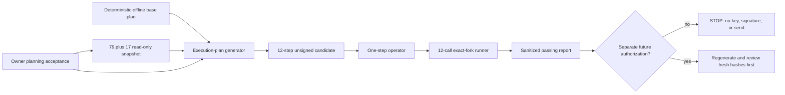
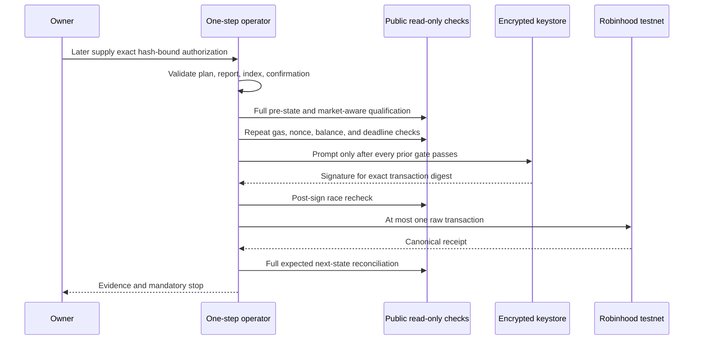

# PLTR/WETH execution candidate and one-step operator — 2026-09-10

## Outcome and boundary

The accepted PLTR/test-WETH genesis exposure now has a generated,
nonce-and-time-bound execution candidate and a finalized one-step operator. A
fork of canonical Robinhood testnet block `116870911` passed all twelve
operator invocations in order. The rehearsal opened no keystore, created no
signature, and submitted no public transaction.

This is execution **evidence**, not execution **authorization**. The candidate
contains `authorizedForBroadcast: false` on every transaction and every
authorization capability remains `false`. It will become stale as its
deadlines or required public state change. Before any future broadcast
decision, regenerate and rehearse one final candidate, review its new hashes,
and record a separate owner authorization.

Public readback after Anvil was stopped showed:

- second-actor nonce `0`;
- PLTR/WETH `sqrtPriceX96 = 0`, tick `0`, and active liquidity `0`;
- PanopticFactoryV4 mapping equal to the zero address; and
- second-actor PositionManager NFT balance `0`; and
- shared PositionManager next-token counter `3865`.

Therefore no PLTR/WETH pool, liquidity position, or Panoptic market was created
on Robinhood testnet in this round.

## Accepted exposure

| Item | Accepted mechanism-test value |
|---|---:|
| Actor and LP/NFT recipient | `0x04D5A0f57Cb2e110faC9703024888cd4562B6d6f` |
| Pool | PLTR/test-WETH, fee `3000`, spacing `60`, hooks zero |
| Synthetic price | `0.001` test WETH per PLTR |
| `sqrtPriceX96` | `2505414483750479311864138015` |
| Initial tick | `-69082` |
| Liquidity range | `-81120` through `-57060` |
| Liquidity | `138450781996976174` |
| Native wrap cap | `0.004` test ETH |
| PLTR transfer cap | `2` PLTR |
| WETH transfer cap | `0.002` WETH |
| Factory salt | `0` |

The ratio is synthetic and exists only to exercise the mechanism. It must
never be described in UI or documentation as a PLTR market quote, issuer
price, oracle value, or investment reference.

## Artifact chain

The artifacts form a one-way evidence chain:

| Artifact | SHA-256 |
|---|---|
| Execution-planning acceptance | `1aed902e4ff62ab7dc05c427c250925eafbc5e6e09a6bc0fa1cc889c49edf5f0` |
| Execution preflight | `4ed37d1cacc7d39dc6d5597433eea79d40dbb23f2aa7417263f77582fc805783` |
| Execution-plan generator | `5f0ec26a33572ea54fb95e9b6eb92a80338d7c3bee44b0483a250734ece160fd` |
| Execution-plan body | `28f56ec95fe4d225a91444ad9aaec4417115ff62cd002d65a9ee53ca77b3d87b` |
| Execution-plan file | `c40bb2420d7cfa5b40241830f385b4ec93ce192e1fb6a216372301095549f442` |
| One-step operator | `12afc611e2c992487a1d7571a3903b055356a72943ab58ce57436c72616e2cfc` |
| Twelve-step simulation runner | `3185057421ed7cdc06777b29522b9c3924551d50b93dcb642d9f52ca419b75db` |
| Aggregate simulation report | `9d02f8634d85971b0caf87b3bf0206803688d52c722bdbd532cd88967bdcc3e1` |

The execution snapshot binds canonical block hash
`0xd9bce422dedeb4eb92b790e7479cc468c58f4a2b5c7f580f2ace159d0f06e4bb`
at timestamp `2026-09-10T12:10:03Z`. Its header was independently read back
from the public RPC after the rehearsal. The candidate binds actor nonces `0`
through `11`, a PositionManager next-token floor of `3865`, liquidity deadline
`1789045803`, and Permit2 expiration `1789049403`. The floor is not a reserved
NFT ID; the actual LP NFT ID is learned from the mint receipt.

## Why the execution candidate is separate

The original offline plan freezes economic intent but deliberately contains no
usable nonce or current deadline. The execution generator accepts only:

1. that deterministic base plan;
2. the exact owner planning-acceptance manifest;
3. a passing fresh preflight; and
4. its own source file.

It then binds the observed pending nonce, replaces only the three
deadline-bearing calldata payloads, recomputes every calldata hash, and emits
the twelve consecutive unsigned transactions. The generator has no RPC,
keystore, signing, serialization, or broadcast implementation. This prevents a
planning command from accidentally becoming an execution command.

The public RPC currently retains state for only a very short window. For the
final replay, Anvil captured the current canonical head with zero generated dev
accounts, immediately mined one local compatibility child, and held the
canonical root immutable. The `79/79` shared and `17/17` exact-plan reads were
then performed against that root before any local mutation. The candidate and
rehearsal both bind the root's canonical number and hash. The compatibility
child exists only because the imported Robinhood L2 header is not directly
mineable by this Anvil version; it does not change public contract state.

## Exact state machine

| Index | Action | Principal value | Required result |
|---:|---|---:|---|
| 0 | Wrap test ETH into WETH | `0.004` ETH | Actor WETH increases exactly |
| 1 | Approve PLTR to Permit2 | `0` | ERC-20 allowance equals 2 PLTR |
| 2 | Approve WETH to Permit2 | `0` | ERC-20 allowance equals 0.002 WETH |
| 3 | Permit PLTR to PositionManager | `0` | Permit2 allowance and expiry exact |
| 4 | Permit WETH to PositionManager | `0` | Permit2 allowance and expiry exact |
| 5 | Initialize PoolKey | `0` | Exact sqrt price and tick appear |
| 6 | Mint bounded V4 liquidity NFT | `0` | Exact mint event, recipient, range, liquidity, and deltas |
| 7 | Revoke PLTR Permit2 allowance | `0` | Remaining PLTR Permit2 allowance zero |
| 8 | Revoke WETH Permit2 allowance | `0` | Remaining WETH Permit2 allowance zero |
| 9 | Revoke PLTR ERC-20 allowance | `0` | PLTR-to-Permit2 allowance zero |
| 10 | Revoke WETH ERC-20 allowance | `0` | WETH-to-Permit2 allowance zero |
| 11 | Register Panoptic market | `0` | Three clones, mapping, wiring, SFPM ID, and factory NFT exact |

The mint consumes approximately `1.977842344644879789` PLTR and `0.00198`
WETH. V4/Permit2 leave the unused headroom in the approvals, rather than
automatically zeroing them. The first operator rehearsal caught that real
behavior. The expected state machine was corrected to require the exact unused
headroom after mint, followed by the four explicit zeroing transactions. Final
simulated allowances are zero at both layers.

### Shared-counter race removed

The final adversarial review found that PositionManager's `nextTokenId` is a
global counter shared with unrelated Robinhood testnet users. During review it
advanced from `3854` to `3859` while the actor nonce, balances, allowances,
PLTR/WETH PoolId, active liquidity, and Panoptic factory mapping all remained
unchanged. That was outside activity, not a stonkHedge public transaction.

The counter is therefore treated only as a monotonic floor. At index `6`, the
operator requires exactly one PositionManager ERC-721 `Transfer` mint from the
zero address to the accepted actor in the canonical receipt and records its
token ID. It then verifies that exact NFT's owner and liquidity. Indices `7`
through `11` require that receipt-derived ID through `--liquidity-token-id` and
recheck it on every invocation. The actor's PositionManager NFT balance must
move from exactly `0` to exactly `1`. This preserves exact ownership evidence
without pretending a shared global counter reserves an ID for us.

## One-step operator design

The operator exposes two mutually exclusive modes.

### Simulation mode

`--simulate` accepts loopback URLs only, verifies the Anvil client and exact
fork lineage, impersonates only the accepted actor, runs exactly one indexed
transaction, reconciles the entire post-state, and stops. It cannot accept a
keystore or send a raw transaction through this path. The aggregate runner
invokes this same one-step function twelve times; it does not have a signing or
public-send path of its own.

### Dormant public mode

`--execute` exists so a future review can bind the exact implementation hash.
It is inert without all of the following:

- the exact official chain-`46630` RPC;
- a passing, exact operator simulation report;
- an authorization manifest binding the execution-plan body and file hashes,
  operator hash, aggregate simulation-report hash, actor, policy, and maximum
  transaction index;
- an exact phrase binding plan hash, selected index, and nonce;
- an encrypted Foundry keystore for the accepted actor; and
- an evidence directory outside the Git repository; and
- for indices `7` through `11`, the exact LP NFT ID recorded by the passing
  index-`6` receipt evidence.

Authorization and confirmation are checked before the operator can open the
keystore. There is no raw-private-key or password argument. After the gates,
the operator performs a complete pre-state reconciliation, runs the 79-check
market-aware qualification, repeats preflight, estimates and bounds gas, signs
one EIP-155 legacy transaction, and checks nonce, time window, state, gas, and
balance again after signing. Only then can it call `eth_sendRawTransaction`
once. It waits for a successful receipt, reconciles the complete next state,
writes evidence, and returns `PASS_STOP_BEFORE_NEXT`.

The report gate now independently validates all twelve step records against
the plan, including ordering, nonce, recipient, value, calldata hash, receipt
status, block sequence, gas bounds, unique transaction hashes, exact Anvil
lineage, initial state, terminal state, and the receipt-derived liquidity NFT
ID. It also verifies that the `79` qualification-result statuses agree with
their pass/fail counters. A file with only a forged top-level `PASS` label is
rejected even if someone recomputes its external file hash.

The market-aware verifier is intentionally phase-sensitive. Through the
pre-state of index `5`, all 79 qualification checks must pass. After the
planned initialization, the
old generic assertion “PLTR V4 PoolId is uninitialized” must be the only
baseline failure, and its observed PoolId and sqrt price must equal this plan.
Every other runtime, wiring, token, account, and non-PLTR-market check must
still pass. Before registration, the generic “market is unregistered” check
also remains true. The operator's full state machine independently verifies
the initialized pool, liquidity, NFT, allowances, predicted clone emptiness,
and final registered wiring.

No arrow after `Owner` was exercised publicly in this round.

## Rehearsal result

The aggregate report records twelve successful, ordered calls through the
one-step operator. The fork ended with:

- nonce `12`;
- PLTR `3.022157655355120211`;
- WETH `0.00202`;
- native balance `0.005995163949030668` test ETH after wrap and simulated gas;
- both ERC-20 allowances zero;
- both Permit2 allowances zero;
- active liquidity `138450781996976174`;
- PositionManager next token ID `3866` in the isolated replay;
- actor ownership of locally minted LP NFT `3865` in that replay, derived from
  its exact receipt event rather than assumed from the public counter;
- predicted PanopticPool and both CollateralTrackers deployed and wired;
- nonzero SFPM pool ID `16897827167146926`; and
- factory NFT ownership assigned to the second actor.

The report is sanitized: it records calldata hashes and transaction results,
not private keys, passwords, signatures, or raw signed transactions.

## Verification lanes

| Lane | Result |
|---|---|
| Fresh canonical read-only preflight | PASS: `79/79` shared and `17/17` exact-plan checks |
| Twelve isolated one-step operator calls | PASS: `12/12` |
| Full plan/report revalidation | PASS: regenerated plan and every report field match their bound sources |
| Python regression suite | PASS: `75/75` |
| Ruff on changed Python files | PASS |
| JSON parsing, local Markdown links, diff whitespace, and secret-pattern scan | PASS |
| Public post-replay non-mutation readback | PASS: nonce `0`, NFT balance `0`, PoolId uninitialized, liquidity `0`, factory mapping zero |
| Broad baseline checkout verifier with `-AllowDirty` | BLOCKED only because the adjacent core checkout is deliberately on `cfaf42c...` / `feat/stock-token-compatibility-harness`, not the manifest's deployment checkout; no checkout was changed |
| Broad PowerShell live verifier | BLOCKED by its `124`-second command timeout; the narrower fresh qualification and exact-plan verifier above completed successfully against the pinned canonical head |

The adversarial review in this round is an owner/Codex self-review, not an
independent-human audit. The invited collaborator review remains useful
defence-in-depth and remains mandatory before any mainnet or real-value use,
but it is not a blocker for this valueless, separately authorized testnet lane.

## Memory aids

Use **PLAN → PROVE → PERMIT → ONE → PROVE → STOP**:

1. **PLAN** — regenerate nonce and deadlines from one immutable head;
2. **PROVE** — replay every step through the exact operator;
3. **PERMIT** — obtain a separate authorization bound to every relevant hash;
4. **ONE** — select, sign, and send no more than one index;
5. **PROVE** — reconcile receipt and complete next state; and
6. **STOP** — review before selecting another index.

Use **ZERO** for the approval and market boundary:

- **Z**ero public authority in planning artifacts;
- **E**xact exposure, nonce, deadline, target, and calldata;
- **R**econcile the whole state machine, not only receipt status; and
- **O**ne transaction per invocation, then stop.

## Next gate

Do not authorize the hashes in this record after they become stale. The next
safe round is:

1. review this implementation, the shared-counter correction, and the final
   evidence hashes;
2. obtain a new explicit testnet-only, maximum-index authorization bound to
   those hashes; and only
3. then consider executing index `0` with the actor's encrypted keystore.

Pool initialization, liquidity, market registration, collateral, swaps, and
options remain publicly unexecuted and unauthorized today.
