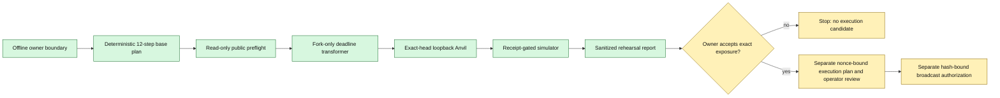

# PLTR/WETH exact-head fork rehearsal

| Field | Value |
|---|---|
| Status | `PASS_LOCAL_FORK_MARKET_GENESIS_REHEARSAL` |
| Scope | Pool initialization, bounded V4 liquidity, permission cleanup, and Panoptic market registration |
| Public-chain effect | None; the fork was local and discarded |
| Pinned public block | `116510322` |
| Pinned block hash | `0x7e2f9ad36e849939324d92c992bddc8a8e5dd96071047044cc95602994812e74` |
| Local compatibility child | `116510323`, parented to the pinned public hash |
| Shared qualification | `79/79` passed |
| Exact-plan preflight | `17/17` passed |
| Positive transitions | `12/12` passed |
| Snapshot-isolated negative cases | `4/4` reverted as required |
| Public authorization | None |

## 1. Outcome and boundary

The first PLTR/WETH market-genesis mechanism has now been proven against an
exact, recent Robinhood Chain testnet state without signing a transaction or
changing public state. The rehearsal started from the real second actor's
nonce, balances, allowances, Stock Token controls, V4 state, deployed Panoptic
  infrastructure, and empty deterministic market addresses at block `116510322`.
It then executed the complete twelve-step genesis sequence on loopback Anvil.

The local end state contained:

- the exact no-hook PLTR/WETH V4 pool at fee `3000` and tick spacing `60`;
- a bounded two-sided liquidity position owned by the second actor;
- zero remaining ERC-20-to-Permit2 and Permit2-to-PositionManager allowances;
- the predicted PanopticPool and two CollateralTracker clones;
- the expected factory mapping, factory NFT ownership, immutable wiring, and
  SFPM pool registration; and
- four demonstrated fail-closed paths.

Anvil was stopped after the report was written. Therefore none of that local
state exists on Robinhood testnet. At the pinned public head, the PoolManager
price was still zero, active liquidity was zero, the Panoptic factory mapping
was zero, and all three predicted clone addresses were empty.

## 2. Evidence pipeline and trust boundaries

The process deliberately separates decisions, observation, local mutation,
and public authority:



The components have intentionally different capabilities:

| Component | May read public RPC | May mutate loopback fork | May read keys | May sign/broadcast publicly |
|---|---:|---:|---:|---:|
| Offline base-plan generator | No | No | No | No |
| Strict preflight verifier | Yes, read-only | No | No | No |
| Fork-plan transformer | No | No | No | No |
| Fork simulator | Only loopback Anvil | Yes | No | No |
| Future public operator | Future scope | No | Encrypted keystore only | Only after separate authorization |

The fork simulator rejects a non-loopback URL, credentials in the URL, a URL
path or query, a non-Anvil client, the wrong chain, or a block-number/hash/time
mismatch before impersonation. Only
`0x04D5A0f57Cb2e110faC9703024888cd4562B6d6f` is impersonated. The positive
path does not fabricate balances, code, nonces, or storage.

## 3. What was pinned from public state

The strict verifier regenerated the base plan from its bound source inputs and
required full equality before reading the chain. At block `116510322` it
proved:

- chain ID `46630` and all recorded Robinhood, V4, Permit2, WETH, Stock Token,
  and Panoptic runtime identities matched;
- PLTR was eligible, unpaused, actor-unblocked, and still sorted as currency0;
- PoolId
  `0xd600fd2ff936078114b72a01d3c6d31d449b7af12c24c82fb61efb7bf9c613ae`
  was uninitialized and had zero active liquidity;
- the Panoptic factory had no market registered for the PoolKey/RiskEngine;
- the actor had nonce `0`, `0.01` test ETH, `5` PLTR, zero WETH, and zero
  allowances at both permission layers;
- PositionManager's next NFT ID was `3740`; and
- the predicted PanopticPool and both tracker addresses had no runtime code.

The public RPC's Python TLS path reported an expired endpoint certificate, so
the evidence was collected with the verifier's existing read-only `cast`
transport. This changed only transport; the exact verifier checks and failure
policy stayed the same.

## 4. Fork-only clock adaptation

The committed base plan intentionally contains historical deadlines and is not
directly reusable. The fork transformer copied the accepted PoolKey, price,
liquidity, amounts, targets, calldata intents, predictions, null nonces, and
false authorization flags. It changed only the two Permit2 expirations and the
PositionManager liquidity deadline, then recomputed their calldata hashes.

| Clock item | Unix value | Rule |
|---|---:|---|
| Exact public-head timestamp | `1788995166` | Read from block `116510322` |
| Local compatibility child | `1788995167` | Public head plus one second |
| Liquidity deadline | `1788998766` | Public head plus one hour |
| Permit2 expiration | `1789002366` | Public head plus two hours |

Anvil could import the Robinhood L2 head, but direct calls at that imported
header lacked the post-Cancun `excessBlobGas` header field expected by the
current EVM path. Forcing an older hardfork was invalid because the deployed
Stock implementation uses newer opcodes. The simulator therefore verifies the
exact imported head first, sets the next timestamp to public-head plus one,
and mines one empty local child. That child has the exact public block as its
parent and provides a locally complete header for calls.

This is a local Anvil compatibility measure. It changes neither the public
chain nor the contracts and is not evidence that Robinhood lacks EVM support.

## 5. Synthetic price and bounded exposure

The rehearsal used a clearly labelled mechanism-test ratio of `0.001` test
WETH per PLTR. It is not a market price, equity quote, issuer price, oracle
observation, or UI display value.

| Parameter | Rehearsed value |
|---|---:|
| `sqrtPriceX96` | `2505414483750479311864138015` |
| Initial tick | `-69082` |
| Lower / upper tick | `-81120` / `-57060` |
| Liquidity | `138450781996976174` |
| Test ETH wrapped | `0.004` |
| Maximum PLTR transfer | `2` |
| Maximum WETH transfer | `0.002` |
| Expected PLTR transfer | `1.977842344644879789` |
| Expected WETH transfer | `0.00198` |

The exact-price precondition prevents the amount caps from becoming permission
for price drift. Liquidity is 99% of the calculated maximum at those budgets,
leaving `0.022157655355120211` PLTR and `0.00002` WETH of transfer headroom.

## 6. Positive transaction sequence

Each receipt had to succeed and its immediate post-state had to reconcile
before the simulator continued:

| # | Local action | Required result |
|---:|---|---|
| 0 | Wrap `0.004` test ETH | Exact WETH balance increase |
| 1–2 | Bound PLTR and WETH ERC-20 approvals to Permit2 | Exact, non-unlimited allowances |
| 3–4 | Bound Permit2 approvals to PositionManager | Exact amounts and fork-only expiry |
| 5 | Initialize the exact PoolKey directly in PoolManager | Exact price and tick |
| 6 | Mint the two-sided V4 range | NFT `3740`, exact liquidity and token deltas |
| 7–8 | Revoke both Permit2 allowances | Both amounts equal zero |
| 9–10 | Revoke both ERC-20 allowances | Both allowances equal zero |
| 11 | `PanopticFactoryV4.deployNewPool` with salt `0` | Exact event, mapping, clones, NFT, wiring, and SFPM ID |

The local actor nonce moved from `0` to `12`. Its final balances were
`0.005995163949030668` test ETH, `3.022157655355120211` PLTR, and `0.00202`
WETH. The small native difference below the planned `0.006` pre-gas reserve is
the locally charged gas; the test did not fabricate a gas balance.

## 7. Deterministic market provenance

PanopticFactoryV4 derives the salt from the actor, PoolId fragment, RiskEngine
fragment, and user salt `0`:

```text
0x04d5a0f57cb2e110fac9d3c6d31d443ad134ff17000000000000000000000000
```

The source-defined CREATE3 and CREATE2 formulas produced and the local receipts
confirmed:

| Object | Address or ID |
|---|---|
| CREATE3 proxy | `0xa7b2ac1231363a675d987c9bc326417d9fc50409` |
| PanopticPool | `0x042c0d9c497d62a85b3410f2773cfa748d18e586` |
| PLTR CollateralTracker | `0x2146295437da444638a4cf80900a9e2d3b1315de` |
| WETH CollateralTracker | `0x48d0e86df893b6032ebe9f14ac0eaa23a7949867` |
| PositionManager NFT | `3740` |
| SFPM pool ID | `16897827167146926` |

The simulator also checked factory mapping, runtime-code presence, factory NFT
ownership, PanopticPool-to-tracker and tracker-to-token links, RiskEngine,
PoolManager, SFPM, PoolId, fee, and token orientation.

## 8. Negative cases

Each failure was run after an `evm_snapshot` and followed by a required
successful `evm_revert`, so it could not contaminate the positive path.

| Case | Why it matters | Result |
|---|---|---|
| Duplicate PoolManager initialization | A raced or stale PoolKey must stop | Reverted |
| Expired liquidity deadline | Historical calldata must not be reusable | Reverted |
| Occupied CREATE3 proxy | A deterministic-deployment collision must stop | Reverted |
| Duplicate Panoptic registration | A second market for the same key/engine must stop | Reverted |

The CREATE3 collision targets the source-defined proxy address. Setting code
only at the predicted final clone is not a faithful Anvil collision injection;
the factory first deploys the deterministic proxy with CREATE2, and that proxy
creates the final clone at nonce one. The simulator now derives the proxy from
the factory, salt, and pinned proxy-bytecode hash, injects both nonzero nonce
and nonempty code inside the snapshot, verifies that injected state, and then
requires the factory transaction to revert.

## 9. Evidence hashes

| Artifact | SHA-256 |
|---|---|
| Base offline plan file | `889eb501f7b20c4ae2f352ce878c76c4f18bbf1b2438027c5c9a7b876e006417` |
| Fresh strict preflight file | `d9d06889b2e4c73d0c741a6fdc4585b1880f1522c2b0f3a43640f0802a14c098` |
| Fork transformer source | `76f7a98043ed52638cd1defea1a445ef053494ecbdcbf611acadc7018b2c7f2a` |
| Fork-plan body | `f4f329ea6cae29f0473c3de664a8a9636f11bf3ea60b380025915b39b1807cb0` |
| Fork-plan file | `0e8a9320744185e340a06570c016373348589168117c610a89fd07e0e6161658` |
| Simulator source | `e8a31b57c1f6906e454304d2a743be1ff62a03e9b79422cd973f1e3b917ec061` |
| Sanitized rehearsal report | `ae7592000663490a81d1d72e357dbb0a79c498aefc884892d8ffb4a80c0dfc0e` |

The report contains transaction hashes from the ephemeral Anvil chain. They
are local evidence, not Robinhood explorer transaction hashes.

## 10. Reproduction and RPC limitations

The testnet RPC prunes historical state quickly. The exact old fork may become
unavailable even though the committed manifest remains valid evidence of the
completed run. A new run should therefore take a fresh head and immediately
carry it through plan generation, Anvil startup, and simulation:

```powershell
python .\scripts\verify_robinhood_market_plan.py `
  --transport cast `
  --output .\manifests\markets\robinhood-testnet-pltr-weth-initial-preflight-2026-09-09.json

python .\scripts\prepare_robinhood_market_fork_plan.py

anvil --fork-url https://rpc.testnet.chain.robinhood.com `
  --fork-block-number <exact-preflight-block> `
  --disable-min-priority-fee --host 127.0.0.1 --port 8547 --silent

python .\scripts\simulate_robinhood_market_fork.py `
  --rpc-url http://127.0.0.1:8547
```

The zero-priority local fee policy is deliberate. At Anvil's normal 1 gwei
minimum tip, the actor's real `0.01` test ETH could not cover the conservative
per-transaction gas cap plus the `0.004` ETH wrap. The simulator still charges
the local base fee and records final native accounting.

## 11. What is still blocked

This pass retires the exact-head genesis-rehearsal gate. It does not grant
authority for a public transaction and does not complete the broader two-actor
options lifecycle. Later on 2026-09-10, gates 1–4 below were completed for
execution planning: the exact exposure was accepted, a fresh candidate was
generated, and the finalized market operator passed `12/12` ordered calls at
block `116968208`. See the
[execution-candidate/operator record](./2026-09-10-pltr-weth-execution-candidate-and-operator.md).

That later round completed the final regeneration, replay, and shared-counter
hardening. An exact authorization for an earlier candidate arrived only after
that candidate's time gate had expired; it was not materialized, signed, or
broadcast. The refreshed candidate therefore still requires a new hash-bound
signing and one-transaction-at-a-time broadcast authorization.

Swaps, collateral deposits, option positions, premium observation, close, and
withdrawal remain a later lifecycle phase and remain unauthorized.

## 12. Memory aids

Use **FORK** for every rehearsal:

- **F — Freeze the head:** block number, hash, timestamp, code, balances, and
  nonce belong to one checkpoint.
- **O — Only loopback:** impersonation and fault injection never point at a
  public RPC.
- **R — Reconcile receipts:** success is insufficient without exact deltas,
  ownership, mapping, runtime, and wiring.
- **K — Kill the fork:** stop Anvil and remember that its transaction hashes
  are not public deployments.

Use **STAMP** before a future execution candidate:

- **S — Sources and hashes** are frozen.
- **T — Time and nonce** are fresh.
- **A — Actor and addresses** are exact.
- **M — Maximum exposure** is explicitly accepted.
- **P — Public permission** is a separate, hash-bound decision.

The current handoff is:

```text
genesis mechanism proven locally
    -> exposure accepted for planning
    -> execution plan and operator replay completed
    -> review and final fresh regeneration
    -> separate authorization
    -> one public step, reconcile, stop
```
infrastructure, and empty deterministic market addresses at block `116510322`.
