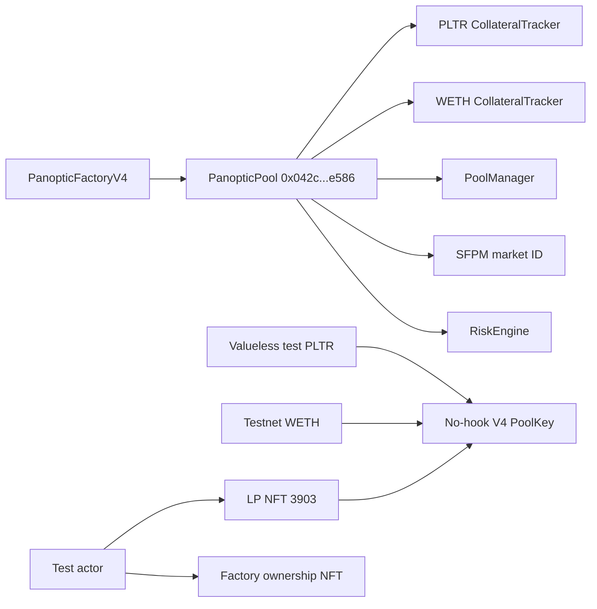

# PLTR/WETH partial public genesis and continuation — 2026-09-10

## Outcome

Robinhood testnet market-genesis transactions `0–3` were signed by the second
actor, mined successfully, and independently reconciled. The original
one-hour liquidity deadline then had too little time remaining to safely run,
review, and reconcile transactions `4–6`. Execution stopped before WETH's
Permit2 approval, pool initialization, or liquidity mint.

The stop was deliberate. Continuing just far enough to initialize the pool
without enough time to mint would have created a worse partial state. A fresh
nine-transaction continuation started from public nonce `4`, refreshed the
already bounded PLTR Permit2 approval, completed the remaining original
intents, and preserved the one-transaction/wait/verify/stop policy. It first
passed an exact-head loopback replay and then received a separate, narrowly
hash-bound authorization.

All nine continuation transactions are now canonical. The exact PoolKey was
initialized, bounded liquidity NFT `3903` was minted to the second actor, all
four allowance slots were returned to zero, and the predicted PanopticPool and
two CollateralTrackers were deployed and registered. The actor ended at nonce
`13`. Public genesis is complete; swaps, collateral deposits, option positions,
premium/solvency testing, and every other market remain outside this execution
and require a new plan and authorization.

## Canonical public transactions

| Original index | Transaction | Block | Effect |
|---:|---|---:|---|
| 0 | [`0x87ad860e…24584f`](https://explorer.testnet.chain.robinhood.com/tx/0x87ad860e64bd75e9af7a55f638ad8523dcd7fc53a3147df4b85aa1753924584f) | `116988374` | Wrapped exactly `0.004` test ETH |
| 1 | [`0xfc948467…1202b8`](https://explorer.testnet.chain.robinhood.com/tx/0xfc94846786de4214c015ae2c5c482b6bfe6c4d28f980c6964b7bb19f8e1202b8) | `116993087` | Approved exactly `2 PLTR` from PLTR to Permit2 |
| 2 | [`0xa9c377c2…106946`](https://explorer.testnet.chain.robinhood.com/tx/0xa9c377c2362df4d23524a1302420c824941424632da9c374cc0b5e226b106946) | `116996104` | Approved exactly `0.002 WETH` from WETH to Permit2 |
| 3 | [`0x4cb6f3c6…e4843a`](https://explorer.testnet.chain.robinhood.com/tx/0x4cb6f3c64ca7d873b2a02af93b0e571dcfa55b17dbee22cc58c7422333e4843a) | `116999668` | Approved exactly `2 PLTR` inside Permit2 for PositionManager |

Every receipt had status `1`, the exact actor, nonce, target, value, calldata
hash, and expected event. The progress manifest also binds the SHA-256 of each
external sanitized operator-evidence file. Those files contain no key,
password, signature, or raw signed transaction.

## Frozen public continuation state

The refreshed read-only checkpoint at block `117008274`, hash
`0x1e8264e9ef88dacb64827c9f85100ac2586fb80d8aeaff4aa4ad789f55d4bb28`,
recorded:

| State | Value |
|---|---:|
| Actor pending nonce | `4` |
| Native balance | `0.00599778904` test ETH |
| PLTR balance | `5` |
| WETH balance | `0.004` |
| PLTR/WETH ERC-20 allowances to Permit2 | `2` / `0.002` |
| PLTR/WETH Permit2 allowances to PositionManager | `2` / `0` |
| Pool `sqrtPriceX96` / active liquidity | `0` / `0` |
| Actor PositionManager NFTs | `0` |
| Panoptic factory mapping | zero address |

The old PLTR Permit2 permission was time-bound. WETH had no Permit2 permission,
so PositionManager could not consume WETH. The continuation repeats the PLTR
Permit2 approval instead of relying on its old expiration.

## Continuation state machine

```mermaid
flowchart LR
    A[Public checkpoint: nonce 4] --> B[Refresh bounded PLTR Permit2]
    B --> C[Set bounded WETH Permit2]
    C --> D[Initialize exact PoolKey]
    D --> E[Mint bounded V4 liquidity NFT]
    E --> F[Revoke both Permit2 allowances]
    F --> G[Revoke both ERC-20 allowances]
    G --> H[Register Panoptic market]
    H --> I[Nonce 13; allowances zero]
```

| Continuation index | Public nonce | Source intent | Required result |
|---:|---:|---|---|
| 0 | 4 | Repeat original PLTR Permit2 approval | Exact `2 PLTR`, fresh expiry |
| 1 | 5 | Original WETH Permit2 approval | Exact `0.002 WETH`, fresh expiry |
| 2 | 6 | Initialize PLTR/WETH PoolKey | Exact synthetic price and tick |
| 3 | 7 | Mint bounded V4 range | Exact deltas, liquidity, recipient, and receipt-derived NFT ID |
| 4–5 | 8–9 | Revoke Permit2 permissions | Both Permit2 amounts zero |
| 6–7 | 10–11 | Revoke ERC-20 permissions | Both token allowances zero |
| 8 | 12 | Register Panoptic market | Exact mapping, clones, ownership, wiring, and SFPM ID |

The continuation still caps token movement at `2 PLTR` and `0.002 WETH`, uses
the accepted synthetic `0.001` test-WETH-per-PLTR ratio, ticks
`-81120..-57060`, liquidity `138450781996976174`, no hook, and factory salt
`0`. It adds no swap, collateral, option, other-market, or mainnet action.

## Canonical continuation transactions

| Continuation index | Transaction | Block | Effect |
|---:|---|---:|---|
| 0 | [`0xcf353d13…52e516`](https://explorer.testnet.chain.robinhood.com/tx/0xcf353d13b4ff8886deaf044feabed221200a926737325b24582546258552e516) | `117013304` | Refreshed the exact `2 PLTR` Permit2 permission |
| 1 | [`0xf4831adb…0ab11c`](https://explorer.testnet.chain.robinhood.com/tx/0xf4831adbcabf22576b78e82f1e7143f395ccc6a300a8621c1983bef8de0ab11c) | `117017451` | Set the exact `0.002 WETH` Permit2 permission |
| 2 | [`0x77243b77…1c7422`](https://explorer.testnet.chain.robinhood.com/tx/0x77243b77eda84facce380b94f39b24d2c675ea2e0c79dc44719e3724c01c7422) | `117018968` | Initialized the exact no-hook PoolKey at tick `-69082` |
| 3 | [`0xc5fe4353…b70725`](https://explorer.testnet.chain.robinhood.com/tx/0xc5fe4353812b1b38335e5a76e2c95090e73994196e26b00e7c8b148373b70725) | `117075884` | Minted liquidity `138450781996976174` as NFT `3903` |
| 4 | [`0xf79ee572…119ca1`](https://explorer.testnet.chain.robinhood.com/tx/0xf79ee572890bf6e5c307147fe77ac397013a81f4b1e080fad385c149d9119ca1) | `117079255` | Revoked the PLTR Permit2 permission |
| 5 | [`0x9bdbf4ad…357e0a`](https://explorer.testnet.chain.robinhood.com/tx/0x9bdbf4ad24aab1fa31b8b96588e9769a915c8f62571f6147395e2dba4c357e0a) | `117081880` | Revoked the WETH Permit2 permission |
| 6 | [`0x54573732…5a6978`](https://explorer.testnet.chain.robinhood.com/tx/0x54573732b7031b4baa4fc968646e881d2f5d4c80ef6f28e83b60026ef95a6978) | `117085895` | Revoked the PLTR ERC-20 permission to Permit2 |
| 7 | [`0xb4e6333d…c782b2`](https://explorer.testnet.chain.robinhood.com/tx/0xb4e6333dee8461eb7b310c2d0091bf7296c48afb2b856096f34ce02a69c782b2) | `117089365` | Revoked the WETH ERC-20 permission to Permit2 |
| 8 | [`0x9081a030…a4b05e`](https://explorer.testnet.chain.robinhood.com/tx/0x9081a03002b0b1f902f05d3e85c9980be0dd2576b848998d6d0f1ac315a4b05e) | `117091700` | Deployed and registered the Panoptic market and minted its factory NFT |

The shared PositionManager counter advanced from the planning floor before the
mint. The operator therefore derived token ID `3903` from the canonical ERC-721
mint event and reverified its owner, PoolKey, ticks, and liquidity instead of
assuming the earlier floor was reserved.

At the historical post-mint checkpoint, both permission layers retained only
the unused headroom: `0.022157655355120211 PLTR` and `0.00002 WETH`.
Continuation indexes `4–7` revoked those permissions without moving either
token. At final reference block `117093052`, all four allowance values are
zero; the actor still owns NFT `3903`, the position still holds liquidity
`138450781996976174`, and the actor balances remain
`3.022157655355120211 PLTR` and `0.00202 WETH`.

## Registered market topology

Final transaction `0x9081…b05e` called the reviewed
`PanopticFactoryV4.deployNewPool` intent with factory salt `0`. Its canonical
`PoolDeployed` event, factory mapping, deployed runtimes, ownership, immutable
wiring, and SFPM registration all match the plan:

| Component | Address or value | Verified relationship |
|---|---|---|
| V4 PoolId | `0xd600fd2f…c613ae` | PLTR/WETH, fee `3000`, spacing `60`, no hook |
| PanopticPool | `0x042c0d9c497d62a85b3410f2773cfa748d18e586` | Factory mapping target; wired to both trackers, RiskEngine, PoolManager, and SFPM |
| PLTR CollateralTracker | `0x2146295437da444638a4cf80900a9e2d3b1315de` | Underlying PLTR; points back to the PanopticPool |
| WETH CollateralTracker | `0x48d0e86df893b6032ebe9f14ac0eaa23a7949867` | Underlying WETH; points back to the PanopticPool |
| RiskEngine | `0x3ad134ff173dfa0a892b4116a65b76b818218585` | `vegoid = 8`; shared by pool and trackers |
| SFPM V4 | `0x86ef420fd3e27c3ac896c479b19b6a840b97bee1` | Nonzero market ID `16897827167146926` |
| Factory NFT | token ID `23818381513481739879081106014905403647144289670` | `uint256(uint160(PanopticPool))`, owned by the actor |

The market contracts existing and being correctly wired does not prove that
the public collateral/option lifecycle works. No public swap, deposit, option,
premium, solvency, liquidation, close, or withdrawal was part of genesis.

## Operational clocks

The first public attempt proved that a one-hour mint deadline is incompatible
with human review between every transaction. The continuation therefore uses:

- four hours from the frozen checkpoint to the liquidity deadline; and
- six hours from the checkpoint to both refreshed Permit2 expirations.

This increases only the duration of already bounded, valueless testnet
permissions. Amount caps, recipient, targets, calldata intent, and cleanup
remain unchanged. Transaction `0` must still start with at least 30 minutes of
mint-deadline headroom. Each invocation signs at most one transaction and
stops after full reconciliation. The operator rejects a continuation
authorization unless its machine-readable clock acceptance matches both the
relative four-hour/six-hour policy and the exact absolute deadline and expiry
embedded in this plan.

For this candidate, the index-`0` cutoff is `2026-09-10T21:43:23Z`, the
liquidity deadline is `2026-09-10T22:13:23Z`, and Permit2 expiration is
`2026-09-11T00:13:23Z`.

## Evidence bindings

| Artifact | SHA-256 |
|---|---|
| Public progress manifest | `fba7fbfce420024696876ead457ac6b20b4dd47c31524414279334a2df007796` |
| Continuation generator | `7646424253569e029e2e8e8acdcdbf54e6b5bfbca28aa13ccad4c89ecef98a9b` |
| Continuation-plan body | `27504e1a06b2257fbd16a61c2f68cdfe758b09d2eeb4f417d259e1e8175a5d06` |
| Continuation-plan file | `4eda54e4b3e0d214578cd369f7e36e872acd54d61f9167db26103b138bda48d3` |
| One-step operator | `96c0889e0f5130035ad5c047950411d8c51abf639cbeb275cbbcce8111361339` |
| Simulation runner | `75a0466d40c5c2273ac5ba761ceb53cf8ca911734c3070111ea562da6fead618` |
| Nine-step simulation report | `0e37ea6a469eef8a6e1db330123f8982c22a506bf11d584b0c9a495939cadbca` |
| [Continuation authorization](../../manifests/markets/robinhood-testnet-pltr-weth-continuation-authorization-2026-09-10.json) | `c99249cfc151cf90fcbb970dce29ca4ccc33449ae0f5d88ae3191236ec9b2b8b` |
| [Continuation public progress](../../manifests/markets/robinhood-testnet-pltr-weth-continuation-public-progress-2026-09-10.json) | `f4f07ce0c034eabbd6ff3a886a91e6cfbdfaedee1ae1afdd46273b34cada6525` |
| [Final public genesis manifest](../../manifests/markets/robinhood-testnet-pltr-weth-public-genesis-2026-09-11.json) | `93d31a5393f7295a0f560de45351ea72d52e9c62b8b4f6419d56e8c39ea3922b` |

The exact-head replay began from the same nonce, balances, permissions, empty
pool, zero NFT balance, and empty Panoptic mapping. It ended at nonce `13`
with exact bounded liquidity, one actor-owned LP NFT, zero allowances at both
layers, and the predicted Panoptic contracts registered and wired.

## Verification

- continuation generator has no RPC, key, signing, serialization, or broadcast
  path;
- exact generator regeneration and source bindings: pass;
- nine isolated one-step loopback calls: pass;
- full report lineage, step, gas, state, and terminal revalidation: pass;
- public continuation pre-state at nonce `4`: pass;
- nine canonical continuation receipts and mined transactions: pass;
- final `PoolDeployed` event, factory mapping, three deployed runtimes, factory
  NFT ownership, and complete pool/tracker/RiskEngine/PoolManager/SFPM wiring:
  pass;
- live terminal PoolKey, balances, four zero permissions, liquidity, LP NFT
  `3903`, factory mapping, and nonzero SFPM ID at block `117093052`: pass;
- Python regression suite: `83/83` pass;
- Ruff check and format on changed Python: pass; and
- Anvil stopped with port `8547` closed.

## Memory aid and next gate

Use **STOP → FREEZE → REFRESH → REPLAY → REAUTHORIZE → ONE**:

1. **STOP** when safe completion cannot fit the clock.
2. **FREEZE** canonical receipts and the complete public state.
3. **REFRESH** only the necessary bounded time-bearing permissions/calldata.
4. **REPLAY** every remaining transition from the exact checkpoint.
5. **REAUTHORIZE** the new plan, operator, and report hashes.
6. **ONE** transaction, full verification, then stop again.

The owner supplied that exact authorization at `2026-09-10T18:21:23Z`. It
binds the four-hour/six-hour operational clock policy, continuation body, file,
operator, report, actor, maximum index `8`, and unchanged exclusions.
Continuation indexes `0–8` passed and consumed the authorization. There is no
remaining permission to sign or broadcast. The next gate is a fresh two-actor
lifecycle design, exact-head simulation, review, and separate authorization;
it must begin with a read-only requalification of the now-registered market.

For the completed genesis, remember **PRICE → RANGE → LIQUIDITY → ZERO →
REGISTER → RECONCILE**:

1. **PRICE** initialized only the labelled synthetic mechanism-test ratio.
2. **RANGE** bounded the LP position to ticks `-81120..-57060`.
3. **LIQUIDITY** minted the receipt-derived NFT `3903` within fixed token caps.
4. **ZERO** removed both ERC-20 and Permit2 permission layers.
5. **REGISTER** deployed the deterministic per-market Panoptic graph.
6. **RECONCILE** proved the receipt, mapping, code, ownership, and wiring before
   declaring public genesis complete.
