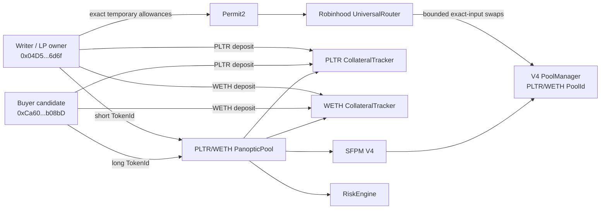

# PLTR/WETH two-actor lifecycle design and fork rehearsal

| Field | Value |
|---|---|
| Status | **Fork rehearsal pass; public lifecycle not authorized or executed** |
| Network represented | Robinhood Chain Testnet, chain ID `46630` |
| Exact public parent | Block `117448363`, hash `0x6415b70fdddd83d289e1c10e0b15da1e7fdf79569655e95fcfd832bf38d27eba` |
| Local result | 25 of 25 ordered calls and 4 of 4 required transaction-order reverts passed on loopback Anvil; premium observation changed; both actors closed with zero open legs |
| Proposal body SHA-256 | `e1aed0b348845d69db5abc5dbfb919d27e77a8c650580725c5130bf853241210` |
| Proposal file SHA-256 | `b0b15da1176eda890491a4375eb3d408875332f9f817c69a90c0c4eaf4c22eae` |
| Rehearsal file SHA-256 | `639934c5d1c96236a2550ca76a7f2d6588a609c4f89a832f5a17ec3c5684dc1f` |
| Authority | None: no key read, signature, nonce binding, or public RPC send path |

## 1. What this milestone proves

StonkHedge now has a deterministic, calldata-bearing proposal for the first
two-account PLTR/WETH Panoptic lifecycle and a successful replay of that
proposal against an exact Robinhood testnet state snapshot.

The replay demonstrated this complete local sequence:

```text
fund buyer WETH
  -> give writer exact temporary swap permissions
  -> swap PLTR/WETH in both directions
  -> deposit PLTR and WETH collateral for both actors
  -> writer opens one short call
  -> buyer opens a smaller matched long call
  -> generate fee and premium observations with two more swaps
  -> buyer closes first
  -> writer closes second
  -> clear every temporary swap allowance
```

The fork state ended with the original V4 liquidity restored, zero option legs
for both accounts, and zero ERC-20/Permit2 router allowances. The writer and
buyer collateral remains in their two CollateralTrackers. Standard withdrawals
are deliberately a later continuation because the safe withdrawal amount is a
post-close state result, not a number that should be guessed in advance.

This is not evidence of public user activity. Every state change occurred on a
loopback Anvil process using account impersonation. That process was stopped
and its state discarded after the report was written.

## 2. Where it fits in the architecture

The lifecycle uses the already-deployed market graph documented in the
[Robinhood testnet system architecture](../architecture/robinhood-testnet-system.md)
and the canonical contracts and receipts in the
[public-genesis milestone ledger](../progress/2026-09-11-public-genesis-milestone.md).
It deploys no new contract.



### Contracts touched by the proposal

| Component | Address | Why it is called |
|---|---|---|
| PLTR Stock Token | `0x1fbe1a0e43594b3455993b5de5fd0a7a266298d0` | Exact swap and collateral approvals; swap input/output asset |
| Testnet WETH | `0x33e4191705c386532ba27cbf171db86919200b94` | Buyer wrap, exact approvals, quote-side collateral, swap input/output asset |
| Permit2 | `0x000000000022d473030f116ddee9f6b43ac78ba3` | Second bounded allowance layer for UniversalRouter |
| UniversalRouter | `0x8876789976decbfcbbbe364623c63652db8c0904` | Executes the four exact-input V4 swaps |
| V4 PoolManager | `0x8366a39cc670b4001a1121b8f6a443a643e40951` | Holds the PLTR/WETH pool state; reached by the router and SFPM |
| PLTR CollateralTracker | `0x2146295437da444638a4cf80900a9e2d3b1315de` | Receives each actor's PLTR collateral and issues tracker shares |
| WETH CollateralTracker | `0x48d0e86df893b6032ebe9f14ac0eaa23a7949867` | Receives each actor's WETH collateral and issues tracker shares |
| PLTR/WETH PanopticPool | `0x042c0d9c497d62a85b3410f2773cfa748d18e586` | Opens, accounts for, and closes each actor's option position |
| SFPM V4 | `0x86ef420fd3e27c3ac896c479b19b6a840b97bee1` | Called by PanopticPool to add/remove tokenized option liquidity |
| RiskEngine | `0x3ad134ff173dfa0a892b4116a65b76b818218585` | Supplies spread, collateral, solvency, and safe-mode rules during dispatch |

PoolManager, SFPM, and RiskEngine are downstream calls rather than direct
transaction targets. The Stock registry, guardian, factory, treasurer, and
deployment contracts are not in the allowed target set.

## 3. Frozen test exposure

The proposal is a valueless mechanism test, not a quote or trading strategy.

| Input | Proposed cap |
|---|---:|
| Buyer native ETH wrapped | `0.0003` |
| Writer PLTR collateral | `0.5` |
| Writer WETH collateral | `0.0005` |
| Buyer PLTR collateral | `0.25` |
| Buyer WETH collateral | `0.00025` |
| Writer PLTR swap input, total | `0.002` |
| Writer WETH swap input, total | `0.000002` |
| Writer short size | `0.01` |
| Buyer matched long size | `0.001` |
| User effective-liquidity limit | `2,000` bps |

The option is one in-range PLTR call chunk at strike `-69060`, width `2`, and
ticks `-69120..-69000`. The published Panoptic SDK produces SFPM pool ID
`16897827167146926`, short TokenId
`3797733774652686947289370334126`, and long TokenId
`3797733779375053430159015547822`. Unit tests freeze those vectors.

The 2,000-bps effective-liquidity bound is explicit because a zero value means
“accept no long-side liquidity removal.” The first replay caught that exact
mistake: the writer short opened, then the long reverted with
`EffectiveLiquidityAboveThreshold()`. The corrected bound is below the
deployed RiskEngine maximum and the exact second replay passed.

## 4. Why the swap encoder is chain-bound

The deployed Robinhood UniversalRouter runtime does not accept the five-field
V4 exact-input-single tuple emitted by `@panoptic-eng/sdk@1.0.49`. Its deployed
V4 periphery revision adds a sixth field, `minHopPriceX36`, after
`amountOutMinimum`.

StonkHedge therefore uses a small product-local adapter for swaps and retains
the published Panoptic SDK for PoolId and TokenId construction. The adapter is
bound to:

- UniversalRouter `0x8876...0904`;
- runtime hash
  `0xfdd90802f39ce5fc8bac4c2f1b3ac7bac530fd17ff46b0630f1bd00f1e14082f`;
- Robinhood V4 periphery source commit
  `3779387e5d296f39df543d23524b050f89a62917`; and
- V4 action bytes `0x06`, `0x0c`, and `0x0f` inside Universal Router command
  `0x10`.

This is a compatibility adapter, not a protocol fork. Runtime drift, address
drift, or tuple drift must fail closed before any later execution candidate is
constructed.

## 5. The 25 calls and why order matters

These are local rehearsal ordinals, not public nonces or public transaction
hashes. Their exact calldata and hashes live in the
[proposal manifest](../../manifests/markets/robinhood-testnet-pltr-weth-lifecycle-proposal-2026-09-11.json);
the sanitized receipts live in the
[fork report](../../manifests/markets/robinhood-testnet-pltr-weth-lifecycle-fork-rehearsal-2026-09-11.json).

| # | Actor | Call | Why it is here |
|---:|---|---|---|
| 0 | Buyer | WETH `deposit()` for `0.0003 ETH` | Creates only the quote balance needed for buyer collateral before any WETH approval. |
| 1 | Writer | PLTR approve Permit2 for `0.002` | Opens the first, exact-bounded layer needed by the four swaps. |
| 2 | Writer | WETH approve Permit2 for `0.000002` | Mirrors the exact WETH swap budget; no unlimited approval is used. |
| 3 | Writer | Permit2 approve PLTR to UniversalRouter | Router cannot spend the ERC-20 allowance without this second layer. |
| 4 | Writer | Permit2 approve WETH to UniversalRouter | Completes the two-token router permission set before routing. |
| 5 | Writer | Swap `0.001 PLTR -> WETH` | Proves the deployed PLTR-to-WETH route and establishes the first baseline observation. |
| 6 | Writer | Swap `0.000001 WETH -> PLTR` | Proves the reverse route before collateral or options complicate diagnosis. |
| 7 | Writer | PLTR approve PLTR tracker for `0.5` | Opens only the amount consumed by the next deposit. |
| 8 | Writer | Deposit `0.5 PLTR` | Creates writer token0 collateral before the short. The tracker consumes the exact allowance. |
| 9 | Writer | WETH approve WETH tracker for `0.0005` | Opens only the amount consumed by the next deposit. |
| 10 | Writer | Deposit `0.0005 WETH` | Completes the writer's two-sided collateral before risk is introduced. |
| 11 | Buyer | PLTR approve PLTR tracker for `0.25` | Opens only the buyer's next token0 deposit. |
| 12 | Buyer | Deposit `0.25 PLTR` | Creates buyer token0 collateral before the long. |
| 13 | Buyer | WETH approve WETH tracker for `0.00025` | Opens only the buyer's next quote deposit. |
| 14 | Buyer | Deposit `0.00025 WETH` | Completes buyer collateral; both actors are now independently checkable. |
| 15 | Writer | Dispatch short call size `0.01` | Adds the offered option liquidity first, so the buyer has a matched chunk to remove. |
| 16 | Buyer | Dispatch long call size `0.001` | Removes only a bounded fraction of the writer-provided chunk under the 2,000-bps limit. |
| 17 | Writer | Swap `0.001 PLTR -> WETH` | Drives an in-position fee/premium observation without changing the strategy. |
| 18 | Writer | Swap `0.000001 WETH -> PLTR` | Drives the reverse observation and returns the tiny price movement near its baseline. |
| 19 | Buyer | Dispatch long size `0`, final list empty | The buyer closes first, returning removed liquidity while the writer position still exists. |
| 20 | Writer | Dispatch short size `0`, final list empty | The writer closes only after the long has returned liquidity, restoring the original active-liquidity state. |
| 21 | Writer | Permit2 revoke PLTR-to-router | Starts cleanup at the inner permission layer. |
| 22 | Writer | Permit2 revoke WETH-to-router | Removes the second inner router permission. |
| 23 | Writer | ERC-20 clear PLTR-to-Permit2 | Removes the outer PLTR path after the router can no longer spend it. |
| 24 | Writer | ERC-20 clear WETH-to-Permit2 | Completes cleanup; every temporary swap allowance is zero. |

The memory aid is **W-A-S-C-O-S-C**:

```text
Wrap -> Allow -> Swap -> Collateral -> Open -> Swap -> Close -> Clean
```

The order encodes four safety invariants:

1. assets exist before permissions, and permissions exist before consumption;
2. the swap route is tested before collateral or option state obscures a fault;
3. the short supplies chunk liquidity before the smaller matched long removes it;
4. the long closes before the short, and inner Permit2 permissions close before
   outer ERC-20 permissions.

## 6. Rehearsal evidence

| Checkpoint | Result |
|---|---|
| Exact fork identity | Chain `46630`, public parent block and hash matched |
| Initial actors | Nonces `13` and `16`; zero tracker shares and zero option legs |
| Baseline swaps | Both directions passed with bounded minimum outputs |
| Collateral | Writer deposited `0.5 PLTR + 0.0005 WETH`; buyer deposited `0.25 PLTR + 0.00025 WETH` |
| Position open | Writer and buyer each reached one open leg |
| Premium observation | Position/premium observations changed across indexes `17–18` |
| Ordered close | Buyer reached zero legs at `19`; writer reached zero at `20` |
| Pool restoration | Active liquidity returned from `185937095068141418` to genesis value `138450781996976174` |
| Permission cleanup | ERC-20 tracker allowances, ERC-20 Permit2 allowances, and Permit2 router amounts all zero |
| Required reverts | `4/4`: no-collateral open, expired swap, zero spread tolerance, and writer-first close |
| Public mutation | None |

Post-close tracker assets show the small premium/accounting movement rather
than pretending the deposits are unchanged:

| Actor | PLTR tracker assets | WETH tracker assets |
|---|---:|---:|
| Writer | `500000003440998825` | `500000894745013` |
| Buyer | `250000719187743372` | `249999914563099` |

## 7. Tool and evidence architecture

| Artifact | Responsibility | Authority boundary |
|---|---|---|
| `lifecycle-inputs-2026-09-11.json` | Human-readable proposed roles, caps, option geometry, and exact public snapshot | All authorization flags false |
| `prepare_robinhood_two_actor_lifecycle_plan.ts` | Offline validation and exact calldata generation | No RPC, key, signing, nonce, or send code |
| `robinhoodV4Swap.ts` | Runtime-bound six-field Robinhood V4 route encoding | Only encoding; cannot call a chain |
| `lifecycle-proposal-2026-09-11.json` | Deterministic 25-call body, source hashes, expected states, and exclusions | Null nonces; not executable authority |
| `simulate_robinhood_two_actor_lifecycle_fork.py` | Loopback-only account impersonation and state reconciliation | Refuses non-loopback and non-Anvil RPCs; no signing path |
| `lifecycle-fork-rehearsal-2026-09-11.json` | Sanitized local receipts and milestone state | Proves only the discarded fork replay |
| `prepare_robinhood_withdrawal_continuation.py` | Builds four nonce-free calls from fresh post-close `maxWithdraw` evidence | Offline only; rejects the privileged deployer as buyer |

The 2026-09-12 [safety and withdrawal boundary](./2026-09-12-lifecycle-safety-and-withdrawal-boundary.md)
documents the strengthened verifier, the new state-derived continuation, the
hard third-account buyer decision, and the fresh-head replay requirement.

## 8. What remains before any public lifecycle

This pass starts the lifecycle phase; it does not close it. The next work is:

1. retain the four passing transaction-order reverts and run the newly added
   fail-closed external-state and swap-output checks on a fresh exact head;
2. replace the buyer with a third unprivileged account. The current candidate
   buyer is also deployer, guardian admin, and treasurer and is now rejected by
   execution-preparation tooling;
3. review the exact collateral, sizes, strike, 2,000-bps spread limit, minimum
   outputs, and residual policy;
4. capture post-close `maxWithdraw` values in the fresh replay, generate the
   four-call bounded withdrawal continuation, and replay its exact sequence;
5. refresh public state, expiry, nonces, gas limits, and calldata against a new
   exact head;
6. build and simulate a one-transaction-at-a-time public operator with strict
   after-each-step verification; and
7. request a new hash-bound authorization that explicitly names the chosen
   actors and maximum transaction index.

No previous deployment or genesis authorization applies to this lifecycle.
No public swap, collateral deposit, option position, withdrawal, other market,
or mainnet action is authorized by this document or its manifests.
