# PLTR/WETH lifecycle safety and withdrawal boundary

| Field | Value |
|---|---|
| Date | 2026-09-12 |
| Network | Robinhood Chain Testnet (`46630`) |
| Outcome | Safety verifier and withdrawal-continuation preparer implemented locally |
| Public transactions | None |
| Signing or broadcast authority | None |
| Current blocker | Replace the privileged deployer-buyer with a third unprivileged account, then capture and replay a fresh exact head |

## 1. What this milestone changes

The completed 2026-09-11 lifecycle rehearsal remains historical evidence for
the discarded fork on which it ran: `25/25` planned calls succeeded and `4/4`
required order/safety transactions reverted. This milestone does not rewrite
that report or pretend it can still be reproduced from the old block.

Instead, it closes three preparation gaps in the next-generation tooling:

1. the loopback verifier now fails closed on external bytecode, immutable
   wiring, issuer controls, account state, allowance state, and actual swap
   outputs;
2. every actor observation now includes both `assetsOf` and `maxWithdraw` for
   each CollateralTracker, which makes post-close recovery amounts explicit;
3. a separate offline preparer can turn a fresh, clean post-close report into
   four nonce-free, state-derived withdrawal calls, but only when the buyer is
   a third unprivileged account.

No operator, keystore, signer, raw-transaction sender, or public RPC submission
path was added.

## 2. Updated evidence architecture

```mermaid
flowchart LR
    A[Fresh public read-only snapshot] --> B[Nonce-free lifecycle proposal]
    B --> C[Exact-head loopback Anvil fork]
    C --> D[External-state fail-closed verifier]
    D --> E[25 ordered lifecycle calls]
    E --> F[Swap input/output reconciliation]
    F --> G[Both positions closed]
    G --> H[Read assetsOf, shares, and maxWithdraw]
    H --> I[Offline withdrawal-only proposal]
    I --> J[Exact four-call sequence replay]
    J --> K[Human review]
    K --> L[Fresh public nonce and deadline binding]
    L --> M[Separate explicit authorization]
```



The separation matters. The lifecycle plan cannot guess safe withdrawals
before premium settlement and both closes. The withdrawal proposal therefore
depends on the post-close report, and any eventual public withdrawal proposal
must be regenerated from the real public post-close state rather than copied
from a discarded fork.

## 3. Fail-closed external-state checks

`simulate_robinhood_two_actor_lifecycle_fork.py` now observes and verifies the
following before impersonating either actor:

| Boundary | Exact check | Why it matters |
|---|---|---|
| Chain and pool identity | Chain ID `46630` and PoolId recomputed from the full PoolKey | Prevents replay on the wrong network or market |
| Runtime identity | Registry, PLTR proxy, WETH, Permit2, UniversalRouter, StateView, PanopticPool, and both trackers match committed bytes and hashes | Stops on upgrades, replacement code, or address drift |
| Stock controls | Registry pause, token pause, current/pending UI multiplier, effective time, and both blocklist results match the accepted state | External issuer controls can change liveness and accounting assumptions |
| Panoptic wiring | Pool-to-trackers, PoolManager, RiskEngine, SFPM, numeric pool ID, tracker-to-pool, and tracker-underlying links reconcile | A valid address with different immutable arguments is not the accepted market |
| Actor state | Frozen nonce, native/token balances, zero tracker shares, zero legs, and every ERC-20/Permit2 allowance match | Prevents accidental use of stale exposure or pre-existing approvals |
| Swap result | Exact input was spent and actual output is at least the calldata-bound minimum | A successful receipt alone is not sufficient lifecycle evidence |

The test suite mutates read-only copies of these observations and proves that
the verifier rejects a wrong PoolId, runtime drift, wiring drift, global pause,
blocked writer, multiplier drift, insufficient balance, elevated allowance,
and sub-minimum swap output. Those are verifier tests, not privileged calls
against the issuer contracts.

## 4. Withdrawal continuation design

`prepare_robinhood_withdrawal_continuation.py` consumes only files. It requires:

- a nonce-free lifecycle proposal with every authorization flag false;
- a loopback rehearsal bound to that plan's exact body and file hashes;
- a canonical `afterIndex24` state with both actors at zero open legs;
- zero ERC-20 and Permit2 allowances;
- positive tracker shares, `assetsOf`, and freshly read `maxWithdraw` values;
- `maxWithdraw <= assetsOf`; and
- no more than `2e12` raw units of residual claim per actor per asset.

When those checks pass, the preparer emits this bounded order:

| Continuation index | Actor | Call | Reason for order |
|---:|---|---|---|
| 0 | Buyer | PLTR tracker `withdraw(maxWithdraw, buyer, buyer)` | Removes the independent test buyer's token0 exposure first |
| 1 | Buyer | WETH tracker `withdraw(maxWithdraw, buyer, buyer)` | Completes buyer recovery before touching writer claims |
| 2 | Writer | PLTR tracker `withdraw(maxWithdraw, writer, writer)` | Recovers writer token0 only after buyer state is settled |
| 3 | Writer | WETH tracker `withdraw(maxWithdraw, writer, writer)` | Leaves one final terminal state to reconcile |

Each nonce remains `null`. Every call binds the tracker, owner, receiver,
assets, calldata hash, source shares, source `assetsOf`, and source
`maxWithdraw`. Before any later send, the operator must re-read
`maxWithdraw >= committed assets`; after each send it must wait for a canonical
receipt and reconcile the underlying balance and burned shares. Because one
withdrawal may change a later vault calculation, the exact four-call sequence
must pass on a fresh fork before it can become an execution candidate.

## 5. Buyer-role decision

The privileged address `0xCa60c8eF6934f8a97c6a503C4e3a46e87F5b08bD`
is the shared-stack deployer, guardian admin, and treasurer. It was acceptable
for a discarded-fork mechanism rehearsal because the proposal allowed only
ordinary user calls and contained no signing path. It is no longer accepted as
the buyer for execution preparation.

The withdrawal preparer enforces all of the following:

- writer and buyer are distinct;
- buyer is not the shared deployer address; and
- the buyer role is explicitly classified as unprivileged.

This removes an avoidable provenance ambiguity: a public buyer should prove
that the ordinary user path works without relying on an address that also owns
emergency or treasury powers.

## 6. Why there is no new replay artifact yet

The old reference block `117448363` is no longer available as archive state
from Robinhood's public RPC. Anvil now fails while creating that historical
fork with missing-trie-node/metadata errors. The already committed 2026-09-11
report remains evidence of its completed run, but it would be misleading to
generate a new report hash without a new passing run.

The next report must therefore use a fresh public head, new balances, a new
third actor, and new rehearsal-only expiry values. This is also why no
withdrawal proposal JSON is committed in this milestone: the existing report
predates `maxWithdraw` capture and its buyer now fails the unprivileged-role
gate.

## 7. Verification performed

```powershell
python -m unittest `
  scripts.tests.test_simulate_robinhood_two_actor_lifecycle_fork `
  scripts.tests.test_prepare_robinhood_withdrawal_continuation
```

The focused Python suite passes `10/10`. The existing TypeScript lifecycle
suite remains green at `7/7`. A direct attempt to prepare withdrawals from the
historical proposal stops before writing output with:

```text
execution preparation requires a third unprivileged buyer; the shared
deployer/guardian/treasurer is not accepted
```

## 8. Next milestone

The next milestone is **fresh three-account lifecycle rehearsal**, still with
no public broadcast:

1. create a third encrypted keystore locally and record only its public address;
2. fund that address from the Robinhood testnet faucet with valueless test ETH
   and Stock Tokens;
3. capture a fresh read-only snapshot for writer, third-account buyer, market,
   issuer controls, runtimes, wiring, balances, allowances, nonces, and head;
4. regenerate the nonce-free 25-call lifecycle proposal with the third buyer;
5. replay it on the exact fresh fork, including all fail-closed checks and
   amount-in/minimum-out reconciliation;
6. capture post-close `assetsOf`, shares, and `maxWithdraw`, generate the four
   withdrawal calls, and replay them in their exact order;
7. review the combined evidence and only then design a fresh nonce/time-bound
   one-step operator; and
8. request a separate, exact hash-bound public authorization if the owner still
   wants a public lifecycle.

Nothing in this document authorizes swaps, deposits, option positions,
withdrawals, another market, or mainnet activity.
