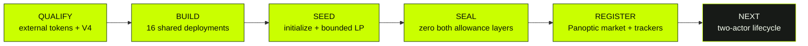
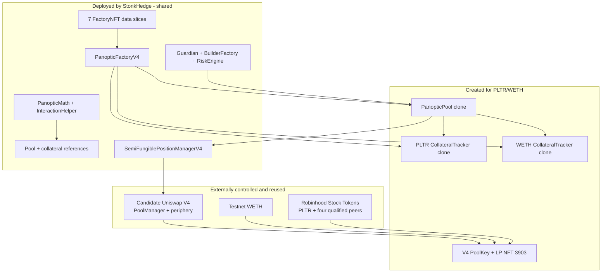

# StonkHedge public-genesis milestone

| Field | Verified value |
|---|---|
| State date | 2026-09-11 |
| Network | Robinhood Chain Testnet (`46630`) |
| Milestone | Shared Panoptic V4 stack deployed; PLTR/WETH V4 pool initialized and funded; first Panoptic market registered |
| StonkHedge deployments | 19 addresses: 16 shared deployments plus 3 per-market clones |
| StonkHedge-signed public transactions | 29: 16 shared deployment transactions plus 13 market-genesis transactions |
| External funding transactions | 2 faucet distributions, reported separately |
| First market | PLTR/WETH, fee `3000`, tick spacing `60`, zero hooks |
| Public lifecycle status | Not started: no public swap, collateral deposit, option position, premium observation, close, liquidation, or withdrawal |

This is the canonical human-readable account of StonkHedge's first public
testnet deployment milestone. It is backed by the [shared deployment
manifest](../../manifests/deployments/robinhood-testnet-direct-public-progress-2026-09-09.json),
the [final market-genesis manifest](../../manifests/markets/robinhood-testnet-pltr-weth-public-genesis-2026-09-11.json),
and fresh read-only reconciliation. The manifests remain authoritative for
machine-readable values.

> **Truth boundary:** this is a valueless mechanism test on Robinhood Chain
> Testnet. It is not an equity quote, issuer endorsement, independent audit,
> production release, mainnet authorization, or invitation to trade.

## 1. The achievement in plain language

StonkHedge now has a functioning public-chain foundation for testing
Panoptic-style perpetual options over Robinhood's faucet-distributed PLTR test
token:

1. Robinhood's external test tokens and an existing Uniswap V4 stack were
   qualified rather than silently treated as StonkHedge deployments.
2. A pinned Panoptic V2 core release was compiled into a 16-transaction,
   sender-and-nonce-bound deployment plan.
3. The 16 shared data, library, reference, authority, risk, position-management,
   and factory contracts were deployed and reconciled byte-for-byte.
4. A PLTR/WETH V4 PoolKey was initialized at a clearly labelled synthetic
   mechanism-test price.
5. The second actor minted bounded two-sided liquidity as Uniswap V4 position
   NFT `3903`.
6. Temporary ERC-20 and Permit2 permissions were explicitly cleared.
7. PanopticFactoryV4 created and registered one PanopticPool and two
   CollateralTracker clones for the initialized market.

The resulting graph is deployed and wired. The user lifecycle is deliberately
the next milestone, not a claim hidden inside this one.

### Memory aid: qualify, build, seed, seal, register

## 2. Architecture and provenance boundaries

The milestone spans three ownership classes. They must not be blended in
technical documentation or public announcements.

### 2.1 External contracts we qualified but did not deploy

| Component | Address | Why it is present | Provenance label |
|---|---|---|---|
| Stock registry / beacon | `0x1dF3cA0fD30ED5eeb09eB01938f4E9c5196E6Ca5` | Shared policy and implementation beacon for the faucet Stock Tokens | Robinhood testnet infrastructure |
| Stock implementation | `0xBd14156E05c6AF28ad39aA53a2AB8eB9CDf657DA` | Shared implementation behind the stock-token proxies | Robinhood testnet infrastructure |
| AMZN | `0x5884aD2f920c162CFBbACc88C9C51AA75eC09E02` | Qualified transferable faucet token | Robinhood faucet token; not deployed by StonkHedge |
| AMD | `0x71178BAc73cBeb415514eB542a8995b82669778d` | Qualified transferable faucet token | Robinhood faucet token; not deployed by StonkHedge |
| TSLA | `0xC9f9c86933092BbbfFF3CCb4b105A4A94bf3Bd4E` | Qualified transferable faucet token | Robinhood faucet token; not deployed by StonkHedge |
| PLTR | `0x1FBE1a0e43594b3455993B5dE5Fd0A7A266298d0` | Base asset in the first mechanism-test market | Robinhood faucet token; not deployed by StonkHedge |
| NFLX | `0x3b8262A63d25f0477c4DDE23F83cfe22Cb768C93` | Qualified transferable faucet token | Robinhood faucet token; not deployed by StonkHedge |
| WETH | `0x33e4191705c386532ba27cBF171Db86919200B94` | Quote asset and wrapped native test ETH | Robinhood testnet infrastructure |
| PoolManager | `0x8366a39CC670B4001A1121B8F6A443A643e40951` | Owns V4 pool state and executes initialize/modify-liquidity operations | Reused candidate; not an official Robinhood deployment claim |
| PositionManager | `0x58daec3116aae6D93017bAAea7749052E8a04fA7` | Mints and manages V4 liquidity-position NFTs | Reused candidate |
| Permit2 | `0x000000000022D473030F116dDEE9F6B43aC78BA3` | Bounded token authorization layer used by PositionManager | Reused candidate |
| Quoter | `0x8Dc178eFB8111BB0973Dd9d722ebeFF267c98F94` | Read-only quote simulation | Reused candidate; not yet part of public lifecycle evidence |
| StateView | `0xF3334192D15450CdD385c8B70e03f9A6bD9E673b` | Read access to V4 state | Reused candidate |
| UniversalRouter | `0x8876789976dEcBfCbBbe364623C63652db8C0904` | Candidate future swap routing | Reused candidate; no public swap has been made |

The candidate V4 stack was accepted for this bounded sandbox after runtime,
wiring, control-state, and provenance checks. That acceptance is neither an
endorsement by Robinhood nor a general mainnet qualification.

## 3. The 16 shared StonkHedge deployments

All 16 were built from Panoptic core commit
`f4abdd7de13ea1414eb1b8f97b53ecbc448b9b8d`. Robinhood testnet did not contain
Panoptic's preferred CREATE3 singleton, and upstream release salts were bound
to Panoptic's Safe. The testnet release therefore used direct `CREATE` from the
StonkHedge deployer `0xCa60c8eF6934f8a97c6a503C4e3a46e87F5b08bD`.

Direct `CREATE` makes the address a function of sender and nonce. This is why
the exact order was a safety property: changing, skipping, or inserting one
transaction would change every later predicted address and invalidate linked
constructor bytecode.

| # / nonce | Deployment | Created address | Canonical transaction | Block | Why at this point |
|---:|---|---|---|---:|---|
| 0 | FactoryNFT data slice 0 | `0x05449292522e3FCCD58dB4f947A94BD083d5e13d` | [`0xbf6a…fda9e`](https://explorer.testnet.chain.robinhood.com/tx/0xbf6ad4ddcf9a22f584f53de5053186a2d9e5ab93eecbfb0847633ab1ac4fda9e) | 116058458 | First immutable metadata segment required by the eventual factory |
| 1 | FactoryNFT data slice 1 | `0xb1820CEE1BE8b9eDdC382eE83304efBe5ceD0019` | [`0x2faa…2050`](https://explorer.testnet.chain.robinhood.com/tx/0x2faa5abd65568cf95a5439e86bc312fab2586a6f287c29a2d77fb2c32f6c2050) | 116067257 | Continues the ordered metadata pointer set |
| 2 | FactoryNFT data slice 2 | `0xa318218fEA30EA64c223A1c8E96551c68B007656` | [`0x122f…1dcd`](https://explorer.testnet.chain.robinhood.com/tx/0x122f14060ca93053445646b08260b0290400c45e4fa76e6925c634e59dce1dcd) | 116071445 | Continues the ordered metadata pointer set |
| 3 | FactoryNFT data slice 3 | `0xbAD75CD571AeE30644aBe85Da20B6Fa527106c5d` | [`0x5a97…d977`](https://explorer.testnet.chain.robinhood.com/tx/0x5a97890ee1c6262d39d8808cfa7f15e67d1e6e513b15d0f1af3498ecc905d977) | 116075738 | Continues the ordered metadata pointer set |
| 4 | FactoryNFT data slice 4 | `0x1F6f1daab8b0d9605D7A880bD738aEe6Fd764107` | [`0x3574…a3b`](https://explorer.testnet.chain.robinhood.com/tx/0x3574eb675f52135c29f4396cef21c92458bab91fecdc08ace1653e2e903f5a3b) | 116079235 | Continues the ordered metadata pointer set |
| 5 | FactoryNFT data slice 5 | `0xB1D560De10Fb3733d7A5dFefED0388A2435fdaBA` | [`0x7e92…42f`](https://explorer.testnet.chain.robinhood.com/tx/0x7e92dc2190ee5e89e32e3cff19cb933a00fe94202c36229104c905cea6cba42f) | 116082889 | Continues the ordered metadata pointer set |
| 6 | FactoryNFT data slice 6 | `0x19E58B3113579A02c2C266e1be0049766F333338` | [`0x74d6…cf7e`](https://explorer.testnet.chain.robinhood.com/tx/0x74d6aaf6568918c2b22aea366593ec2a3a7c4cdad48b123b9cc43f06ebb1cf7e) | 116087683 | Completes the seven immutable factory metadata segments |
| 7 | PanopticMath | `0x45bb5b5719bB2B6cf516BE7C063B4D318890D3e7` | [`0x7651…e9ca`](https://explorer.testnet.chain.robinhood.com/tx/0x76517a4e1b3c045a474a0123508143d29a0d6571b492a9f84a756ba151d0e9ca) | 116091933 | Shared mathematical dependency needed by later linked initcode |
| 8 | InteractionHelper | `0xDCf9936b330D6957CaD463f850D1F2B6F1eABc3A` | [`0x1375…d99`](https://explorer.testnet.chain.robinhood.com/tx/0x137518d0c035b72d9e2a155320eae6a58c9a968e105f99e2bbaeace77183cd99) | 116100739 | Shared interaction dependency needed by references and factory |
| 9 | CollateralTrackerV2 reference | `0x41119aAd1c69dba3934D0A061d312A52B06B27DF` | [`0xada9…f8cb`](https://explorer.testnet.chain.robinhood.com/tx/0xada976f64a54e3b95945e8a0d1a3e2018ef8208967e8f737954b71376b5af8cb) | 116105325 | Clone implementation must exist before the factory can create market trackers |
| 10 | PanopticGuardian | `0x4620fCf531A72EC24af9325dD1Fa476A59Bd7b9e` | [`0xf8d2…b222`](https://explorer.testnet.chain.robinhood.com/tx/0xf8d25dc1dc40287c926474dc5c3468c9dab06a618cfa248ce068cfaeb465b222) | 116111093 | Establishes testnet guardian-admin and treasurer authority used downstream |
| 11 | BuilderFactory | `0xAa1Cc5922f41C93d09CeCbE80373B63D96cC027B` | [`0xe818…1ac`](https://explorer.testnet.chain.robinhood.com/tx/0xe81804ec951300ab37156f53171ce200b400d4a2fbfc75900e7d60000c9181ac) | 116117316 | Owned by Guardian and required by RiskEngine construction |
| 12 | RiskEngine | `0x3Ad134ff173dFA0a892B4116A65B76B818218585` | [`0x9016…ce69`](https://explorer.testnet.chain.robinhood.com/tx/0x9016c3c23af95686aff1eb876257d854c909cf7a424e7e1b3b4627c14beace69) | 116319416 | Binds Guardian, BuilderFactory, solvency buffers, and `vegoid` before pools |
| 13 | SemiFungiblePositionManagerV4 | `0x86ef420fD3e27c3Ac896c479B19b6A840b97Bee1` | [`0x4505…8a71`](https://explorer.testnet.chain.robinhood.com/tx/0x45051fe95a982aecd8a463a4a06ceb5b0a226a4c7a88540fa7745706c1758a71) | 116323275 | Connects Panoptic positions to the qualified V4 PoolManager |
| 14 | PanopticPoolV2 reference | `0xfBA5b34cb1471605d82BBF395F244Fa41148b155` | [`0xa670…83f7`](https://explorer.testnet.chain.robinhood.com/tx/0xa6704349e2e7382a3a0a590a174d40f71d54388e3258a003b423746d3c9a83f7) | 116333319 | Clone implementation linked to SFPM and RiskEngine, required by factory |
| 15 | PanopticFactoryV4 | `0x96C3291C9b0C34b007893326ee9dcA534BfcFa0c` | [`0xdd57…3150`](https://explorer.testnet.chain.robinhood.com/tx/0xdd57acfa50ea1a9f5e06ca0825add442286f2457ea7d5a697c8cf505d7bd3150) | 116340671 | Last because its constructor binds the metadata pointers, references, and shared dependencies |

The first seven addresses hold immutable metadata bytes used by the factory's
NFT renderer; they are data contracts, not seven independent protocol logic
modules. The shared deployment reconciled all 16 runtime identities and 11
constructor/wiring assertions before market work began.

### Shared deployment ordering mnemonic: **7 D → 2 L → C G B R S P F**

- **7 D**ata slices establish factory metadata pointers.
- **2 L**ibraries establish shared linked code.
- **C**ollateral reference precedes the factory that clones it.
- **G**uardian precedes **B**uilderFactory and **R**iskEngine.
- **S**FPM connects Panoptic to V4.
- **P**ool reference binds SFPM and risk.
- **F**actory comes last and binds the completed graph.

## 4. The first PLTR/WETH market

| Property | Value |
|---|---|
| PoolId | `0xd600fd2ff936078114b72a01d3c6d31d449b7af12c24c82fb61efb7bf9c613ae` |
| Synthetic starting policy | `0.001` test WETH per PLTR; mechanism testing only, not a market quote |
| `sqrtPriceX96` / initial tick | `2505414483750479311864138015` / `-69082` |
| LP range | ticks `-81120` to `-57060` |
| Active liquidity | `138450781996976174` |
| LP NFT | PositionManager token `3903`, owned by the second actor |
| Assets paid | `1.977842344644879789` PLTR and `0.00198` WETH |
| Panoptic SFPM pool ID | `16897827167146926` |

The price was selected to exercise the mechanism with faucet-sized balances.
It must never be surfaced as a real PLTR price, valuation, oracle, or investment
signal.

### 4.1 All 13 genesis transactions, in execution order

The actor was `0x04D5A0f57Cb2e110faC9703024888cd4562B6d6f`. Every step used the policy
`ONE_TRANSACTION_WAIT_VERIFY_STOP_ON_MISMATCH`. The original deadline became
too short after nonce 3, so execution stopped safely; a fresh exact-head
simulation and separately authorized continuation resumed at nonce 4.

| Nonce | Action | Canonical transaction | Block | Why this order |
|---:|---|---|---:|---|
| 0 | Wrap `0.004` native test ETH into WETH | [`0x87ad…584f`](https://explorer.testnet.chain.robinhood.com/tx/0x87ad860e64bd75e9af7a55f638ad8523dcd7fc53a3147df4b85aa1753924584f) | 116988374 | Create the quote asset before approving or supplying it |
| 1 | Approve exactly 2 PLTR from ERC-20 to Permit2 | [`0xfc94…02b8`](https://explorer.testnet.chain.robinhood.com/tx/0xfc94846786de4214c015ae2c5c482b6bfe6c4d28f980c6964b7bb19f8e1202b8) | 116993087 | Permit2 cannot move PLTR until the token itself allows it |
| 2 | Approve exactly `0.002` WETH from ERC-20 to Permit2 | [`0xa9c3…946`](https://explorer.testnet.chain.robinhood.com/tx/0xa9c377c2362df4d23524a1302420c824941424632da9c374cc0b5e226b106946) | 116996104 | Establish the same bounded first-layer permission for WETH |
| 3 | Permit2 approval for PositionManager to use PLTR | [`0x4cb6…843a`](https://explorer.testnet.chain.robinhood.com/tx/0x4cb6f3c64ca7d873b2a02af93b0e571dcfa55b17dbee22cc58c7422333e4843a) | 116999668 | PositionManager requires a second-layer allowance; deadline then became unsafe |
| 4 | Refresh bounded PLTR Permit2 approval under the continuation deadline | [`0xcf35…e516`](https://explorer.testnet.chain.robinhood.com/tx/0xcf353d13b4ff8886deaf044feabed221200a926737325b24582546258552e516) | 117013304 | Replaces the aging time-bound permission before resuming |
| 5 | Permit2 approval for PositionManager to use WETH | [`0xf483…b11c`](https://explorer.testnet.chain.robinhood.com/tx/0xf4831adbcabf22576b78e82f1e7143f395ccc6a300a8621c1983bef8de0ab11c) | 117017451 | Completes the two bounded token paths needed for the LP mint |
| 6 | Initialize the exact PLTR/WETH V4 PoolKey | [`0x7724…7422`](https://explorer.testnet.chain.robinhood.com/tx/0x77243b77eda84facce380b94f39b24d2c675ea2e0c79dc44719e3724c01c7422) | 117018968 | A V4 pool must exist at a starting price before it can hold liquidity |
| 7 | Mint bounded two-sided liquidity NFT `3903` | [`0xc5fe…0725`](https://explorer.testnet.chain.robinhood.com/tx/0xc5fe4353812b1b38335e5a76e2c95090e73994196e26b00e7c8b148373b70725) | 117075884 | Creates positive liquidity required for meaningful pool and market registration checks |
| 8 | Revoke PLTR Permit2-to-PositionManager allowance | [`0xf79e…ca1`](https://explorer.testnet.chain.robinhood.com/tx/0xf79ee572890bf6e5c307147fe77ac397013a81f4b1e080fad385c149d9119ca1) | 117079255 | Removes the temporary second-layer PLTR permission immediately after use |
| 9 | Revoke WETH Permit2-to-PositionManager allowance | [`0x9bdb…7e0a`](https://explorer.testnet.chain.robinhood.com/tx/0x9bdbf4ad24aab1fa31b8b96588e9769a915c8f62571f6147395e2dba4c357e0a) | 117081880 | Removes the temporary second-layer WETH permission |
| 10 | Revoke PLTR ERC-20-to-Permit2 allowance | [`0x5457…6978`](https://explorer.testnet.chain.robinhood.com/tx/0x54573732b7031b4baa4fc968646e881d2f5d4c80ef6f28e83b60026ef95a6978) | 117085895 | Closes the first-layer PLTR authorization path |
| 11 | Revoke WETH ERC-20-to-Permit2 allowance | [`0xb4e6…82b2`](https://explorer.testnet.chain.robinhood.com/tx/0xb4e6333dee8461eb7b310c2d0091bf7296c48afb2b856096f34ce02a69c782b2) | 117089365 | Closes the first-layer WETH authorization path; all four allowances are now zero |
| 12 | Deploy/register Panoptic market and mint factory NFT | [`0x9081…4b05`](https://explorer.testnet.chain.robinhood.com/tx/0x9081a03002b0b1f902f05d3e85c9980be0dd2576b848998d6d0f1ac315a4b05e) | 117091700 | Last: factory registration is accepted only after exact PoolKey initialization, positive liquidity, and permission cleanup |

### Genesis ordering mnemonic: **W A A / A A / I M / Z Z Z Z / R**

**W**rap, four bounded **A**pproval operations across two layers, **I**nitialize,
**M**int liquidity, four **Z**eroing operations, then **R**egister. The safe
deadline pause occurred inside the approval phase and did not mutate the pool.

## 5. The per-market contracts created by the final transaction

These three minimal-proxy clones count as StonkHedge deployments but not as
three additional actor transactions: PanopticFactoryV4 created all three
inside nonce 12.

| Contract | Address | Role | Key verified wiring |
|---|---|---|---|
| PanopticPool | `0x042c0d9c497d62a85b3410f2773cfa748d18e586` | Market-level options engine for the exact PLTR/WETH V4 PoolKey | PoolManager, SFPM, RiskEngine, both trackers, and numeric SFPM pool ID reconcile |
| PLTR CollateralTracker | `0x2146295437da444638a4cf80900a9e2d3b1315de` | Tracks PLTR-side collateral accounting | Underlying PLTR, PanopticPool, RiskEngine, and PoolManager reconcile |
| WETH CollateralTracker | `0x48d0e86df893b6032ebe9f14ac0eaa23a7949867` | Tracks WETH-side collateral accounting | Underlying WETH, PanopticPool, RiskEngine, and PoolManager reconcile |

The factory also minted a deployment NFT to the second actor. Its token ID is
`uint256(uint160(PanopticPool))`, or
`23818381513481739879081106014905403647144289670` for this market.

## 6. Funding provenance

The faucet distributed test ETH and five Stock Tokens to each project account.
These transactions made bounded testing possible but are external funding
events, not StonkHedge deployment or operator transactions.

| Recipient | Transaction | Block | Classification |
|---|---|---:|---|
| Deployer `0xCa60…08bD` | [`0x4ad5…7d98`](https://explorer.testnet.chain.robinhood.com/tx/0x4ad5005f8f19e454a2a4b0bbe111f3f5ead57a15b146023f87000b3c18e47d98) | 115750101 | Robinhood faucet distribution |
| Second actor `0x04D5…d6f` | [`0xc9a5…69b9`](https://explorer.testnet.chain.robinhood.com/tx/0xc9a5d901ddb0bd2d109fda652029550ec96b280433e9fb18e385da7c18a169b9) | 116017132 | Robinhood faucet distribution |

## 7. Why the operational controls matter

- **Offline planning:** plan generation had no private-key, signing, broadcast,
  or RPC mutation capability.
- **Exact-head simulation:** each authorized run was replayed against fresh
  canonical state, including nonce and time-dependent preconditions.
- **Hash-bound authorization:** approval named the plan body, file, operator,
  simulation report, actor, maximum index, and exclusions.
- **One step at a time:** every transaction was reviewed, signed, mined,
  receipt-checked, and state-checked before the next.
- **Stop on mismatch:** a wrong password did not broadcast, and a shrinking
  liquidity deadline caused an intentional stop and fresh continuation plan.
- **Receipt-derived identity:** LP NFT `3903` came from the canonical mint
  receipt; it was not assumed from Uniswap's shared global counter.
- **Terminal cleanup:** both ERC-20 allowances and both Permit2 allowances were
  verified as zero before the authorization closed.

These controls do not replace an independent audit. They make this particular
testnet procedure reproducible and reduce operator error.

## 8. Verified terminal state

At reconciliation block `117093052`:

- all 29 StonkHedge-signed public transactions had canonical successful
  receipts;
- deployer nonce was `16` and actor nonce was `13`;
- all 19 StonkHedge-deployed addresses had the expected code or clone identity;
- the PLTR/WETH PoolKey remained at the accepted synthetic starting state;
- LP NFT `3903` belonged to the second actor with liquidity
  `138450781996976174`;
- factory mapping returned PanopticPool `0x042c…e586`;
- the PanopticPool and both CollateralTrackers reconciled their full wiring;
- SFPM market ID `16897827167146926` was nonzero; and
- all four temporary token permissions were zero.

The final market-genesis transaction was
[`0x9081a03002b0b1f902f05d3e85c9980be0dd2576b848998d6d0f1ac315a4b05e`](https://explorer.testnet.chain.robinhood.com/tx/0x9081a03002b0b1f902f05d3e85c9980be0dd2576b848998d6d0f1ac315a4b05e),
mined successfully in block `117091700`.

## 9. What we can and cannot say publicly

### Accurate milestone language

- “StonkHedge deployed and reconciled a 16-contract shared Panoptic V4 stack on
  Robinhood Chain Testnet.”
- “We initialized a faucet-scale PLTR/WETH Uniswap V4 pool and minted bounded
  two-sided test liquidity.”
- “We registered the first Panoptic market, producing one PanopticPool and two
  CollateralTracker clones.”
- “The deployment and genesis sequence contains 29 successful
  StonkHedge-signed public testnet transactions.”
- “All temporary genesis allowances were verified as zero at completion.”
- “The next target is a controlled two-actor options lifecycle.”

### Language to avoid

- Do not say the project deployed or issued Robinhood's Stock Tokens.
- Do not call the synthetic `0.001` WETH/PLTR starting policy a quote or price
  feed.
- Do not call the candidate V4 contracts official Robinhood infrastructure.
- Do not say options trading, hedging, collateral, swaps, or the user app are
  live.
- Do not call the contracts audited, mainnet-ready, production-safe, or
  endorsed by Robinhood, Panoptic, Uniswap, Palantir, or any token issuer.
- Do not imply that successful testnet mechanics confer regulatory approval or
  production rights.

### Short release-ready fact sheet

> StonkHedge has completed its first public market-genesis milestone on
> Robinhood Chain Testnet. A pinned Panoptic V2 release was deployed as 16
> shared contracts, then connected to an initialized PLTR/WETH Uniswap V4
> PoolKey with bounded faucet liquidity. The final factory call created and
> registered a PanopticPool and two asset-specific CollateralTrackers. Across
> the shared release and market genesis, 29 StonkHedge-signed transactions
> succeeded, and all temporary token permissions were cleared. This remains a
> valueless, unaudited mechanism test; public options lifecycle testing is the
> next gate.

## 10. Evidence and related architecture

| Need | Canonical record |
|---|---|
| System components, flows, and trust boundaries | [Robinhood testnet architecture](../architecture/robinhood-testnet-system.md) |
| Shared deployment receipts and reconciliation | [Direct-deployment public progress](../deployment/2026-09-09-direct-deployment-public-progress.md) |
| V4 and token qualification | [Robinhood testnet qualification](../chain/2026-09-08-robinhood-testnet-qualification.md) |
| Original and continued genesis execution | [PLTR/WETH public continuation](../markets/2026-09-10-pltr-weth-public-continuation.md) |
| Forward gates | [Market-genesis roadmap](../roadmap/2026-09-09-market-genesis.md) |
| Exact machine-readable terminal state | [Final public-genesis manifest](../../manifests/markets/robinhood-testnet-pltr-weth-public-genesis-2026-09-11.json) |
| Shared deployment machine evidence | [Shared deployment manifest](../../manifests/deployments/robinhood-testnet-direct-public-progress-2026-09-09.json) |
| Chain addresses and external provenance | [Chain manifest](../../manifests/chains/robinhood-testnet-46630.json) |

## 11. Media-pack provenance

The initial visual pack was supplied by the project owner on 2026-09-11 and is
used by the build-in-public site:

- black-background StonkHedge / Robinhood testnet hero;
- transparent green crystal character;
- park-scene StonkHedge hero; and
- six-second animated brand video.

Their checksums and publication-rights reminder live beside the copied site
assets in `public/media/README.md`. Confirm rights and any required attribution
before a commercial or third-party press distribution.

## 12. Next milestone

The next logical gate is not another deployment claim. It is a fresh,
separately reviewed two-actor public lifecycle plan covering:

1. minimal SDK adapters and golden vectors;
2. a controlled swap or other explicitly selected price-transition mechanism;
3. bounded collateral approval and deposit;
4. one small option-position open;
5. premium and solvency observation over time;
6. clean close and withdrawal;
7. negative/adverse-state behavior and cleanup; and
8. a first-user developer experience backed by the same evidence schema as the
   public progress dashboard.

No transaction in that lifecycle is authorized by this milestone record.
