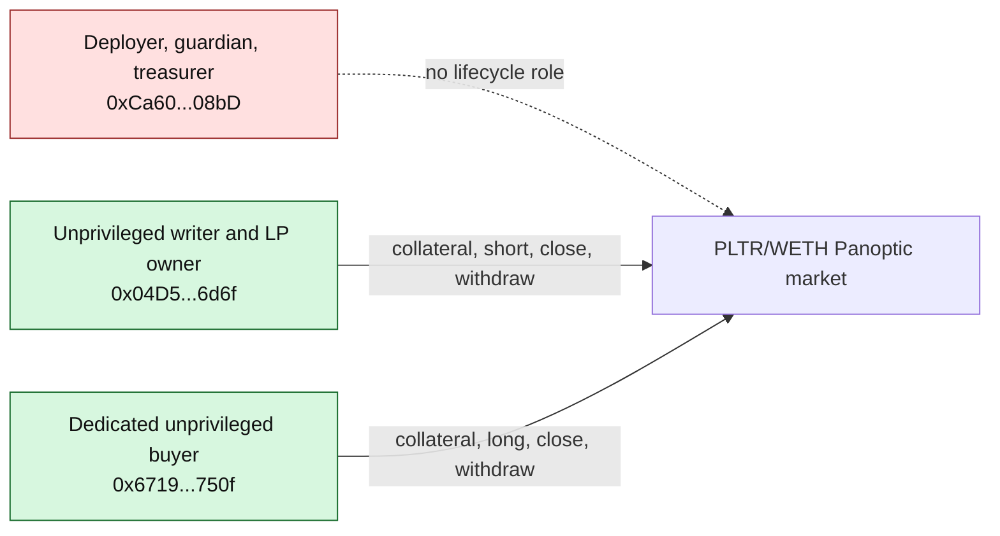
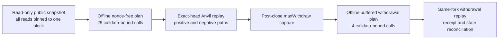

# Three-account PLTR/WETH lifecycle and withdrawal rehearsal

| Field | Value |
|---|---|
| Date | 2026-09-14 |
| Network source | Robinhood Chain Testnet (`46630`) |
| Public snapshot | Block `119052230`, hash `0x4d3e584cbb313286fde094af25c3107015fe3c35cbf577c63547a8908732e41f` |
| Writer | `0x04D5A0f57Cb2e110faC9703024888cd4562B6d6f` |
| Dedicated buyer | `0x6719E877C05b2d6c28aBceA405fC033FEeF5750f` |
| Lifecycle result | `25/25` calls, `4/4` required reverts, `8/8` fail-closed cases, `4/4` swap checks passed |
| Withdrawal result | `4/4` state-derived calls and all postconditions passed |
| Public transactions | None |
| Signing, nonce binding, or broadcast authority | None |

## 1. Milestone outcome

StonkHedge has now rehearsed the complete bounded PLTR/WETH user lifecycle with
three separated accounts and no privileged buyer:

```text
publicly deployed market
  -> second actor writes the bounded short
  -> dedicated third actor buys the matched long
  -> both actors close in dependency-safe order
  -> all temporary approvals return to zero
  -> post-close withdrawal limits are measured
  -> both actors recover bounded collateral
  -> residual tracker assets remain below the accepted ceiling
```

Only the starting state came from Robinhood testnet. All 29 state-changing
calls ran against a discarded loopback Anvil fork through account
impersonation. No private key was loaded, no transaction was signed, and no
public RPC submission method was used.

This proves the deployed contracts can support the intended mechanism path at
the captured state. It is not yet evidence of public user execution and it is
not authorization to create that evidence.

## 2. Three-account trust separation



The snapshotter and planner both reject a buyer equal to the writer or shared
deployer. The buyer role must explicitly be marked `UNPRIVILEGED`, and every
authorization field remains false. This closes the provenance ambiguity in the
historical two-account rehearsal.

## 3. Evidence pipeline



The public snapshotter records chain and block identity, Stock Token controls,
PoolId and live pool state, both actors' nonces and balances, blocklist state,
zero open positions, zero tracker shares, and zero ERC-20/Permit2 allowances.
Every read is made at the same block tag. It deliberately records no TWAP
instead of mislabelling the spot tick as one.

The lifecycle simulator then verifies runtime identities and immutable wiring
before impersonating either user. Its four swaps reconcile exact input spent
and output received against the calldata-bound minimum. Its negative evidence
includes four transaction-order reverts and eight in-memory adverse preflight
mutations; no issuer-admin method is called.

## 4. Why the 25 lifecycle calls are ordered this way

| Indexes | Stage | Why this order is required |
|---:|---|---|
| `0` | Buyer wraps `0.0003 ETH` | Establishes bounded WETH before any buyer approval |
| `1–4` | Writer grants exact ERC-20 and Permit2 router allowances | UniversalRouter requires both permission layers; no unlimited approval is used |
| `5–6` | Writer swaps in both directions | Proves routing and minimum-output enforcement before collateral or options complicate diagnosis |
| `7–10` | Writer approves and deposits PLTR/WETH | Establishes two-sided writer collateral before the short is opened |
| `11–14` | Buyer approves and deposits PLTR/WETH | Establishes independent buyer collateral before the long is opened |
| `15` | Writer opens the bounded short call | The matched short liquidity must exist before the buyer removes its long chunk |
| `16` | Buyer opens the smaller matched long call | Exercises the ordinary-user buyer path against the existing writer position |
| `17–18` | Writer performs two bounded swaps | Produces in-position fee/premium observations and returns price near baseline |
| `19` | Buyer closes first | Releasing the removed liquidity is a prerequisite for the writer's final close |
| `20` | Writer closes second | Leaves both users at zero open legs before permission cleanup |
| `21–24` | Writer clears Permit2, then ERC-20 allowances | Removes inner router permissions before outer token permissions and ends at zero allowance |

The four required negative transactions prove that opening without collateral,
using an expired swap deadline, opening with zero effective-liquidity
tolerance, and closing the writer while the matched buyer remains open all
fail on the fork.

## 5. Withdrawal discovery and correction

The first attempted withdrawal rehearsal failed locally with
`ExceedsMaximumRedemption`. That was not contract corruption or public-chain
state damage. The tracker implements this sequence:

```text
withdraw(requested assets)
  -> accrueInterest(owner)
  -> recompute maxWithdraw(owner)
  -> reject if requested assets now exceed the recomputed maximum
```

A view-only `maxWithdraw` sampled immediately before the call can therefore be
one raw unit above the value seen after internal accrual. The preparer now
subtracts a fixed `1e12` raw-unit execution buffer. That buffer remains inside
the previously accepted `2e12` raw-unit residual ceiling.

The second local verifier stop exposed a related accounting detail: internal
interest accrual can burn tracker shares before the withdrawal burns its own
shares. The final verifier therefore reconciles:

```text
actor share balance delta
  = sum of tracker Transfer(owner -> zero) events
  = interest-accrual burn + Withdraw-event share burn
```

It separately requires the `Withdraw` event's asset amount and the actor's
underlying-token balance increase to equal the committed withdrawal amount.
Any verifier exception now restores an Anvil snapshot to the pristine
post-close state.

## 6. Four-call withdrawal sequence and results

| Index | Actor | Asset | Withdrawn raw units | Final residual raw units |
|---:|---|---|---:|---:|
| `0` | Buyer | PLTR | `249999719178821104` | `999999999999` |
| `1` | Buyer | WETH | `248999914563099` | `1000000000000` |
| `2` | Writer | PLTR | `499999003449921092` | `1000000000001` |
| `3` | Writer | WETH | `499000894745013` | `1000000000000` |

Buyer-first ordering prevents the writer's larger claims from changing the
buyer's available recovery. Within each actor, token0 precedes token1 so there
is one deterministic sequence to review and reproduce. Every final residual is
at or just above the `1e12` execution buffer and below the `2e12` ceiling.

## 7. Hash ledger

| Artifact | SHA-256 or body hash |
|---|---|
| Lifecycle input file | `7ce559f915777e1cc5edaec9a9accfddeb36dd4e49c1bd6afcaf9db88edbd7ce` |
| Lifecycle plan body | `a3ffd5a0157d69b6841d72eb914c1c1fd07d4e652c6c5906d55dc862b7476d33` |
| Lifecycle plan file | `e2ba5f4f4826d20dcd57e2f31e5877a80e8ef52a2c4b713e765869f7cf6dd6bb` |
| Lifecycle rehearsal file | `5c30aa9a107b6dbafb49eb5321f05754b47d4ea4cdcb1850a02414671c38429b` |
| Withdrawal plan body | `eba3dcd7560022518d33a149e2aae742385d881cf5cdc1d4f0a06fdbedb48112` |
| Withdrawal plan file | `3e711644f4dc9c855efb875eea85395c23cc39f20c43a5446af04d66143378d0` |
| Withdrawal rehearsal file | `60a837dd34f5e7df72129916bb9298149813e0f26048c2a4ddebff42f7710948` |

These artifacts are mutually hash-bound. Because the public RPC has a short
historical-state window, the running Anvil fork was established first and its
exact head was then used for the pinned public snapshot. This retains exact
state identity without claiming archive-node availability.

The implementations that produced and checked the evidence are also frozen by
the manifests:

| Implementation | SHA-256 |
|---|---|
| Read-only snapshotter | `ce0c5d6eafa7effb5e00dd1b7fdfbf53529489fc83a2a0bff68f90973bb5c261` |
| Offline lifecycle planner | `ddde5487247eb032ffe5cd0b3fab80484032653564b93a435aabe455c5c3a0c7` |
| Lifecycle fork simulator | `09085da8845f15a7158665c1354da24d62b6c027ae34151cabb08e8ee6b8a25d` |
| Withdrawal preparer | `63f2d196f58f21b8a3a7d5ada05e8f5777092fad2df667664a8b1abe91b362ed` |
| Withdrawal fork simulator | `11eaabfa1f1beec26d15a94644cacff4a6866f01c5fb79613998e4f9b331a3ef` |

## 8. Verification gates

The repository-wide validation run after freezing the evidence passed:

```powershell
python -m unittest discover -s scripts\tests -p "test_*.py" # 100/100
npm run check                                                    # 17/17 + production build
python -m py_compile scripts\capture_robinhood_lifecycle_inputs.py `
  scripts\prepare_robinhood_withdrawal_continuation.py `
  scripts\simulate_robinhood_withdrawal_continuation_fork.py
```

An additional offline provenance check recomputed both canonical plan-body
hashes and every file/source/report cross-binding. All matched. The scoped
source and evidence contain no keystore payload, private key, signature, or raw
signed transaction.

## 9. What is and is not complete

Complete:

- third-account buyer separation and faucet funding;
- reproducible pinned snapshot tooling;
- fresh nonce-free lifecycle calldata generation;
- full positive, negative, adverse-state, swap, close, allowance-cleanup, and
  withdrawal replay;
- bounded residual and receipt-event reconciliation.

Still excluded:

- public swaps, collateral deposits, options, closes, or withdrawals;
- nonce/deadline-bound execution plans;
- keystore loading, signatures, broadcast operators, or authorization files;
- other markets and all mainnet activity.

## 10. Next gate

The next milestone is **execution-preparation review**, not public execution:

1. independently review the roles, exact exposure caps, token IDs, transaction
   ordering, minimum outputs, withdrawal buffer, and all artifact hashes;
2. verify the writer and buyer public balances/nonces have not been changed by
   unrelated activity;
3. design a one-transaction-at-a-time operator that binds separate sender
   nonces, short-lived deadlines, exact calldata, receipt checks, and stop-on-
   mismatch behavior;
4. simulate that operator against another fresh head; and
5. only then request a separate explicit hash-bound authorization.

Nothing in this milestone constitutes that authorization.
