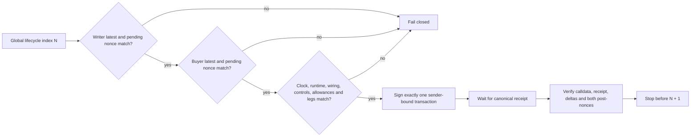

# PLTR/WETH lifecycle execution preparation

| Field | Value |
|---|---|
| Date | 2026-09-15 |
| Network source | Robinhood Chain Testnet (`46630`) |
| Fresh public reference | Block `120109926`, hash `0x55963b621b9118194476747c8bb569d08414eadeba4f85966a9f6ac1a18c0f88` |
| Writer | `0x04D5A0f57Cb2e110faC9703024888cd4562B6d6f` |
| Dedicated buyer | `0x6719E877C05b2d6c28aBceA405fC033FEeF5750f` |
| One-step operator replay | `25/25` calls passed on exact-head Anvil |
| Adverse state checks | `8/8` rejected by fail-closed preflight |
| Public lifecycle transactions | None |
| Signing or broadcast authorization | None |

The authorization-ready evidence was refreshed after the initial preparation
run. The current hashes and clocks in this document supersede the earlier
candidate; unchanged account state and a second complete `25/25` operator
replay were verified before freezing this revision.

## 1. Milestone outcome

StonkHedge now has a complete **execution-preparation lane** for the first
public PLTR/WETH options lifecycle. The lane converts the previously proven,
nonce-free 25-call design into two independently sequenced account streams,
refreshes the time-sensitive calldata, and exercises the same one-transaction,
wait, verify, stop discipline used for market genesis.

```text
fresh read-only public qualification
  -> exact accepted starting state
  -> writer nonce stream 13..30
  -> buyer nonce stream 0..6
  -> short-lived Permit2 and swap clocks
  -> exact-head local one-step replay
  -> receipt + state + both-nonce reconciliation after every call
  -> stop before public authorization
```

The resulting operator is technically capable of signing through an encrypted
Foundry keystore, but that path is closed unless a separate authorization file
matches the exact plan, operator, and simulation hashes. This milestone did not
load either keystore, request a password, create a signature, or submit a
public transaction.

## 2. Why two nonce streams are one global safety lock

Ethereum nonces order transactions per sender, not across senders. The lifecycle
alternates between the writer and buyer, so checking only the active sender
would allow a valid but wrongly ordered call. Each transaction therefore binds
the expected **confirmed and pending nonce for both actors** before it may be
signed.



For example, lifecycle index `11` is buyer nonce `1`, but it is permitted only
after the writer has reached nonce `23`. Any unrelated transaction from either
account changes the vector and stops the operator before password entry.

## 3. Fresh public preflight

The read-only qualifier rechecked the state that the 2026-09-14 rehearsal had
accepted. All reads were pinned to block `120109926`; pending nonces were then
sampled immediately and required to equal the confirmed values.

| Check | Result |
|---|---|
| Chain and PoolId | `46630`; exact PLTR/WETH PoolId retained |
| Pool state | Tick `-69082`; active liquidity `138450781996976174` |
| Stock controls | Registry and token unpaused; multipliers unchanged; both actors unblocked |
| Writer | Nonce `13`; balances unchanged; zero tracker shares, legs, and allowances |
| Buyer | Nonce `0`; balances unchanged; zero tracker shares, legs, and allowances |
| Pending queues | Both pending nonces equal their confirmed nonces |

This is a deliberately strict equality gate. It does not silently resize an
accepted transaction because a balance, allowance, PoolId, tick, liquidity
value, or actor nonce changed.

## 4. Time and exposure policy

The execution candidate preserves every amount, minimum output, TokenId, strike,
width, target, and call order from the successful rehearsal. Only the six live
deadline-bearing calldata blobs change:

- Permit2 grants at indexes `3` and `4` expire six hours after the pinned block;
- swaps at indexes `5`, `6`, `17`, and `18` expire four hours after the pinned
  block; and
- zero-amount Permit2 cleanup calls at `21` and `22` remain encoded with zero
  expiry and are still audited as time-sensitive permission cleanup.

| Bound | Exact value |
|---|---:|
| Buyer native wrap | `0.0003 ETH` |
| Writer collateral | `0.5 PLTR` and `0.0005 WETH` |
| Buyer collateral | `0.25 PLTR` and `0.00025 WETH` |
| Total writer swap input | `0.002 PLTR` and `0.000002 WETH` |
| Per PLTR swap minimum output | `0.0000008 WETH` |
| Per WETH swap minimum output | `0.0008 PLTR` |
| Writer short size | `10000000000000000` raw units |
| Buyer matched long size | `1000000000000000` raw units |
| Strike / width | `-69060` / `2` spacing units |
| Position range | ticks `-69120` to `-69000` |
| Effective-liquidity limit | `2000` bps |

The frozen candidate uses reference time `2026-09-15T21:13:38Z`, swap deadline
`2026-09-16T01:13:38Z`, and Permit2 expiry `2026-09-16T03:13:38Z`. These values
are evidence of the replay, not a standing execution window. If the safety
margin expires before authorization, the entire preflight, plan, and simulation
must be regenerated and re-hashed.

## 5. The 25 transactions and why they remain in this order

| Global index | Sender nonce | Action | Ordering reason |
|---:|---:|---|---|
| `0` | Buyer `0` | Wrap `0.0003 ETH` into WETH | Funds buyer WETH collateral before any approval |
| `1` | Writer `13` | Approve exact PLTR swap budget to Permit2 | Establishes the outer PLTR permission layer |
| `2` | Writer `14` | Approve exact WETH swap budget to Permit2 | Establishes the outer WETH permission layer |
| `3` | Writer `15` | Permit2 PLTR grant to UniversalRouter | Adds the bounded inner router permission |
| `4` | Writer `16` | Permit2 WETH grant to UniversalRouter | Completes router prerequisites without unlimited approval |
| `5` | Writer `17` | Swap exact-input PLTR to WETH | Proves the currency0-to-currency1 route and output floor |
| `6` | Writer `18` | Swap exact-input WETH to PLTR | Proves the reverse route before collateral complicates diagnosis |
| `7` | Writer `19` | Approve exact PLTR collateral | Authorizes only the immediately following tracker deposit |
| `8` | Writer `20` | Deposit PLTR into tracker0 | Establishes writer token0 collateral and consumes approval |
| `9` | Writer `21` | Approve exact WETH collateral | Authorizes only the immediately following tracker deposit |
| `10` | Writer `22` | Deposit WETH into tracker1 | Establishes writer token1 collateral and consumes approval |
| `11` | Buyer `1` | Approve exact PLTR collateral | Begins the independent buyer collateral path |
| `12` | Buyer `2` | Deposit PLTR into tracker0 | Establishes buyer token0 collateral and consumes approval |
| `13` | Buyer `3` | Approve exact WETH collateral | Binds the buyer's final collateral permission |
| `14` | Buyer `4` | Deposit WETH into tracker1 | Establishes buyer token1 collateral before any long |
| `15` | Writer `23` | Open bounded short call | Writer liquidity must exist before the matched long removes it |
| `16` | Buyer `5` | Open smaller matched long call | Exercises the dedicated ordinary-user buyer path |
| `17` | Writer `24` | Premium-driving PLTR-to-WETH swap | Moves in-range fee/premium accounting under a bounded input |
| `18` | Writer `25` | Premium-driving WETH-to-PLTR swap | Returns direction and provides the second premium observation |
| `19` | Buyer `6` | Close the matched long | Restores removed liquidity before the writer closes |
| `20` | Writer `26` | Close the short | Leaves both actors with zero option legs |
| `21` | Writer `27` | Revoke PLTR Permit2 router allowance | Removes the inner PLTR permission first |
| `22` | Writer `28` | Revoke WETH Permit2 router allowance | Removes the inner WETH permission first |
| `23` | Writer `29` | Clear PLTR ERC-20 allowance to Permit2 | Removes the outer PLTR permission |
| `24` | Writer `30` | Clear WETH ERC-20 allowance to Permit2 | Ends with every temporary allowance at zero |

## 6. What the one-step operator verifies

Before every transaction, the operator requires:

- exact plan regeneration and source-file hashes;
- chain `46630`, both latest nonces, and both pending nonces;
- Stock Token pause, multiplier, blocklist, runtime, and immutable-wiring state;
- the exact allowance schedule, tracker-share milestones, and option-leg count;
- a live gas estimate below the per-transaction cap and enough native balance;
- a four-hour/six-hour clock that still satisfies the configured margin; and
- an authorization whose permitted and excluded scopes exactly match the code.

After a receipt, it verifies the sender, target, nonce, value, full input,
transaction hash, gas bound, both post-nonces, and expected post-state. Swaps
must spend the exact input and receive at least the committed minimum. Deposits
must transfer the exact asset amount and increase tracker shares. The WETH wrap
must mint exactly the native value. Allowances and option-leg counts must match
the next global index.

No automatic loop exists in the public path. A successful call returns
`PASS_STOP_BEFORE_NEXT`; the next index requires another explicit command and
another password prompt from whichever role owns that transaction.

## 7. Exact-head replay results

The final evidence run forked the candidate's exact public block, mined one
local compatibility block, and used Anvil impersonation for the two public
addresses. It did not load either encrypted keystore.

| Result | Evidence |
|---|---|
| One-step calls | `25/25` `PASS_STOP_BEFORE_NEXT` |
| Writer nonce transition | `13 -> 31` |
| Buyer nonce transition | `0 -> 7` |
| Controlled swaps | `4/4` exact input and minimum output checks passed |
| Premium observation | Changed between post-open and post-swap milestones |
| Terminal option state | Writer `0` legs; buyer `0` legs |
| Terminal permissions | All ERC-20 and Permit2 allowance amounts zero |
| Total local gas used | `3,744,435` |
| Largest local call | Writer short open, `607,881` gas |
| Public mutation | None |

The prior source rehearsal remains the proof for four required transaction
reverts. This operator replay additionally reran all eight fail-closed adverse
state mutations and proved the positive path under the exact dual-nonce and
deadline policy.

## 8. Hash ledger

| Artifact | SHA-256 or canonical body hash |
|---|---|
| Public preflight body | `eb0425c657c762e8ddf8fa6cfbc28320eebac9356fa2afbe138baa201fae24f5` |
| Public preflight file | `cea5dc3f98b43c2599c77008400ad7da9f4e5ca1283b526f1d676476a1f70fc6` |
| Execution candidate body | `a3b454799853ddf2ce87d0bc2fcbd093d32a0bcf611c2178fb0af123b7552ae3` |
| Execution candidate file | `67e11d16ca5556a2525c6c3c50e7c25fea9f6e84493c173bbf17b8b6a8510e2c` |
| Read-only qualifier | `78ac0868402cbdc8f89e09d3c03acc688d431e0c57aa5bd0cbe94ee9a0fb22f9` |
| Offline execution preparer | `b4538b3ac1e0a82f982f4069f5d05a29b227644fe316e2b3ae518b97f027f170` |
| One-step operator | `cdc85dfc524f68b39f3a044fe2796aa67a9826e0061d8f29309ba397d7ed38c4` |
| Exact-fork simulation runner | `001e714a357500bdc324d8816c9946b4d94bed795feae18fb83a5ab995a40db0` |
| Operator simulation report | `29a50349ddbfd7cad2f78435b92739ead31f01a9eb81c7b4971106a32230adce` |

These hashes are cross-bound in the machine-readable artifacts. Editing the
operator, simulation runner, plan, preflight, or source evidence invalidates
the authorization validator.

## 9. What remains excluded

This milestone does not authorize or complete:

- any public wrap, approval, swap, collateral deposit, option position, close,
  allowance cleanup, or withdrawal;
- the four state-derived withdrawals, which require a new plan from actual
  public post-close `maxWithdraw` values;
- another ticker, issuer administration, factory administration, deployment,
  mainnet activity, or real-value use; or
- a claim of external audit, issuer endorsement, economic depth, or a live
  equity price.

## 10. Next gate

The next safe step is human review of this document and the three new manifests.
If the current time margin is still sufficient, the owner may then provide a
new explicit authorization that names the exact execution plan body and file,
operator, simulation report, both role addresses, maximum index `24`, and
`ONE_TRANSACTION_WAIT_VERIFY_STOP_ON_MISMATCH` policy. If any hash, nonce,
balance, deadline, runtime, issuer control, pool state, or pending queue has
changed, regenerate from a fresh public head and repeat the exact simulation.

Only after all 25 public receipts reconcile may StonkHedge read the real
post-close tracker state, create a fresh buffered withdrawal continuation, and
request a distinct withdrawal authorization.
