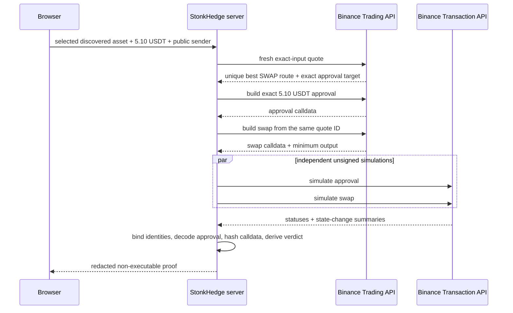

# BNB Gap Guardian unsigned-simulation milestone

**Date:** 2026-10-09

**Network:** BNB Smart Chain (`56`)

**Status:** implemented, tested, and live-negative accepted

**Boundary:** simulation only; no wallet, private key, signing, broadcast, or
mainnet spend

## What this milestone proves

Gap Guardian can now take either live NVDA representation discovered through
the Binance Web3 RWA API, obtain a fresh `5.10 USDT` exact-input route, compile
the route's exact ERC-20 approval and swap transaction on the server, and send
both unsigned payloads to the Binance Transaction API simulator.

This is deliberately narrower than execution. The server discards executable
calldata after simulation. The public response and website contain only:

- chain, asset, sender, input, vendor, and slippage identity;
- the decoded approval spender and exact amount;
- four-byte function selectors and SHA-256 calldata fingerprints;
- simulator statuses, bounded change counts, and failure reasons; and
- an explicit `CLEAR` or `BLOCKED` verdict.

No private key is loaded. No browser wallet is connected. No signature or raw
transaction is created. No BSC transaction is broadcast.

## Architecture and ordering



The order matters even though nothing is submitted on-chain:

1. Asset discovery prevents an arbitrary destination address from entering the
   compiler.
2. A fresh quote supplies the vendor, best-route identity, output, and exact
   approval target.
3. Approval construction must decode to `approve(spender, 5.10 USDT)` exactly.
   Unlimited or mismatched approval bytes fail before simulation.
4. Swap construction must repeat chain `56`, sender, input token, destination
   token, raw amount, vendor, expected output, zero native value, and the `0.5%`
   slippage cap.
5. Approval and swap simulations run independently. This avoids inventing
   state between calls and makes the unfunded-wallet result visible.
6. Only redacted evidence crosses the server/browser trust boundary.

RFQ routes remain fail-closed because they require a signing step. This
milestone admits only `SWAP` routes that can be simulated without a wallet.

## Live evidence

At `2026-10-09T20:11:53.446Z`, Ondo `NVDAon` produced a fresh LiquidMesh
route. The exact `5.10 USDT` approval simulation returned `SUCCESS` with one
allowance change. The swap simulation returned `FAILED` with
`BEP20: transfer amount exceeds balance` because the public buyer address has
no BSC USDT.

At `2026-10-09T20:12:35.814Z`, bStocks `NVDAB` produced the same controlled
outcome: exact approval simulation `SUCCESS`, swap simulation `FAILED` for
insufficient balance, and final verdict `BLOCKED`.

That failure is the acceptance result. It proves the system surfaces the real
external state and keeps the signing gate closed instead of substituting a
fixture, cached quote, or optimistic success. The complete public-safe evidence
is recorded in
[`manifests/testing/bnb-gap-guardian-unsigned-simulation-2026-10-09.json`](../../manifests/testing/bnb-gap-guardian-unsigned-simulation-2026-10-09.json).

## Fail-closed controls

- HMAC credentials stay in the server environment and never appear in URL or
  body parameters.
- The POST signature covers the exact serialized simulation body.
- BSC addresses, integer strings, status values, selectors, and response sizes
  are strictly validated.
- The approval selector and ABI length are decoded locally; spender and amount
  must match the quote.
- Quote IDs are hashed before publication. Raw quote IDs and calldata are not
  returned to the browser or checked into evidence.
- Unknown execution modes fail. RFQ signing is not emulated.
- Simulator failure produces `BLOCKED`; there is no wallet or broadcast
  fallback.
- Simulation requests consume six units of the 30-unit per-IP minute budget,
  limiting this more expensive public operation to five attempts per minute.
- Source-boundary tests reject signing and broadcast primitives in the BNB
  simulation surfaces.

Two live schema differences were incorporated without weakening identity
checks: swap responses may omit the documented `signatureData` field, and a
successful simulation may encode no failure reason as an empty string instead
of `null`. All other fields remain strictly parsed.

## Reproduction

With ignored local credentials configured, run:

```powershell
npm run bnb:rwa:simulate -- NVDA 0xa9ee28c80f960b889dfbd1902055218cba016f75 0x6719E877C05b2d6c28aBceA405fC033FEeF5750f
npm run bnb:rwa:simulate -- NVDA 0x02fca66c1d1afb4e2a7884261eb00f63598a7436 0x6719E877C05b2d6c28aBceA405fC033FEeF5750f
npm run check
```

The acceptance script prints public simulation evidence only. It does not read
a keystore or accept a private-key argument.

## What remains excluded

This milestone does not prove that an actual funded swap will succeed, that the
route remains available, or that either wrapper is legally or economically
suitable for a user. It does not authorize funding, approval submission,
signing, broadcasting, post-trade reconciliation, options activity, or any
Robinhood Chain transaction.

The next logical boundary is a separately designed browser-wallet confirmation
lane with fresh quote and simulation binding, decoded user consent, strict
notional caps, receipt/post-state reconciliation, and explicit owner
authorization before any real BSC mainnet spend.

## Sources

- [Binance Web3 Trading API](https://web3.binance.com/en/dev-docs/catalog/web3-wallet/api/rest-api/trading-api)
- [Binance Web3 Transaction API](https://web3.binance.com/en/dev-docs/catalog/web3-wallet/api/rest-api/transaction-api)
- [Binance Web3 authentication](https://web3.binance.com/en/dev-docs/authentication)
