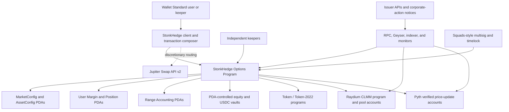

# Solana perpetual-options feasibility and integration study

| Field | Research record |
|---|---|
| Evidence date | 2026-09-15 |
| Scope | A Solana-native StonkHedge product for perpetual equity options, including assets, liquidity, pricing, collateral, routing, runtime, clients, operations, governance, security, legal constraints, and migration from the Robinhood/EVM design |
| Decision | **Conditional go for specification and prototype; no-go for production or real-value launch today** |
| Recommended path | A StonkHedge-owned Solana program using an allowlisted concentrated-liquidity market as the option primitive, native Solana USDC as the only quote/cash-collateral asset, exact underlying-token escrow for covered calls, and qualified oracle, issuer, and pool-state checks as risk guards |
| Reuse expectation | Product semantics, safety gates, test invariants, documentation, and some presentation components are reusable; the on-chain engine and most transaction, SDK, indexing, deployment, and verification code are not |
| Authorization | Research only. This document does not authorize implementation, deployment, asset listing, public transactions, marketing claims, or real-value access. |

## 1. Executive conclusion

Solana has the low-level ingredients that make a StonkHedge research prototype technically plausible: programmable custody, Token-2022 assets, concentrated-liquidity markets, equity reference feeds, native USDC, deterministic program-derived authorities, composable transactions, wallets, indexing infrastructure, multisig governance, and competitive transaction landing. This does **not** yet prove an end-to-end perpetual-options protocol technically or economically feasible. The counterparty model, premium formula, settlement promise, and exercise/force-close mechanism remain specification gates; none of the ingredients, alone or in combination, supplies them.

The decisive finding is that this work is a **new protocol implementation**, not a chain configuration, Solidity transpilation, or adapter around an existing Solana perpetual-futures exchange. The reviewed ecosystem did not provide a current, production-proven, drop-in equivalent of Panoptic's perpetual concentrated-liquidity options. PsyOptions implements expiring American options and was designed around Serum; Zeta ceased protocol operations in 2025; current Phoenix documentation concerns perpetual futures; and OpenBook supplies an order book rather than option premium, margin, exercise, or liquidation logic.[^1][^2][^3][^4]

The strongest prototype route is:

1. issue no new representation of a stock initially; qualify an existing exact Token-2022 equity mint, most plausibly an xStock;
2. use native Solana USDC as the only quote and cash-collateral asset, while covered calls escrow the exact admitted underlying token;
3. use Raydium CLMM as the first concentrated-liquidity integration candidate because it publishes the necessary range/fee state and explicitly documents `ScaledUiAmount` support;
4. implement StonkHedge-owned position, collateral, premium, exercise, risk, liquidation, corporate-action, and shutdown logic in a new Solana program;
5. qualify an exact Pyth Core or Pro product as a reference and safety input—otherwise reject the market—rather than substituting an oracle for the CLMM state that drives a Panoptic-like mechanism;
6. use Jupiter for user routing and bounded backup liquidation routes, never as the authoritative price or the sole solvency path; and
7. retain the current project's fail-closed progression from exact state capture through simulation, independent review, scoped authorization, execution, and post-state reconciliation.

The most important unresolved issue is not raw transaction throughput. It is whether the system can remain solvent and fair when a tokenized US equity trades on-chain while the underlying venue is closed, the oracle is stale or session-limited, liquidity is thin, a corporate-action multiplier changes, an issuer freezes or administratively controls the token, and keepers are competing for a congested block. These are coupled market-structure risks, not isolated integrations.

### 1.1 Feasibility by domain

| Domain | Assessment | Why | Gate before real value |
|---|---|---|---|
| Solana runtime | Feasible | Programs, PDAs, token custody, CPI, versioned transactions, and mature test tooling can express the lifecycle | Worst-case account, message-size, compute, lock-contention, and wallet compatibility proof |
| Tokenized equities | Conditionally feasible | Solana has live Token-2022 equity products, but every mint has issuer, extension, authority, redemption, session, and jurisdiction constraints | Exact-mint admission record and documented issuer/partner consent where required, or a written counsel conclusion that it is unnecessary |
| Concentrated liquidity | Feasible as a primitive | Raydium and Orca expose range positions and fee growth | Exact asset/USDC pool with production-shaped liquidity and full PDA-owned lifecycle proof |
| Perpetual-options engine | Plausible but unproven; not available off the shelf | A new counterparty, state, accounting, premium, collateral, exercise, and liquidation design is required | Independently reviewed mathematical specification, implementation, audit, and economic testing |
| Oracles | Feasible with restrictions | Pyth supports equity data and Solana verification, but sessions, pull-update selection, freshness, and confidence must be enforced | Every market/session/failure mode rehearsed with exact feed IDs |
| Routing and liquidation | Feasible with multiple paths | Direct CLMM CPI and Jupiter can complement one another | Solvency-safe direct route plus bounded fallback, two keepers, and two RPC providers |
| Economic liquidity | **Unproven** | Spot depth does not prove option-writer inventory, narrow-range depth, or gap resilience | Live depth/slippage study, committed market makers, caps, and stress results |
| Licensing | Blocking until reviewed | Panoptic, venue programs, and client SDKs use different licenses | Written dependency and clean-room opinion before implementation scope is fixed |
| Legal and distribution | **Blocking until reviewed** | A tokenized security plus an option/derivative creates issuer, venue, jurisdiction, access, disclosure, and operator questions | Counsel-approved product perimeter and enforceable access model |
| Production readiness | **No-go today** | There is no Solana code, exact admitted market, audit, operator fleet, or public lifecycle evidence in this repository | All phased gates in section 16 |

## 2. Scope, definitions, and evidence standard

### 2.1 What this study covers

This study evaluates the complete dependency chain needed to offer perpetual equity options on Solana:

- the meaning and payoff of the option product;
- tokenized-equity issuers and exact mint qualification;
- quote asset and collateral custody;
- concentrated-liquidity or order-book venues;
- premium, mark, oracle, and market-session policy;
- program/account architecture and transaction composition;
- routing, exercise, liquidation, keepers, and transaction landing;
- wallets, SDKs, RPC, indexing, monitoring, and evidence;
- upgrade governance, incident response, and user exit;
- licensing, jurisdiction, and distribution constraints;
- testing, audits, rollout sequence, people, and operational cost; and
- the exact adaptation from the current Robinhood/EVM architecture.

It does not provide a legal opinion, audit any external protocol, certify an issuer's reserves, select a production ticker, or assert that present liquidity will persist. Exact program IDs, mint addresses, feed IDs, deployed hashes, authorities, and pool accounts must be captured from primary registries at a pinned slot during implementation; they are deliberately not copied into this long-lived design record where they could become silently stale.

### 2.2 Terminology

The following products must not be conflated:

| Product | Economic exposure | Expiry | Typical payment | Relevance here |
|---|---|---|---|---|
| Perpetual future | Approximately linear long/short exposure to spot | None | Periodic funding between longs and shorts | Useful hedge venue, but **not an option** |
| Dated option | Convex call/put payoff with a strike | Fixed | Up-front or margined premium | Valid product, but not the requested perpetual product |
| Everlasting option | Convex payoff maintained without fixed expiry | None | Recurring funding/premium derived from mark and payoff | A possible architecture, but needs a credible mark/volatility market[^5] |
| Panoptic-like CLMM option | Option geometry expressed through concentrated-liquidity ranges; premium accrues while positions remain open | None by default | Streaming premium related to displaced/used liquidity and fee growth | Closest continuity with StonkHedge's present product thesis[^6][^7] |
| Structured vault | Pooled strategy that sells or buys options for depositors | Strategy-dependent | Vault P&L and fees | A future distribution wrapper, not the core market |

For this study, “perpetual options” means real call/put convexity with an explicit strike or strike range, no mandatory calendar expiry, a long whose maximum debit is bounded by a prepaid premium reserve and deterministic close threshold, defined short collateral, continuous or periodic premium, and deterministic close/force-exercise/liquidation rules. A perpetual future with an option-themed interface does not meet that definition.

### 2.3 Evidence labels

- **Verified external fact** means a statement supported by the primary sources listed in section 18 as observed on the evidence date.
- **Current repository fact** means a statement linked to checked-in code, manifests, or documents.
- **Recommendation** means an architecture decision proposed by this study, not an implemented feature.
- **Gate** means evidence that must exist before the next phase; passing an earlier gate never implies authorization for a later one.

## 3. Current StonkHedge baseline and honest migration boundary

The present repository is an EVM product and delivery control plane. Protocol contracts live in a separate Panoptic core fork, SDK work in a separate SDK fork, and chain/market evidence plus the build-in-public interface live here. The [current Robinhood testnet architecture](../architecture/robinhood-testnet-system.md) is therefore the comparison baseline, not code that can simply be recompiled for Solana.

As of this study:

- the shared 16-contract Panoptic V4 graph and a PLTR/WETH no-hook Uniswap V4 market graph are publicly deployed and reconciled on Robinhood Chain testnet;
- a discarded exact-state fork, not the public chain, passed a three-account matched short/long call lifecycle and bounded withdrawals;
- public swaps, collateral deposits, option positions, closes, withdrawals, liquidations, and an end-user trading application are not live; and
- protective puts, covered calls, cash-secured puts, and collars remain intended product flows rather than publicly accepted lifecycles.

The [three-account rehearsal record](../progress/2026-09-14-three-account-lifecycle-rehearsal.md) is valuable because its invariants can migrate even though its bytecode cannot. Those portable invariants include separate privileged and unprivileged roles, buyer/seller ordering, exact-input/minimum-output checks, state-derived withdrawals, required-revert tests, issuer-control checks, allowance cleanup, bounded residuals, and a strict distinction between simulation evidence and public authorization.

### 3.1 Reuse map

| Area | Reuse level | Treatment |
|---|---|---|
| Product positioning and strategy language | High | Preserve risk-management-first semantics, then revalidate every payoff against the Solana engine |
| Economic invariants and failure catalogue | High conceptually | Convert into chain-neutral specifications and Solana property tests |
| Evidence ladder and manifests | High conceptually | Replace EVM fields with cluster, slot, loader-specific deployment state, IDL, account, signature, and authority evidence |
| Documentation and much of visual design | Medium | Generalize the hard-coded chain/address/transaction models |
| Token and issuer adapters | Low | Replace ERC-20/ERC-8056 behavior with exact SPL or Token-2022 extension parsing |
| Liquidity and router adapters | None | Replace Uniswap V4, PositionManager, Permit2, and UniversalRouter |
| Panoptic contracts and storage | None as deployed code | Specify and implement a Solana-native engine subject to license review |
| SDK transaction builders | Low | Replace viem/EVM ABI and Panoptic TokenIds with Solana instructions, accounts, IDL/codecs, and confirmation handling |
| Fork and deployment machinery | Low | Replace nonce/CREATE/runtime-code proofs with Solana account snapshots, PDAs, loader-specific program/build proofs, and signatures |

The current web data model also assumes one numeric EVM `chainId`, `0x` addresses and hashes, block numbers/nonces, EVM explorer paths, Robinhood manifests, and viem. Presentation components may survive; identity, transaction, explorer, protocol graph, wallet, and state-loading layers require explicit multichain abstractions.

## 4. Solana runtime implications

Solana programs are stateless executable code; durable state and token balances live in accounts passed explicitly to instructions. Program-derived addresses let the StonkHedge program control vaults and sign cross-program invocations without a private key. CPI enables atomic calls into Token-2022, the CLMM, and other programs, but all invoked work shares the transaction's account and compute envelope.[^8][^9]

This model is well suited to isolated markets, but it changes nearly every EVM assumption:

| EVM assumption | Solana consequence |
|---|---|
| A contract owns an implicit storage tree | Every mutable account is explicit; ownership, seeds, discriminator, size, and write permission must be validated |
| Calls discover or load state internally | Required accounts must be known and included; large multi-leg operations can hit message/account limits |
| One global risk contract can update many markets | A shared writable account serializes transactions; market and exposure state should be sharded |
| `CREATE` address follows deployer nonce | Program IDs and PDAs follow deployed keys and seed derivations |
| ABI calldata plus `msg.sender` | Instruction data plus signer/writable account metadata and PDA signer seeds |
| Gas limit chosen by sender | Compute units, loaded-account data, priority fee, and message size must all be bounded |
| Sequential account nonce | Recent blockhash lifetime and transaction signatures provide replay bounds |
| Revert unwinds the call | A transaction is atomic, but failures still consume fees and a composed path can exceed runtime limits |

Current Solana documentation reports version-1 transactions active across clusters with a 4,096-byte message, up to 64 inline addresses, explicit compute-unit and loaded-account-data limits, and an absolute-lamport priority fee. Version 1 does not use address lookup tables and older clients cannot construct it. Version 0 retains the smaller 1,232-byte envelope, supports lookup tables, and remains the broad interoperability format.[^10] The larger format improves feasibility, but activation does not establish support across every wallet, hardware signer, RPC, explorer, and dependency. The launch baseline should therefore be:

- version 0 plus frozen, hash-bound lookup tables whose full contents and last-extension slot are part of each proposal;
- version 1 only through `@solana/kit` 8 or another explicitly compatible client, after a wallet/RPC capability handshake and end-to-end tests;
- no critical instruction whose safety depends on a proposed or selectively supported transaction feature;
- worst-case benchmarks against the documented transaction compute ceiling, not average-path estimates; and
- a state machine for workflows that genuinely cannot fit atomically, with commitments, expiries, idempotence, and permissionless recovery.

### 4.1 Concurrency and account design rules

The program should avoid a universal writable accumulator. Independent markets should be able to trade in parallel. Within a busy market, exposure should be partitioned into bounded strike/range buckets so a liquidation in one bucket does not lock every position. Global and asset configuration should normally be read-only in trading instructions.

Every external account must be validated by exact address or derivation, owner program, token program, mint, expected extensions, signer/writable privileges, and relationship to the selected market. User-provided “remaining accounts” are an adversarial input. Duplicate aliases, substituted token accounts, unchecked CPI targets, reused PDAs, and fake oracle accounts are first-class threats.

Exact open-interest control requires an explicit contention choice. The recommended first version allocates immutable or timelocked caps to range buckets whose sum cannot exceed the market ceiling; each trade writes only its bucket. Reallocating capacity is a separate governed operation. If dynamic exact market-wide utilization is required instead, the program must write a serialized market accumulator and accept the resulting hot-account contention rather than claiming both exact aggregation and unconstrained parallelism.

## 5. Tokenized-equity and collateral feasibility

### 5.1 Candidate issuer landscape

The research found two relevant current Solana equity paths:

1. **xStocks.** Its documentation describes freely transferable tokenized equities on supported networks, Token-2022 `ScaledUiAmount` handling for corporate actions, issuer mint/redemption processes, and restrictions that partners must enforce.[^11][^12][^13] Its mechanics appear technically compatible with a DeFi prototype, provided the exact mint, jurisdiction, consent requirements, and partner terms pass admission.
2. **Ondo Global Markets.** Ondo announced a Solana rollout and documents attestation-based mint/redemption APIs and legal restrictions.[^14][^15] It broadens the possible catalogue but is not assumed interchangeable with xStocks; custody, transfer semantics, access, liquidity, and integration rights must be separately qualified.

Robinhood Stock Tokens are not a chain-neutral asset abstraction. A Solana product changes issuer, legal terms, token program, mint authority, custody/redemption process, market liquidity, and corporate-action mechanism. “PLTR” or another ticker is not an identity. A market is bound to one exact mint and one exact oracle feed under one recorded issuer policy.

### 5.2 Exact-mint admission record

Before code can admit an equity asset, a signed and reviewed asset manifest must record:

- cluster genesis identity, qualification slot, exact mint public key, token-program owner, decimals, supply, and metadata identity;
- every Token-2022 extension, its configuration, and every mutable authority;
- mint, freeze, pause, permanent-delegate, transfer-hook, transfer-fee, metadata, close, and scaled-UI authorities where present;
- issuer, custodian, bankruptcy/remoteness disclosures, reserve or backing method, mint/redemption eligibility, fees, operating hours, and service dependencies;
- permitted jurisdictions, sanctions controls, investor or partner requirements, and whether protocol-level transfers are legally permitted;
- primary listing, ticker/ISIN or equivalent reference, split/dividend/merger/delisting policy, and notification channel;
- exact Pyth or other feed ID, session coverage, exponent, confidence behavior, and source relationship;
- exact CLMM pool/program identity, token order, tick spacing, fee tier, liquidity distribution, volume, price impact, and upgrade authority; and
- explicit caps, safe-mode thresholds, monitoring owners, and exit plan.

Admission must reject a changed mint or authority state rather than silently accepting it under the same symbol.

### 5.3 Token-2022 extension policy

Token-2022 extensions modify transfer and authority semantics and may be incompatible with one another or with an external venue.[^16] The first release should use a positive allowlist:

| Extension or authority | Initial policy | Reason |
|---|---|---|
| Metadata Pointer / Token Metadata | Allow after identity validation | Descriptive metadata does not define economic identity |
| `ScaledUiAmount` | Allow with dedicated integer unit logic and corporate-action state machine | Required by likely xStocks assets; changes displayed units, not raw balances |
| Transfer Fee | Exclude initially | Deposits, withdrawals, premium, exercise, and liquidation would require received-balance-delta accounting and mutable-fee risk |
| Transfer Hook | Exclude initially | Adds accounts, CPI, compute, availability, substitution, and hook-governance risk to every transfer[^17] |
| Confidential Transfer / NonTransferable | Reject | Incompatible with transparent solvency or transferable collateral |
| Permanent Delegate | Reject or isolate behind exceptional governance | A delegate can transfer or burn balances without holder authority[^18] |
| Pausable / default-frozen / active freeze authority | Reject for normal markets | Can disable the transfers needed for settlement and liquidation[^19] |
| Unknown or newly activated extension | Fail closed | Compatibility must be demonstrated, not inferred |

Raydium's current support matrix explicitly accepts `ScaledUiAmount` and certain other extensions, while rejecting or specially gating several dangerous extensions.[^20] Exceptional mints can enter through Raydium's admin-managed `SupportMintAssociated` registry, and the pool-creation compatibility decision is not an independent risk review repeated on every swap. Registry admission is therefore a high-trust compatibility bypass, not StonkHedge approval. Existing pools may persist while mint authorities or configurations create new risks. StonkHedge must independently inspect and continuously monitor the exact mint, its authorities, the Raydium registry PDA/admin, and whether issuer controls can freeze pool-vault or settlement token accounts and thereby strand a venue position.

### 5.4 Scaled units and corporate actions

With `ScaledUiAmount`, the raw integer in a token account does not change when the multiplier changes; the displayed amount is derived by multiplying raw units by the active scale. Solana's documentation warns that floating-point UI conversion is not guaranteed to round-trip exactly.[^21] Consensus and risk calculations must therefore never execute the UI floating-point conversion.

`AssetConfig` must store the exact on-chain multiplier bit pattern, the scheduled bit pattern/effective time, and a governance-approved rational `M_num / M_den`. Admission/reconciliation accepts only finite, positive, bounded values and proves that the rational maps to the observed bit pattern within a declared error and residual budget. The program uses only the integer rational. One canonical first-version representation is:

```text
displayed_quantity      = raw_token_units * M_num / (10^mint_decimals * M_den)
raw_token_strike        = invariant USDC strike per raw token unit
displayed_share_strike  = raw_token_strike * M_den / M_num
raw_token_oracle_price  = reference_share_price * M_num / M_den
equity_value_usdc       = raw_token_units * raw_token_oracle_price / 10^mint_decimals
```

The implementation must specify rational bounds, integer scale factors, rounding direction, overflow bounds, and residual budgets. Raw position quantity and raw-token strike remain invariant across a multiplier event unless an event-specific rule says otherwise. It must observe both the on-chain scheduled/current multiplier and an authenticated issuer announcement. A disagreement is a halt condition.

Splits and reinvested dividends cannot be treated as a cosmetic UI event. Splits may be value-neutral transformations when the share price and multiplier adjust consistently. A reinvested dividend changes the tracker certificate's economic exposure and makes it closer to a total-return underlier than the unadjusted listed-share spot. Dividend entitlement, stock-borrow/carry, USDC opportunity cost, and rate treatment require an explicit premium and stress rule. Both event classes affect strike display, collateral value, fee/premium denominators, exercise transfers, liquidation thresholds, caps, and historical reporting. Section 12 defines the required state machine.

### 5.5 Quote, cash collateral, and segregated capital

Use only Circle-issued native Solana USDC as the quote and cash-collateral asset in the first implementation, resolved from Circle's current address registry at deployment.[^22] Covered calls separately escrow the exact admitted underlying-token raw units. Do not admit wrapped, bridged, or look-alike “USDC” mints. Circle CCTP can later support user ingress and egress through native burn/mint across supported domains, including Solana, but an in-flight message is not collateral and a bridge is not an atomic margin component.[^23]

Settlement collateral and CLMM/range capital must be separately funded and accounted. In the recommended first version, covered-call equity and cash-secured-put USDC remain in settlement vaults and are never also counted as Raydium liquidity. Independent protocol-liquidity providers or market makers fund range-capital vaults. If a future version treats an encumbered CLMM position as collateral, it needs conservative token-composition haircuts and an atomic unwind specification; it may not simultaneously satisfy a writer, LP, premium, fee, or insurance claim.

Initial policy should be isolated and fully collateralized:

- covered calls lock the exact underlying raw units required for exercise;
- cash-secured puts lock the maximum USDC obligation under the specified strike/quantity units;
- each long pre-funds a maximum premium reserve; accrual stops at the reserve and the position becomes permissionlessly closable, so no uncollateralized premium receivable is booked;
- no cross-market netting, portfolio margin, external lending, rehypothecation, LP-token collateral, or bridged collateral; and
- each market has separate user vault accounting, fee vault, and capped insurance/backstop vault.

## 6. Liquidity venues and routing

### 6.1 Venue comparison

| Venue | What it contributes | Strengths | Material limitation | Recommendation |
|---|---|---|---|---|
| Raydium CLMM | Range liquidity, tick state, fee growth, swaps, position NFTs/accounts | Published CLMM source and accounts; explicit Token-2022 `ScaledUiAmount` support | External upgrade/governance dependency; exact PDA-owned lifecycle and SDK license need proof | **Primary prototype candidate**[^20][^24][^25] |
| Orca Whirlpools | Range liquidity, tick arrays, positions, SDKs | Mature documentation, source, program identities, audits/verifiable-build practices | Extension/client support must be proven per exact mint; current licensing and commercial-use terms require counsel | Build a thin comparative adapter/proof, not the default[^26][^27] |
| Meteora DLMM | Discrete liquidity bins, Token-2022 integration paths | Useful liquidity and routing surface | Official developer material does not provide the same fully open on-chain implementation basis for deep risk coupling | Secondary routing venue only after source/governance review[^28] |
| OpenBook v2 / Phoenix Legacy | Spot central-limit order-book primitives | Useful for spot hedging, market-maker inventory, or a later RFQ/mark layer | Phoenix Legacy is distinct from the current Phoenix perpetual-futures product; neither spot CLOB creates option convexity, premium, collateral, exercise, or liquidation | Optional periphery, not the engine[^3][^4][^29] |
| Jupiter Swap API | Aggregated spot routing and transaction/instruction construction | Strong user execution and route breadth | Off-chain quote dependency, changing routes, account/compute pressure; some modes return non-modifiable transactions | UX and bounded fallback, never oracle or sole liquidation path[^30] |

Raydium is a candidate dependency, not trusted merely because it is allowlisted. Qualification must pin its exact program ID, loader ID/version and loader-specific deployment state, deployed build identity where verifiable, IDL/account schema, upgrade authority, registry PDA/admin state, pool accounts, token vaults, observation state, tick arrays, and all position operations. An unexpected program, registry, mint, or authority change should stop risk-increasing actions until a new review.

Licenses differ by component. Raydium's published licensing page distinguishes its Apache-licensed on-chain programs from a GPL-licensed TypeScript SDK.[^25] Orca and Panoptic have their own current terms. Importing a client library, copying formulas, depending on a program, and producing a semantic reimplementation are distinct legal questions; all must be recorded before choosing implementation code.

### 6.2 Required venue proof

The exact production-shaped asset/USDC pair must demonstrate, through ordinary unprivileged accounts and PDA ownership:

1. deterministic pool and token identity reconciliation;
2. creation or adoption of a position across approved ticks;
3. increase/decrease liquidity, both swap directions, fee collection, and close;
4. option open, premium checkpoint, close, force exercise, and liquidation composed with the venue;
5. zero unauthorized delegate or residual approvals/authorities after each operation;
6. behavior at tick-array boundaries, empty ranges, depleted vaults, maximum fee growth, and extreme prices;
7. multiplier activation and decimals without UI floating point;
8. worst-case message, account, loaded-data, compute, and lock contention;
9. expected failure if the program, pool, mint, extension set, observation, or authority drifts; and
10. sufficient live depth across the actual strike/range grid under gap and liquidation sizes.

### 6.3 Routing policy

Jupiter's current guidance uses Swap API v2; router mode can supply instructions for composition, while meta-aggregator mode can return a completed transaction that the client cannot modify.[^30] Use it for discretionary user inventory swaps and as a tightly bounded secondary liquidation route. The core program must validate exact input, minimum output, route allowlists, account identities, expiry, and post-transfer deltas.

Solvency must retain a direct, allowlisted CLMM route that does not require a successful off-chain quote service. A route quote is neither an oracle nor an assurance of landing. RFQ/last-look liquidity can be useful to a market maker, but a permissioned, partially signed, short-lived transaction is not permissionless on-chain liquidity and cannot be the protocol's only unwind path.[^31]

## 7. Oracle, market-session, and price policy

### 7.1 Role separation

The recommended mechanism is **CLMM-native but oracle-limited**:

- CLMM ticks, range liquidity, trades, observations, and fee growth supply the market-native state needed for position geometry and streaming premium;
- a qualified exact Pyth Core or Pro feed/product supplies an independently identified equity reference price, publish time, exponent, and confidence interval; if the asset/session/entitlement is unavailable, the market is not admitted;
- issuer multiplier/status data establishes units and corporate-action state;
- CLMM time-weighted observations detect pool manipulation/divergence; and
- an independently qualified second provider, potentially Switchboard, may add a circuit-breaker signal, but two wrappers over the same upstream data are not independent redundancy.[^32]

The reference oracle must not overwrite actual CLMM fee growth. Conversely, the CLMM spot price must not be accepted as an unconstrained liquidation oracle. Each source answers a different question.

### 7.2 Pyth controls

Pyth's Solana pull integration requires the consumer to validate the receiver/account owner, exact feed ID, price age, exponent, and confidence. Its recommended interface includes an age-bounded read rather than an unqualified latest value.[^33][^34] Pull delivery creates a special adversarial case: a caller may choose an older update that still falls inside a loose acceptance window. For derivatives, Pyth recommends tighter freshness/confidence protections and mechanisms such as delayed settlement or minimum holding periods.[^34]

US equity data also follows market sessions. Current Pyth documentation separates traditional Core coverage from extended/overnight Pro products, and Pro verification on SVM adds a top-level signature-verification instruction rather than a simple CPI-only path.[^35][^36] Therefore “Solana trades 24/7” does not mean risk-increasing equity options can safely trade 24/7.

Pyth's Solana receiver and delivery requirements changed shortly before this evidence date, and the current Hermes path requires service credentials. Resolve the receiver and feed registry immediately before a release instead of copying an address from this report. Pin the exact Rust/Anchor crates as well: the versions documented by the oracle and selected CLMM may not share one Anchor dependency line, so a native parsing boundary or isolated adapter may be safer than forcing incompatible framework versions.[^33]

Prove the fully verified update path under the complete transaction envelope; do not silently reduce verification integrity to make a transaction fit. If update posting/verification plus option execution cannot fit atomically, use a pre-posted, fully verified, freshness-bounded update account or a committed two-step design that rechecks every epoch and state transition at finalization.

Every price-consuming instruction should enforce:

- the exact feed and verified update program;
- maximum publish age by session and action;
- confidence-adjusted conservative price: lower bound for collateral assets and upper/lower bound as adverse for the obligation;
- maximum deviation among oracle, CLMM TWAP, CLMM spot, and issuer reference/NAV where available;
- monotonic update/observation rules where relevant;
- a minimum hold or delayed finalization for manipulation-sensitive exercise/settlement;
- explicit rounding direction and unit/multiplier version; and
- action-specific behavior: risk-reducing closes may remain enabled when new risk and withdrawals fail closed.

### 7.3 Market state machine

```text
OPEN_REGULAR ───────► OPEN_EXTENDED ───────► CLOSED_OR_STALE
      │                      │                        │
      └──────────────┬───────┴──────────────┬─────────┘
                     ▼                      ▼
              ORACLE_DIVERGENCE     CORPORATE_ACTION_PENDING
                     │                      │
                     └──────────┬───────────┘
                                ▼
                   RISK_REDUCTION_ONLY / HALTED
```

`ISSUER_HALT`, `TOKEN_CONTROL_CHANGED`, and `PROGRAM_DRIFT` are independent overrides. In degraded states, the default policy is:

- allow collateral deposits if transfer semantics remain safe;
- allow risk-reducing close or repay paths when they cannot worsen another account;
- disallow new positions, risk increases, leverage, and collateral withdrawals;
- suspend discretionary oracle-based force exercise unless a pre-specified delayed procedure is satisfied; and
- never promise cash settlement for an inaccessible underlying unless the contract terms and reserves explicitly support it.

## 8. Perpetual-options architecture alternatives

### 8.1 Alternative A — CLMM-native streaming-premium options

The program maps calls and puts to approved ranges around CLMM ticks. It escrows or controls concentrated liquidity, attributes fee growth and utilization across those ranges, and maintains long/short option obligations with no fixed expiry.

**Advantages:** closest continuity with Panoptic and StonkHedge; uses observable on-chain liquidity and fee state; avoids fragmented calendar expiries; creates a distinctive product rather than relabeling a perp.

**Costs:** highest implementation and audit complexity; Raydium semantics are not identical to Uniswap V3/V4; premium economics, range ownership, fee attribution, force exercise, rounding, and manipulation resistance require a new formal specification. Thin xStock liquidity can make strikes theoretical rather than executable.

**Verdict:** recommended research/prototype architecture, contingent on the economics gate.

### 8.2 Alternative B — oracle-margined everlasting options

The program defines a recurring funding transfer between longs and shorts based on an option mark and current payoff, following the everlasting-options family of mechanisms.[^5]

**Advantages:** does not require option claims to be direct wrappers around CLMM range positions; can expose familiar strike/payoff semantics; easier to isolate collateral accounting from one AMM implementation.

**Costs:** requires a credible option mark or volatility surface, not merely spot; creates a funding-index governance/manipulation problem; a thin or off-chain mark market weakens permissionless claims; still needs liquidations and market makers.

**Verdict:** valuable second research track or later RFQ market, not the initial implementation unless CLMM-premium equivalence fails.

### 8.3 Alternative C — dated options on an order book or RFQ network

**Advantages:** familiar expiry/settlement, clearer maximum obligations, standard market-maker risk systems, and potentially simpler price discovery for active series.

**Costs:** fragments liquidity across strikes and expiries, requires expiry settlement and listing operations, and does not satisfy the perpetual requirement.

**Verdict:** valid future product, not an answer to this request.

### 8.4 Alternative D — integrate a perpetual-futures venue and synthesize an option

Dynamic trading of futures can approximate an option off-chain, but the hedge is path-dependent, requires continuous rebalancing, exposes users to keeper and slippage risk, and does not create an on-chain limited-loss option claim.

**Verdict:** reject as the product definition. A futures venue may hedge protocol or market-maker delta, but it cannot be marketed as the option engine.

### 8.5 Decision

Proceed with Alternative A through a mathematical and local prototype gate while retaining Alternative B as a falsification benchmark. If the CLMM mechanism cannot produce defensible premium, liquidation, and capital-efficiency behavior with real xStock liquidity, stop rather than concealing the mismatch behind perpetual-futures terminology.

## 9. Recommended Solana reference architecture



Dashed edges are off-chain assistance, never authoritative state. A core open, close, exercise, or liquidation succeeds only from accounts and proofs validated inside the transaction.

### 9.1 Program and account layout

| Account or component | Responsibility | Concurrency/security rule |
|---|---|---|
| `ProtocolConfig` PDA | Program version, governance, guardians, accepted token programs, global fee and emergency bounds | Read-only on trade paths; changes timelocked except narrowly defined halt |
| `AssetConfig` PDA | Exact mint, token program, decimals, extension/authority digest, issuer policy, oracle feed, multiplier version, session policy | One per mint; monitored and failed closed on drift |
| `MarketConfig` PDA | Exact underlying/USDC pair, CLMM program/pool, token order, tick spacing, approved ranges, caps, risk parameters | One per market; immutable identities separated from mutable bounded parameters |
| `MarketRisk` / range-bucket PDAs | Open interest, utilization, premium accumulators, debt, liquidation state | Shard by bounded range; avoid universal writable market hot spot |
| `MarginAccount` PDA | One user's isolated collateral, debt, health, nonce/sequence, active position references | Use subaccounts; user signer plus program ownership checks |
| `Position` PDA | Explicit legs, side, quantities, strike/range, entry accumulators, collateral reservation, timestamps, state | No opaque cross-chain TokenId assumption; canonical serialization and round-trip tests |
| Settlement equity and USDC vaults | Segregated custody of writer obligations and long premium reserves | PDA authority; exact mint/program; post-transfer balance-delta checks; never counted as range capital |
| Range-capital vaults and CLMM position custody | Separately funded venue assets, position NFT/account, and related tick arrays | PDA authority; venue-specific adapter; no user-supplied arbitrary pool; explicit claim priority |
| Insurance/backstop vault | Capped loss/reward reserve | Not counted as ordinary user collateral; transparent replenishment and exhaustion policy |
| `CorporateAction` PDA | Announced/on-chain multiplier, effective time, evidence digest, reconciliation state, transformation version | One pending action per asset; dual-source confirmation and replayable transformation |
| Event/log schema | Position and governance transitions for indexers | Helpful but non-authoritative; accounts remain source of truth |

### 9.2 Module boundaries

The options program should isolate:

- fixed-point price, tick, unit, payoff, collateral, premium, and health math;
- Token/Token-2022 transfer and extension validation;
- venue adapters with the smallest possible CPI surface;
- oracle/session validation;
- market and corporate-action state machines;
- position lifecycle;
- liquidation and insurance accounting;
- governance and emergency capabilities; and
- event serialization.

Do not put off-chain JSON parsing, ticker resolution, generalized arbitrary CPI, aggregator route discovery, or issuer web requests in the program. Off-chain services prepare transactions and evidence; on-chain logic accepts only cryptographically or account-state verifiable inputs under bounded rules.

## 10. Full integration plan

This matrix separates required launch dependencies from useful periphery. “Integrate” always means qualify an exact deployed instance and failure mode, not merely install an SDK.

| Capability | Candidate | Criticality | On-chain responsibility | Off-chain responsibility | Acceptance condition |
|---|---|---:|---|---|---|
| Equity asset | xStocks first; Ondo evaluated independently | Critical | Validate exact mint, Token-2022 owner, allowed extensions, authority/configuration digest, multiplier epoch | Issuer onboarding, terms, corporate-action/status monitoring, legal eligibility | One exact mint passes technical, liquidity, issuer, and legal admission |
| Quote and collateral | Native Solana USDC for quote/cash collateral; exact admitted equity escrow for covered calls | Critical | Exact mints/programs, segregated PDA vault custody, raw-unit accounting, balance-delta validation | Circle/issuer registry verification and control monitoring | No aliases or double counting; deposit/withdraw/conservation tests pass |
| Token transfers | SPL Token and Token-2022 | Critical | Minimal allowlisted CPI wrapper; validate every mint/account/authority/extension | Build extension manifests and drift alerts | Unsupported semantics fail before transfer |
| Concentrated liquidity | Raydium CLMM primary candidate | Critical | Direct bounded CPI, position custody, fee-growth checkpoints, tick-array validation | Pool discovery, live liquidity study, program/authority monitoring | Full production-shaped lifecycle fits runtime and economic bounds |
| Comparative CLMM | Orca Whirlpools adapter proof | Optional gate/fallback | No production dependency until extension/license review | Compare execution, fee accounting, governance, and liquidity | Explicit decision record; no silent fallback |
| Spot routing | Jupiter Swap API v2 | Important periphery | Validate only approved route accounts/instructions and post-state if composed | Quote discovery, simulation, slippage/user presentation | Loss of Jupiter cannot make all safe closes impossible |
| Order book / RFQ | OpenBook v2, Phoenix Legacy spot CLOB, issuer RFQ where eligible | Optional | Only explicitly approved settlement or hedge instructions | Market-maker inventory and future price discovery | Never confused with current Phoenix perps or treated as an option engine/authoritative mark without a separate design |
| Primary risk reference | Exact qualified Pyth Core or Pro feed/product | Critical | Verify update, owner/program, feed ID, age, exponent, confidence, session, and full verification status | Obtain updates, credentials/entitlement, schema monitoring | Exact feed, fully verified delivery path, and every session/failure transition pass |
| Issuer reference | Issuer API, multiplier, status, corporate-action notice | Critical off-chain guard | Store only governance-approved action/epoch evidence; compare to mint state | Authenticate, archive, reconcile, alert | Conflicts halt risk increase; no web request is trusted inside program |
| Independent price guard | Chainlink xStocks/equity Data Streams or Switchboard after qualification | Optional initially, desirable for launch | Verify only a supported proof/account schema | Commercial entitlement, source independence, liveness study | Demonstrated upstream independence and deterministic failure behavior[^32][^37] |
| Client library | `@solana/kit` plus generated/manual program codecs | Critical | None | Instruction composition, simulation, confirmation, typed errors, account decode | Golden vectors shared with Rust; no hidden ticker/address lookup[^38] |
| Wallet connection | Wallet Standard | Critical | Signer rules enforced by instructions | Capability negotiation for v0/v1, preview, hardware/mobile testing | Supported-wallet matrix proves signing and confirmation[^39] |
| RPC | At least two production providers | Critical | Never trust an off-chain response not revalidated in transaction | Reads, simulation, send, websocket/Geyser, archival backfill, health voting | Failover drill; provider disagreement alerts; public endpoints not used for production[^40] |
| Indexer | Self-controlled event/account index plus replay | Important | Accounts remain authoritative | Slot/signature ingestion, rollback handling, backfill, portfolio views | Rebuild from a pinned slot and reconcile balances/positions exactly |
| Keepers | Two minimum; three preferred for launch-critical duties | Critical | Permissionless/idempotent refresh, checkpoint, liquidate, reconcile, and close-only actions | Separate keys, RPCs, hosts, alert paths, profitability controls | Measured inclusion time fits risk assumptions under stress |
| Scheduler | Independent services; optional TukTuk redundancy | Optional | Instructions remain callable without scheduler | Trigger cadence and retry | Scheduler failure does not eliminate permissionless action[^50] |
| Transaction landing | Ordinary multi-provider send; optional Jito | Important | Freshness, slippage, sequence, and state checks make replay harmless | Priority-fee policy, duplicate send, bundle monitoring | A returned signature/bundle ID is never treated as final state[^41] |
| Governance | Squads v4-style multisig/timelock or equivalently reviewed controls | Critical | Separate upgrade, risk, guardian, treasury, and asset-admission powers | Proposals, review delay, signer operations, key rotation | Published authority graph; emergency powers narrow and tested[^42] |
| Program provenance | Solana verified builds and independent reproduction | Critical | Optional self-reported version is non-authoritative | Pin source commit, toolchain, ELF, IDL/codecs, loader ID/version, loader-specific deployment state, and authority | Independent build matches deployed program[^43] |
| Cross-chain ingress | Circle CCTP; xBridge only after separate review | Optional/later | None inside margin or liquidation | Complete bridge before deposit; monitor finality | In-flight messages and remote assets never count as collateral |
| Analytics/monitoring | Direct RPC/account reads plus indexed history | Critical | Emit stable, versioned events | Solvency, utilization, price, multiplier, authority, keeper, RPC, and upgrade alerts | Alerts map to rehearsed operator actions |

### 10.1 Dependency policy

For every external program or data provider, the release record must include:

- why it is required and what happens if it is unavailable;
- program/account/API identity and supported network;
- deployed code/build or schema version and upgrade/change authority;
- license and commercial terms;
- audits and unresolved findings, without treating an audit badge as a guarantee;
- exact account and CPI surface used by StonkHedge;
- transaction size, compute, loaded data, fees, rate limits, and entitlements;
- an allowlist of mutable parameters that may change without a new integration review;
- monitoring, fallback, safe-mode, and removal procedures; and
- a reproducible fixture for local and continuous integration tests.

### 10.2 Frontend and SDK adaptation

The client should present the complete transaction effect before signature: option side, payoff type, underlying mint, quote mint, raw and displayed quantities, multiplier epoch, strike/range, maximum premium or funding, collateral reserved, fees, minimum outputs, oracle publish time/session, route, program IDs, writable accounts, and expiry/blockhash. Simulation is necessary but not sufficient; the program rechecks all limits on-chain.

The current Vite application can retain typography, layout, accessibility, and evidence views. It needs a chain-neutral domain model with tagged EVM/Solana identities rather than weakening all identifiers into strings. A Solana transaction record uses cluster/genesis identity, signature, slot, message version, recent blockhash, fee payer, instructions, program IDs, accounts, compute, confirmation status, and post-state—not an EVM nonce/contract-address schema.

Golden vectors should cover every codec and calculation in both Rust and TypeScript: PDA seeds, instruction discriminators, leg serialization, tick/price conversion, multiplier normalization, premium checkpoints, margin, health, corporate-action transforms, and displayed values. The UI must never perform consensus-critical floating-point calculations and then submit the result as trusted risk state.

## 11. Economic and lifecycle specification

This section proposes the minimum coherent product. It is a specification direction, not proof that Raydium fee state reproduces Panoptic economics.

### 11.1 Initial market and products

Launch research should evaluate candidate xStock/native-USDC markets and proceed only if one satisfies executable-depth, oracle/session, issuer/consent, legal, corporate-action, and committed-market-maker gates. No deeply traded eligible market is assumed to exist. Selection must follow measured evidence—not brand recognition or continuity with PLTR.

The first engine supports only:

- a covered short call and its matched long;
- a cash-secured short put and its matched long;
- one- or two-leg risk-defined combinations only after each individual leg passes;
- isolated margin by user subaccount and market;
- explicit maximum notional, open interest, utilization, range concentration, and accounts per user; and
- voluntary close plus a narrowly specified force-exercise/close process.

No naked short call, undercollateralized put, portfolio offset, cross-asset collateral, lending, rehypothecation, socialized loss, or permissionless new market belongs in the first release.

### 11.2 Units, payoff, and collateral

Let `Q` be the contract's economic share quantity after applying the recorded multiplier epoch and `K` the strike in USDC per economic share. The design must keep three prices distinct:

- `S_display`, an informational UI mark with no consensus authority;
- `S_margin`, an adverse, confidence- and liquidity-adjusted price used only for collateral and health; and
- `S_settlement`, the exact contract-defined observation used for cash settlement, if the selected market supports cash settlement at all.

Using the applicable contract payoff observation `S_payoff`, the familiar instantaneous references are:

```text
call payoff = max(S_payoff - K, 0) * Q
put payoff  = max(K - S_payoff, 0) * Q
```

These are payoff references, not a complete perpetual-option price. `S_margin` cannot silently become `S_settlement`; a conservative solvency bound is not an economically neutral transfer price. A non-expiring long continues to owe streaming premium or funding while open, and the close/exercise terms determine when value transfers.

For the fully secured first version:

- the call writer locks the exact raw equity amount corresponding to `Q`, plus conservative transfer/rounding reserves;
- the put writer locks at least `K * Q` USDC under the contract's fixed-point and rounding rules, plus accrued premium/fees;
- the long pre-funds a maximum premium/fee reserve; accrual never exceeds that reserve, and reaching a declared threshold stops further accrual and makes the position permissionlessly closable or `CLOSE_PENDING` while the short's obligation remains locked;
- withdrawals use current state-derived capacity after checkpointing every obligation, never the originally deposited amount.

The protocol should maintain value in raw token units and fixed-point USDC. No unpaid amount beyond the long's reserve is booked as a protocol asset or writer receivable. Display-scale changes must not mint collateral or erase debt.

### 11.3 Range and position representation

A position stores explicit, canonical legs rather than reproducing an opaque EVM-packed TokenId:

- call/put;
- long/short;
- underlying/quote orientation;
- lower and upper tick, strike mapping, width, and ratio;
- raw quantity/liquidity;
- collateral reservation;
- entry fee-growth and premium accumulators for token 0 and token 1;
- opening oracle/multiplier/session epoch and minimum-hold timestamp;
- counterparty or pool-liquidity relationship as defined by the mechanism;
- lifecycle state and close/exercise constraints; and
- schema/math version.

The design must specify whether CLMM positions are pooled by identical range or isolated per position. Pooling saves accounts and compute but introduces pro-rata fee, entry/exit, rounding, and griefing problems. A bounded range-bucket model is the likely compromise: one venue position per approved market/range bucket, with internal shares and accumulator checkpoints. It requires conservation proofs under deposits, partial closes, tick crossings, and zero-liquidity transitions.

### 11.4 Streaming premium

For a range `r`, the conceptual realized component over a checkpoint interval is:

```text
realized_fees_r =
    liquidity_share_r *
    (delta_fee_growth_inside_token0 +
     value_adjusted_delta_fee_growth_inside_token1)

premium_r = realized_fees_r * utilization_adjustment_r + explicit_risk_charge_r
```

This is deliberately not an implementation formula. The formal design must define token-specific Q64.64 or venue scaling, price conversion time, fee ownership, dynamic fee changes, in/out-of-range behavior, utilization curve, minimum/maximum charge, payer/recipient, rounding, collection lag, and bad-debt behavior. Raydium fee growth is an input; it does not automatically become Panoptic premium.[^44]

Trading fees are also not implied volatility. A quiet or out-of-range equity pool may generate little premium immediately before an earnings announcement or weekend gap. The risk engine therefore needs independent scheduled-event, closed-session, confidence, concentration, liquidity, and jump-risk add-ons. If economically adequate premium requires a centrally set volatility surface, that governance dependency must be disclosed and Alternative B reconsidered honestly.

Every open, close, exercise, liquidation, and withdrawal checkpoints premium first. Premium debt cannot disappear because a range is empty, a keeper is late, an accumulator wraps, or a position is partially closed. Accrual is capped by the remaining prepaid reserve; when the threshold is reached, the state transition is deterministic even if a keeper has not yet submitted the final close.

### 11.5 Open lifecycle

A safe atomic open should:

1. receive a user-signed instruction with exact market, position terms, maximum premium/fee, minimum outputs, multiplier epoch, oracle constraints, and expiry;
2. verify any required oracle proof/update at the top level;
3. validate program version, market state, exact mints, extension digest, venue program/pool, oracle feed, session, issuer/multiplier state, and all account derivations;
4. checkpoint the affected range and both parties' existing obligations;
5. enforce per-user, per-range, and per-market caps and minimum hold;
6. transfer collateral and verify actual vault balance deltas;
7. create/update the bounded range liquidity through an allowlisted CLMM CPI if the mechanism requires it;
8. write both sides' position and accumulator checkpoints;
9. recompute post-state health and conservation; and
10. emit a versioned event containing identities and commitments sufficient for independent reconciliation.

If this cannot fit atomically under the compatibility transaction format, the design must be simplified. A multi-transaction reservation is acceptable only if no intermediate state permits withdrawal, free optionality, replay, price substitution, or stranded collateral, and any actor can cancel/complete it after expiry.

### 11.6 Close, exercise, and force exercise

Voluntary close must define whether the long, short, or either side can initiate, how unmatched liquidity is handled, which price/fee checkpoint applies, and how partial closes round. The current EVM rehearsal's buyer-first dependency is evidence to retest, not an assumption to copy.

“Exercise” also requires a precise promise, and each market must choose exactly one settlement mode. “Physical” or token delivery here means delivery of the exact admitted tokenized tracker/certificate mint—not legal title to a registered share of the referenced company. In a token-delivery call, the exercising long atomically tenders `K × Q` USDC and receives the specified raw tracker units. In a token-delivery put, the exercising long atomically tenders those tracker units and receives `K × Q` USDC. If writers are pooled, deterministic assignment and rounding rules select and debit writer obligations. A cash-settled market instead needs a predeclared `S_settlement` observation and separately reserved cash; it cannot assume that selling a frozen or illiquid tracker realizes the reference-share price.

For a CLMM force-close design, force exercise may instead remove an inefficient/out-of-range claim after a grace/minimum-hold period and transfer a separately defined amount. That is not token delivery and may not be called exercise without disclosure. The interface must never blur these outcomes, and Phase 0 must close this choice before implementation is treated as durable.

Exercise-sensitive operations should use delayed or two-observation validation when a pull oracle or thin pool could be selected around one slot. A commitment records terms and source epochs; finalization after the delay rechecks price, multiplier, session, pool divergence, collateral, and intervening corporate action. Safe voluntary matched close can remain faster where manipulation cannot externalize a loss.

### 11.7 Health and liquidation

For any partially collateralized future version, health is conceptually:

```text
health = haircut(collateral)
       - stressed_close_or_exercise_obligation
       - accrued_premium_or_funding
       - fees_and_interest
       - conservative_close_slippage
```

The stressed obligation must include up/down gaps, earnings/weekend scenarios, confidence widening, liquidity impact, multiplier transitions, USDC impairment, concentration, and correlated failure. Delta-only or recent-volatility-only margin is inadequate for options.

A liquidation instruction should:

1. validate current session, oracle proof, multiplier epoch, venue state, and target account;
2. checkpoint premium and recompute health on-chain;
3. size a partial action to restore a specified buffer where possible;
4. transfer or close only through direct allowlisted venues or a constrained prevalidated route;
5. require minimum proceeds and post-action health improvement before paying a reward;
6. progress to full close under deterministic rules if partial repair fails; and
7. charge the capped insurance fund only under documented conditions.

Fully secured covered/cash-secured writers reduce reliance on fire-sale liquidation, but do not remove premium debt, oracle manipulation, inaccessible-token, range accounting, or operational liveness risk.

### 11.8 Core invariants

At minimum, property tests and runtime assertions must cover:

- vault assets equal user claims plus explicitly accounted fees/reserves, within a derived raw-unit residual bound;
- no raw token, vault balance, CLMM position/share, premium reserve, earned fee, protocol fee, or insurance asset can satisfy more than one user, settlement, liquidity, premium, fee, or loss claim;
- no position can be created without balanced long/short or explicitly funded pool inventory;
- total long claim never exceeds enforceable short/pool obligation;
- premium debt is monotonic between payments/close, never exceeds prepaid reserve, and is conserved between payer and recipient less declared fees;
- raw token supply does not change with a scaled-UI update; normalized collateral and obligations change only through an authenticated, predeclared corporate-action rule;
- withdrawals cannot make current or stressed health worse than the required buffer;
- a liquidator is rewarded only for a valid, net health-improving action;
- repeated tiny opens/closes/checkpoints cannot extract rounding profit;
- a failed CPI or transfer leaves no partial protocol state;
- unsupported mint, extension, program, pool, feed, epoch, or authority substitution fails;
- a halted market cannot increase aggregate risk; and
- every open position has at least one rehearsed risk-reducing or governed resolution path.

## 12. Corporate actions and issuer-control failures

Tokenized equities inherit off-chain lifecycle events and on-chain administrative controls. They cannot be treated like immutable commodity tokens.

### 12.1 Corporate-action state machine

| State | Allowed | Blocked | Exit condition |
|---|---|---|---|
| `NORMAL` | Normal capped lifecycle | None beyond ordinary risk rules | Authenticated event or on-chain drift |
| `ANNOUNCED` | Deposit, premium checkpoint, safe risk reduction | New risk, withdrawals that could race adjustment | Event terms, effective time, and transformation approved |
| `PRE_EFFECTIVE_FREEZE` | Safe matched close and administration | Open, exercise based on ambiguous units, liquidation from stale normalization | Final pre-event snapshot and time/slot boundary |
| `OBSERVED_UNRECONCILED` | Deposit if semantics remain safe | Open, withdrawal, exercise, liquidation | On-chain multiplier/issuer/oracle/pool normalized and agree |
| `RECONCILED` | Risk reduction; normal activity only after delay | New risk until review delay ends | Independent checks and governance/automatic bounded approval |
| `EVENT_SPECIFIC_CLOSE_ONLY` | Published close, redemption, or settlement path | New positions | All positions resolved or migrated |

For a split, reverse split, or reinvested-dividend multiplier, archive pre/post raw balances, exact multiplier bit pattern and approved rational, normalized share quantity, oracle convention, ticks, CLMM price, collateral, open interest, premium accumulators, and every transformed field. Prove conservation for neutral transformations such as splits, with explicit rounding allocation. Reinvested dividends are not grouped into that neutrality assumption: separately prove entitlement, tracker total-return behavior, value allocation, carry/rate treatment, and the effect on option holders and writers.[^12][^45]

Mergers, spinoffs, cash takeovers, ticker changes, delistings, issuer redemption, or certificate termination cannot be handled by a generic scale factor. Each needs predeclared contract terms and an event-specific close-only or settlement proposal. Governance must not invent a favorable outcome after positions are known.

### 12.2 Issuer and token control failure modes

The risk register must include:

- mint or freeze authority use;
- pause/default-frozen/transfer-hook/transfer-fee activation or configuration change;
- permanent-delegate transfer or burn;
- custodial reserve impairment or issuer insolvency;
- redemption suspension, restricted eligibility, or widened fees;
- API/signing-key compromise or contradictory corporate-action data;
- on-chain/off-chain multiplier race;
- bridge halt or canonical-mint migration;
- sanctions or jurisdictional transfer restrictions;
- dividend treatment inconsistent with option pricing; and
- a token that remains visible but cannot be delivered or liquidated.

An insurance fund cannot cure an inaccessible underlying or rewrite legal ownership. The admission terms must say whether the market becomes close-only, waits, cash settles from separately reserved USDC, follows issuer redemption, or invokes a governed resolution. The chosen policy needs user disclosure and pre-position consent.

## 13. Security and operational threat model

### 13.1 On-chain implementation threats

- substituted executable program, mint, token account, pool, tick array, oracle, or sysvar;
- forged PDA relationship, seed collision/domain confusion, missing bump or signer check;
- writable/signer privilege escalation through CPI;
- duplicate mutable account aliasing and time-of-check/time-of-use assumptions;
- unchecked Token versus Token-2022 owner and extension behavior;
- transfer-hook reentry/composability surprises if ever admitted;
- stale or selectively supplied pull-price update;
- exponent, decimals, token order, tick sign, multiplier, or fixed-point conversion error;
- overflow, underflow, Q-format mismatch, accumulator wrap, and asymmetric rounding extraction;
- fee-growth errors across tick crossing, liquidity change, partial close, or dynamic fees;
- close/exercise/liquidation state races and replay;
- account initialization, realloc, rent, close-authority, and lamport-drain flaws;
- unbounded account iteration, compute exhaustion, or attacker-created hot-account contention;
- unsafe upgrade/migration and old client schema compatibility; and
- a “safe” degraded mode that accidentally traps every risk-reducing path.

### 13.2 Economic threats

- shallow-range manipulation of CLMM spot/TWAP;
- headline TVL that is not executable near the relevant strike;
- option premium that underprices earnings, weekends, dividends, or gap risk;
- concentrated writer, buyer, market-maker, or liquidator inventory;
- toxic flow against delayed issuer/oracle/CLMM normalization;
- cross-source feeds that share one upstream failure;
- keeper censorship, congestion, priority-fee escalation, and unprofitable liquidation;
- liquidation feedback that exhausts depth and widens the oracle/pool gap;
- USDC depeg, freeze, or token-program incident;
- governance repricing after users enter; and
- bad debt hidden by stale marks or an off-chain indexer.

### 13.3 Off-chain and supply-chain threats

- compromised issuer, oracle, RPC, routing, indexer, keeper, or frontend endpoint;
- dependency or build-tool compromise and unreproducible deployed binaries;
- malicious wallet simulation/transaction presentation or blind signing;
- stale address registry, feed schema, IDL, lookup table, or program authority;
- leaked upgrade, guardian, treasury, keeper, or deployment keys;
- false confirmation from one RPC or treating a Jito bundle ID as landing proof;
- incomplete rollback/backfill after a fork; and
- geographic controls present only in the UI while direct program access remains open.

### 13.4 Control architecture

Use separate authorities for program upgrade, ordinary risk parameters, asset admission, emergency risk reduction, treasury, and oracle/provider changes. Ordinary changes receive a public timelock; the emergency guardian can enter more restrictive modes but cannot withdraw user funds, add markets, increase caps, change settlement economics, or upgrade code instantly. The authority graph, pending proposals, loader ID/version and corresponding deployment-state accounts, and verified build must be public.

The mature target may revoke program upgrade authority, but immutability is appropriate only after migrations, emergency exit, and bugs have been addressed. Until then, multisig is risk reduction, not trust elimination. Squads documents multisig, roles, spending controls, and program-management patterns that can implement this separation.[^42]

## 14. Legal, licensing, and distribution gates

This section is risk identification, not legal advice.

### 14.1 Product and jurisdiction

A transferable claim on an equity and a call/put derivative over that claim can engage securities, derivatives, exchange/venue, broker/dealer, clearing, custody, offering, market-abuse, disclosure, consumer, sanctions, and data-licensing rules. The result depends on instrument rights, settlement, operator control, target users, marketing, and jurisdiction. A 2026 SEC staff statement expressly distinguishes issuer-sponsored tokenization from third-party tokenized interests and notes that some structures may be security-based swaps; it is not a StonkHedge-specific determination.[^46] MiFID II's instrument categories expressly include options and other derivatives relating to securities.[^47]

Before real-value access, counsel must decide:

- what legal instrument each token and StonkHedge position represents;
- whether the operator, program, frontend, governance, market maker, or liquidator performs a regulated activity;
- which countries and user classes may access mint/redemption, secondary token transfers, and the derivative;
- KYC/AML, sanctions, suitability, accreditation/professional-client, reporting, record, surveillance, and tax responsibilities;
- whether delivery of the admitted tracker token (not registered-company shares), cash settlement, perpetual premium, or protocol control changes the analysis;
- required issuer, custodian, venue, oracle/data, and market-maker agreements;
- disclosures for backing, dividends, voting, counterparty, smart-contract, oracle, liquidity, gap, upgrade, and resolution risk; and
- how positions are closed if access or an asset becomes prohibited.

An issuer describing the base token as permissionless or freely transferable does not authorize a third party to operate every derivative. A frontend geofence also does not constrain direct calls to a permissionless program. The product must consciously choose between protocol-level eligibility/allowlisting and an open program with a restricted official interface, based on written legal analysis rather than a technical default.

### 14.2 Licensing

Panoptic V2's current core repository is primarily BUSL-1.1, with component-specific notices; Solana does not remove the license question.[^7] A line-by-line port is plainly inappropriate without permission. A clean-room reimplementation of published economic ideas reduces direct source-copying risk but does not by itself resolve license, patent, trademark, confidential-information, or derivative-work questions. Counsel should define what specifications, tests, interfaces, formulas, and names may be reused before engineers begin.

Likewise:

- confirm the license of every Raydium program, crate, interface, example, and client package actually used; its on-chain and TypeScript licensing differ;
- obtain a written commercial-use conclusion or permission before relying on Orca source under its current terms;
- do not make a deeply coupled security dependency on a deployed venue whose relevant source/build cannot be independently reviewed;
- record oracle data entitlements, on-chain verification rights, derived-data display, retention, and redistribution terms; and
- review “Panoptic,” issuer, exchange, ticker, and market-data branding separately from code licenses.

The licensing gate should end in a repository record mapping each dependency and copied/adapted artifact to version, owner, license, intended use, obligations, and approval. “Open source” is not a sufficient field.

## 15. Testing, evidence, deployment, and operations

### 15.1 Test ladder

| Layer | Purpose | Required evidence |
|---|---|---|
| Pure Rust math | Fixed-point units, ticks, payoffs, margin, accumulators, multiplier transforms | Boundary vectors, proofs/derivations, property and differential tests |
| Instruction harness | Account validation, ownership, signers, failure paths, compute | Mollusk-style per-instruction tests and compute snapshots[^48] |
| Fast program runtime | Stateful lifecycle and fuzzing | LiteSVM/program-test suites with deterministic fixtures[^49] |
| Local validator | Real RPC, transaction versions, lookup tables, external program binaries/accounts | Reproducible scripts, pinned artifacts, full lifecycle and required reverts |
| Devnet | Wallet/RPC/confirmation/operator integration | Synthetic Token-2022 mint, multiplier/authority controls, public signatures, post-state manifests |
| Mainnet read-only shadow | Real mint, pool, feed, sessions, depth, authority changes, corporate actions | At least 8–12 weeks proposed observation spanning weekends, earnings, and action replay |
| Capped pilot | Real-value lifecycle under explicit authorization | Audit closure, legal/issuer approval, caps, independent participants, incident drill, reconciled final state |

Devnet cannot prove mainnet xStock liquidity or issuer behavior and may reset.[^40] A locally cloned account set is not a full historical fork and may omit sysvars, program upgrades, oracle delivery, congestion, and off-chain dependencies. Every evidence record must state what its environment does and does not prove.

### 15.2 Required adversarial scenarios

At minimum, automated suites and drills should include:

- ordinary/reverse split, dividend multiplier, delayed API, conflicting multiplier, and changed authority;
- regular/extended/closed session, stale feed, wide confidence, wrong feed, wrong exponent, older-valid pull update, oracle/pool divergence, and oracle outage;
- empty/thin range, tick crossing, dynamic fee, maximum accumulator, partial liquidity, zero liquidity, and manipulation followed by reversal;
- wrong mint/program/pool/tick/oracle/vault, duplicate account, forged PDA, missing signer, malicious CPI, and unsupported extension;
- failed transfer, transfer that receives less than requested, USDC impairment, issuer pause/freeze/burn/delegate action, and redemption halt;
- simultaneous large closes, two largest accounts failing, keeper delay/censorship, RPC disagreement, high priority fees, and account-lock contention;
- blockhash expiry, duplicate send, version mismatch, lookup-table drift, partial client failure, and false/off-chain confirmation;
- upgrade proposal, unexpected deployed program change, guardian compromise, governance key loss, migration, rollback, and emergency exit; and
- repeated minimum-size operations designed to harvest rounding.

### 15.3 Evidence manifests

Preserve the existing repository's evidence philosophy with Solana-native fields:

- `cluster`: genesis hash, RPC providers, commitment, observed slot/time;
- `program`: program ID, loader ID/version, executable and loader-specific deployment-state accounts (`ProgramData` for loader-v3 or loader-v4 state where applicable), owner, upgrade authority, ELF/build hash, source commit, toolchain, IDL/codecs hash, verified-build result;
- `asset`: mint, token program, decimals, supply, extensions, authorities, multiplier state, issuer/legal record digest;
- `market`: CLMM program/pool/vaults/observation/tick arrays/fee tier, oracle feeds, session policy, caps;
- `proposal`: exact instructions, accounts, data hashes, message version, lookup tables, compute limits, priority fee bounds, blockhash/expiry policy;
- `simulation`: input snapshot, external binaries/accounts, expected changes/reverts, compute/logs, known fidelity gaps;
- `authorization`: proposal hash, scope, signers/reviewers, validity window, maximum cost/loss, stop conditions;
- `execution`: signatures, slots, blockhashes, status, fees, events, before/after account hashes; and
- `reconciliation`: collateral/positions/premium/authorities/caps/residuals, excluded actions, incidents, and next gate.

A signature proves inclusion only after confirmation and state reconciliation. It does not prove correct account identities, economic outcome, upgrade state, or absence of hidden residual authority.

### 15.4 Operations and liveness

Solana programs do not wake themselves. Provide permissionless, idempotent instructions for price refresh where applicable, premium checkpoint, liquidation, multiplier reconciliation, and safe finalization. Operate at least two independent keepers—and preferably three for a pilot—with separate keys, hosts, RPC providers, and alert paths. Rewards must cover congestion while caps ensure a compromised keeper cannot redirect value.

Jito can improve landing and can atomically order a small bundle, but tips compete in an auction and a returned bundle identifier does not prove inclusion.[^41] Liquidation should normally fit one ordinary atomic transaction; Jito is an optional route, not a correctness assumption. Duplicate broadcast through standard providers remains safe because every instruction validates fresh state and idempotence.

Monitoring must cover solvency, collateral conservation, premium lag, utilization, depth/slippage, oracle age/confidence/session, CLMM divergence, multiplier/action state, mint extensions/authorities, external program upgrades, RPC disagreement, keeper inclusion latency, transaction failure reasons, governance changes, and insurance capacity. Every critical alert maps to a named owner, automatic risk-reduction where safe, a runbook, and a rehearsal.

## 16. Phased implementation roadmap and stop/go gates

### Phase 0 — product, legal, license, and dependency decision

Deliver the precise Panoptic-like specification and Alternative B falsification model; obtain issuer/partner and counsel input; review Panoptic, Raydium, Orca, SDK, oracle, and data licenses; qualify candidate exact mints, feeds, venues, and market makers.

**Exit:** a signed architecture decision record names the mechanism and exact prototype dependencies. **Stop** if no legally usable asset, no implementation/license perimeter, or no plausible liquidity provider exists.

### Phase 1 — chain-neutral mathematics and economic simulation

Implement pure Rust fixed-point units, range mapping, payoffs, collateral, fee-growth checkpoints, utilization, risk add-ons, multiplier transformations, and liquidation scenarios. Differentially test venue math and replay historical equity sessions, earnings gaps, weekends, splits, and thin liquidity.

**Exit:** independent math review, golden vectors, invariant/fuzz suite, and documented residual bounds. **Stop** if CLMM fee economics cannot support a defensible perpetual option without undisclosed central pricing.

### Phase 2 — local Solana program prototype

Build isolated, fully secured covered-call/cash-secured-put lifecycles using synthetic Token-2022 assets and a pinned CLMM. Implement explicit PDAs, vaults, extension allowlist, oracle fixtures, state modes, close, force exercise, and failure paths.

**Exit:** full ordinary and adversarial lifecycle under v0 constraints; version 1 measured separately; all conservation/security properties green. This is not a public deployment authorization.

### Phase 3 — public devnet integration

Use controlled synthetic mints because production xStocks/liquidity may not exist on devnet. Exercise wallets, RPCs, keepers, governance, indexing, multiplier schedules, program upgrades, and incident runbooks with independent unprivileged actors.

**Exit:** reproducible public signatures/manifests and required-revert evidence. **Stop** on unresolved runtime, contention, confirmation, or operator liveness gaps.

### Phase 4 — mainnet read-only qualification and shadow engine

Pin exact mainnet mints, extensions, authorities, Raydium pools, Pyth/other feeds, sessions, depth, and external program deployments. Run shadow positions and hypothetical liquidations without custody or orders through multiple real market events.

**Exit:** proposed minimum 8–12 weeks of reconciled data, including weekends, earnings, degraded feeds, and a real or high-fidelity replayed corporate action. This phase cannot authorize user funds.

### Phase 5 — audit and capped real-value pilot

Complete independent Solana and economic audits, remediation/retest, verified builds, bug bounty, legal approval, documented issuer/partner consent where required (or a written counsel conclusion that consent is unnecessary), market-maker commitments, governance setup, and external keeper/RPC readiness. Start with one market, fully secured writers, native USDC, isolated margin, low caps, and a predeclared maximum-loss/exit plan.

**Exit:** public lifecycle evidence for deposit, matched open, premium, close/exercise, withdrawal, stale-oracle rejection, corporate-action mode, and liquidation drill. Expansion requires a separate decision.

### Phase 6 — controlled expansion

Only after evidence supports it: more assets, richer strategies, alternative venues, portfolio margin, partial collateralization, structured vaults, RFQ marks, or cross-chain ingress. Each feature reopens legal, economic, runtime, and audit scope. Cross-chain collateral and undercollateralized cross-margin should be last, not launch features.

## 17. Delivery effort, cost drivers, viability, and open blockers

### 17.1 Planning effort

For an experienced Solana/protocol team, a defensible capped pilot is a multi-quarter program, not an adapter sprint. A rough planning envelope is nine to fifteen months for a six-to-nine-person cross-functional team, with legal/issuer work and audit scheduling able to dominate the critical path. This is an engineering planning estimate, not a delivery commitment.

The minimum persistent capabilities are:

- protocol/economic design;
- two or more Solana/Rust security engineers;
- CLMM/quantitative risk engineering;
- TypeScript client/wallet engineering;
- indexing/SRE/keeper operations;
- security testing and independent audit coordination;
- product/design/documentation; and
- legal/compliance plus issuer/market-maker business development.

Major cost drivers are independent audits and remediation, oracle/data entitlements, RPC/Geyser/archive capacity, keeper infrastructure and priority fees, market-maker incentives/inventory, insurance/backstop capital, issuer/legal work, monitoring/incident coverage, and recurring re-review of upgradeable dependencies. Vendor quotes and liquidity commitments are required before a monetary budget can be credible.

### 17.2 Economic launch scorecard

Do not select a first asset from spot TVL alone. Score each exact market on:

| Dimension | Required measurement |
|---|---|
| Executable liquidity | Bidirectional price impact at maximum user open/close and liquidation size across relevant ranges |
| Range quality | Liquidity distribution, inactive/out-of-range share, tick-array availability, dynamic fee, adverse-selection behavior |
| Option supply | Committed covered-call equity and cash-secured-put USDC by independent writers/market makers |
| Hedgeability | Regular and extended-session venues, issuance/redemption access, borrow/inventory, gap behavior |
| Oracle quality | Exact feed, source count/independence, session coverage, latency, confidence, entitlement, incident history |
| Corporate actions | Frequency/complexity, notice quality, multiplier process, historical reconciliation |
| Issuer controls | Freeze/delegate/pause/mint/redemption/custody risks and change notification |
| Legal access | Permitted users/jurisdictions, operator/partner obligations, settlement rights |
| Operations | Keeper profitability, contention, priority fee, RPC/provider coverage, safe exit |

Caps should be functions of executable exit depth and committed backstop capacity. They must decrease automatically or through bounded guardian action when depth, price quality, keeper latency, issuer state, or quote stability deteriorates.

### 17.3 Blocking decisions

The following must be answered before Phase 2 becomes more than a disposable prototype:

1. Is the product a physically exercisable Panoptic-like claim, a force-closed CLMM claim, or an everlasting cash-settled derivative?
2. What exact source or independently specified rules define premium, utilization, risk charges, and force exercise?
3. What Panoptic ideas/code/tests can be used under written license and IP guidance?
4. Which exact xStock or other mint, issuer relationship, jurisdiction, and market maker are eligible?
5. Which CLMM deployment and license are accepted, and is public-program upgrade risk preferable to a liquidity-fragmenting controlled fork?
6. Which Pyth tier/feed and any Chainlink/Switchboard source cover each session, under what entitlement and update cost?
7. Are official access controls enforced on-chain, in the client, through the asset, or through a permissioned pilot?
8. What happens contractually and technically on freeze, redemption halt, merger, spinoff, cash takeover, or prohibited-market order?
9. What maximum loss can the pilot absorb, who capitalizes it, and who is prohibited from assuming it is guaranteed?
10. What evidence and independent reviewers have authority to approve the first real-value transaction?

Until those questions are closed, the correct status is: **prototype investigation is technically plausible and warranted; end-to-end feasibility and any production product remain unproven**.

## 18. Sources

Primary project, protocol, provider, standards, research, and regulatory sources were preferred. External behavior, addresses, licensing, entitlements, and availability are time-sensitive and must be revalidated at implementation and release.

[^1]: Mithraic Labs, [PsyOptions protocol repository](https://github.com/mithraiclabs/psyoptions), including its American-options and Serum-oriented design.
[^2]: Zeta Foundation, [protocol closure notice](https://zeta-foundation.gitbook.io/zeta-foundation) and [final epoch record](https://docs.zeta.markets/rewards-programs/final-epoch).
[^3]: Phoenix, [current protocol documentation](https://docs.phoenix.trade/).
[^4]: OpenBook, [OpenBook v2 program repository](https://github.com/openbook-dex/openbook-v2).
[^5]: Ackerer, Hugonnier, and Jermann, [Perpetual American Options](https://www.nber.org/papers/w32936), including its distinction between perpetual American and funding-based everlasting constructions.
[^6]: Guillaume Lambert, [Panoptic: A perpetual, oracle-free options protocol](https://arxiv.org/abs/2204.14232), 2022.
[^7]: Panoptic Labs, [Panoptic V2 core repository and license](https://github.com/panoptic-labs/panoptic-v2-core).
[^8]: Solana, [Programs](https://solana.com/docs/core/programs) and [program execution](https://solana.com/docs/core/programs/program-execution).
[^9]: Solana, [Cross-program invocation](https://solana.com/docs/core/cpi) and [program limitations](https://solana.com/docs/programs/limitations).
[^10]: Solana, [Versioned transactions](https://solana.com/docs/core/transactions/versioned-transactions), [transactions](https://solana.com/docs/core/transactions), and [compute budget](https://solana.com/docs/core/fees/compute-budget).
[^11]: xStocks, [How xStocks work](https://docs.xstocks.fi/docs/how-xstocks-work) and [issuance and redemption](https://docs.xstocks.fi/docs/issuance-and-redemption).
[^12]: xStocks, [Multipliers](https://docs.xstocks.fi/developers/multipliers).
[^13]: xStocks, [partner information](https://xstocks.com/partner) and [terms of service](https://xstocks.com/documents/xstocks-terms-of-service.pdf).
[^14]: Ondo Finance, [Global Markets live on Solana](https://ondo.finance/blog/global-markets-live-on-solana).
[^15]: Ondo Finance, [mint or redeem attestation API](https://docs.ondo.finance/api-reference/attestations/request-a-mint-or-redeem-attestation) and [legal disclaimers](https://docs.ondo.finance/legal/disclaimers).
[^16]: Solana, [Token extensions](https://solana.com/docs/tokens/extensions).
[^17]: Solana, [Token-2022 Transfer Hook extension](https://solana.com/docs/tokens/extensions/transfer-hook).
[^18]: Solana, [Token-2022 Permanent Delegate extension](https://solana.com/docs/tokens/extensions/permanent-delegate).
[^19]: Solana, [Token-2022 Pausable extension](https://solana.com/docs/tokens/extensions/pausable) and [Default Account State extension](https://solana.com/docs/tokens/extensions/default-state).
[^20]: Raydium, [Token-2022 support matrix](https://docs.raydium.io/reference/token-2022-support).
[^21]: Solana, [Token-2022 Scaled UI Amount extension](https://solana.com/docs/tokens/extensions/scaled-ui-amount).
[^22]: Circle, [USDC contract and mint address registry](https://developers.circle.com/stablecoins/usdc-contract-addresses) and [What is USDC?](https://developers.circle.com/stablecoins/what-is-usdc).
[^23]: Circle, [Cross-Chain Transfer Protocol](https://developers.circle.com/cctp) and [supported chains/domains](https://developers.circle.com/cctp/concepts/supported-chains-and-domains).
[^24]: Raydium, [CLMM accounts](https://docs.raydium.io/products/clmm/accounts) and [official CLMM program repository](https://github.com/raydium-io/raydium-clmm).
[^25]: Raydium, [program and SDK licensing](https://docs.raydium.io/resources/license) and [versions, migration, and upgrade model](https://docs.raydium.io/protocol-overview/versions-and-migration).
[^26]: Orca, [Whirlpools repository](https://github.com/orca-so/whirlpools), [developer overview](https://docs.orca.so/developers/overview), and [Token extension architecture](https://docs.orca.so/developers/architecture/token-extensions).
[^27]: Orca, [current Whirlpools license](https://github.com/orca-so/whirlpools/blob/main/LICENSE).
[^28]: Meteora, [DLMM developer documentation](https://github.com/MeteoraAg/docs/blob/main/developer-guides/dlmm/index.mdx) and [Rust integration guide](https://github.com/MeteoraAg/docs/blob/main/developer-guides/dlmm/rust-integration/library.mdx).
[^29]: Ellipsis Labs, [Phoenix v1 on-chain order-book repository](https://github.com/Ellipsis-Labs/phoenix-v1).
[^30]: Jupiter, [Swap API v2](https://developers.jup.ag/docs/swap), [order and execute](https://developers.jup.ag/docs/swap/order-and-execute), and [development basics](https://developers.jup.ag/docs/get-started/development-basics).
[^31]: xStocks, [xChange atomic RFQ integration](https://docs.xstocks.fi/developers/xchange-atomic-rfq).
[^32]: Switchboard, [On-Demand program and SDK repository](https://github.com/switchboard-xyz/on-demand).
[^33]: Pyth Network, [Solana pull integration](https://docs.pyth.network/price-feeds/core/use-real-time-data/pull-integration/solana), [Solana contract addresses](https://docs.pyth.network/price-feeds/core/contract-addresses/solana), and [price feed IDs](https://docs.pyth.network/price-feeds/core/price-feeds/price-feed-ids).
[^34]: Pyth Network, [Price Feed best practices](https://docs.pyth.network/price-feeds/core/best-practices).
[^35]: Pyth Network, [equity market hours](https://docs.pyth.network/price-feeds/pro/market-hours) and [2026 extended-hours migration notice](https://www.pyth.network/blog/extended-hours-us-equity-data-moves-to-pyth-pro).
[^36]: Pyth Network, [Pyth Pro SVM consumer integration](https://docs.pyth.network/price-feeds/pro/integrate-as-consumer/svm).
[^37]: Chainlink, [institutional tokenization and xStocks data announcement](https://chain.link/blog/chainlink-institutional-tokenization-announcements) and [Data Streams release notes](https://docs.chain.link/data-streams/release-notes).
[^38]: Solana, [frontend client libraries](https://solana.com/docs/frontend/client).
[^39]: Wallet Standard, [chain-agnostic wallet interface repository](https://github.com/wallet-standard/wallet-standard).
[^40]: Solana, [clusters and public RPC endpoint limitations](https://solana.com/docs/references/clusters) and [RPC provider technical criteria](https://platform.solana.com/provider-onboarding/rpc-providers.pdf).
[^41]: Jito, [low-latency transaction send and bundles](https://docs.jito.wtf/lowlatencytxnsend/).
[^42]: Squads Protocol, [v4 program repository](https://github.com/Squads-Protocol/v4) and [multisig documentation](https://docs.squads.so/main).
[^43]: Solana, [verified builds](https://solana.com/docs/programs/verified-builds).
[^44]: Raydium, [CLMM mathematics and fee-growth/observation model](https://docs.raydium.io/algorithms/clmm-math).
[^45]: xStocks, [dividends and stock splits](https://docs.xstocks.fi/docs/dividends-and-stock-splits) and [frequently asked questions](https://docs.xstocks.fi/docs/frequently-asked-questions).
[^46]: U.S. Securities and Exchange Commission staff, [Statement on Tokenized Securities](https://www.sec.gov/newsroom/speeches-statements/corp-fin-statement-tokenized-securities-012826-statement-tokenized-securities), 2026-01-28.
[^47]: European Securities and Markets Authority, [MiFID II Annex I — lists of services, activities, and financial instruments](https://www.esma.europa.eu/publications-and-data/interactive-single-rulebook/mifid-ii/annex-i).
[^48]: Anza, [Mollusk SVM program test harness](https://github.com/anza-xyz/mollusk).
[^49]: Anchor, [LiteSVM testing](https://www.anchor-lang.com/docs/testing/litesvm) and [testing libraries](https://www.anchor-lang.com/docs/testing).
[^50]: Helium, [TukTuk transaction automation network](https://github.com/helium/tuktuk).

## 19. Robinhood-to-Solana adaptations comparison

The comparison is against what the repository has actually proved, not the full aspirational Robinhood product. Today the public Robinhood market graph exists, while the full option lifecycle is exact-fork evidence and the application is not live. Solana begins with no implementation or inherited public acceptance.

### 19.1 Assets, market structure, and option economics

| Capability | Robinhood/EVM today | Required Solana adaptation | Reuse level | Required acceptance proof |
|---|---|---|---|---|
| Network identity | Numeric chain ID, RPC, block number, EVM explorer | Genesis hash/cluster, slot/commitment, program and account identities, Solana explorer/RPC semantics | Policy only | Two-provider identity agreement and pinned qualification slot |
| Equity identity | Robinhood Stock Token proxy plus issuer registry/beacon/implementation | Exact SPL or Token-2022 mint, token program, extension bitmap, authorities, issuer/custody/redemption record | None technically | Per-mint admission manifest and drift monitor |
| Corporate-action units | ERC-8056-style multiplier and issuer controls in the current research/specification | Token-2022 `ScaledUiAmount` epoch plus issuer notice and fixed-point raw-unit normalization | Economic hazard reused | Split/dividend/reverse-split conservation and race rehearsal |
| Administrative controls | Pause, blocklist, administrative burn, upgradeable issuer graph | Freeze, pause, permanent delegate, transfer hook/fee, mint authority, issuer off-chain controls | Threat model reused | Every authority exercised in a controlled fixture; safe close/exit behavior |
| Quote/collateral | WETH side of the PLTR/WETH market and asset-specific trackers | Native Solana USDC for quote/cash collateral; exact admitted tracker escrow for covered calls; isolated PDA vaults | Product policy partly reused | Exact mints, transfer conservation, segregation, depeg/freeze response |
| Market identity | Immutable Uniswap V4 `PoolKey`: currencies, fee, tick spacing, hooks | CLMM program/pool, token vaults/order, tick spacing, fee configuration, observations, tick arrays | Identity principle reused | Exact account graph and unexpected-drift rejection |
| Liquidity primitive | Uniswap V4 singleton `PoolManager`, PositionManager, bounded LP NFT | Raydium CLMM first candidate, PDA-controlled position NFT/account and direct CPI | New integration | Full range lifecycle, fee collection, stress liquidity, runtime bounds |
| Hook assumption | Genesis market is permanently no-hook; a hook cannot be retrofitted | Risk/options logic lives in the separate StonkHedge program calling a fixed external CLMM | Lesson reused | No claim of hook equivalence; program/pool allowlists enforced |
| Spot routing | Robinhood-specific UniversalRouter six-field tuple plus Permit2 | Jupiter v2 for UX, direct CLMM for solvency, optional RFQ/CLOB for market makers | New integration | Exact-input/min-output, post-delta, outage and fallback tests |
| Option primitive | Panoptic maps concentrated liquidity to non-expiring call/put positions | New audited CLMM-native position and range-accounting specification | Semantics only, license-dependent | Independent math/economic review and live-shaped shadow results |
| Position encoding | SFPM/Panoptic multi-leg packed ERC-1155-style TokenId | Explicit versioned Position PDAs and bounded leg arrays | Concepts only | Rust/TypeScript round-trip vectors and substitution tests |
| Premium | Panoptic fee/premium accumulators derived from V4 liquidity behavior | Raydium token-0/token-1 fee-growth checkpoints plus defined utilization and risk charge | Invariant only | Tick-crossing/partial-liquidity differential tests and economic adequacy |
| Passive liquidity / borrowing | Panoptic liquidity-provider inventory and borrowing/interest semantics | Separately funded Solana range capital with explicit LP shares, borrowing terms, encumbrance, and claim priority | Economic goal only | No writer collateral double counting; LP entry/exit, loss, and fee invariants |
| Calls and puts | Current rehearsal proves one matched short/long call; broader strategies are scope | First prove covered calls and cash-secured puts with corresponding longs | Product intent reused | Separate end-to-end lifecycle and required reverts for each payoff |
| Expiry/exercise | Panoptic-style non-expiring positions with close/force-exercise semantics | One explicit mode per market: exact tracker-token delivery, cash settlement from reserves, or disclosed CLMM force-close; hold/delay and session policy | Product requirement reused | Manipulation-resistant voluntary close and force path under gaps |
| Assignment and consideration | Current matched long/short call ordering in fork rehearsal | Define who may exercise, deterministic pooled-writer assignment, the exact tracker/USDC each side tenders, and what force-close means | Lifecycle lesson only | Atomic consideration, rounding, partial assignment, and insufficient-inventory tests |
| Collateral shares | Two ERC-4626-like CollateralTracker clones with assets/shares and `maxWithdraw` | PDA vaults plus audited internal shares or SPL share mint; raw balance deltas | Accounting invariants reused | Conservation, premium-debt, residual, and state-derived withdrawal proofs |
| Margin | Panoptic RiskEngine calculations; local lifecycle only | Isolated fully secured covered/cash-secured obligations first; scenario margin later | Safety posture reused | Gap/earnings/weekend/depth stress and no naked exposure |
| Liquidation | RiskEngine and guardian semantics; no public accepted liquidation lifecycle | Permissionless bounded instruction with fresh session/oracle/multiplier, direct venue, and health-improvement reward | Lifecycle concept reused | Congested public-cluster drill with independent keeper and adverse cases |
| Oracle role | Panoptic's internal AMM-derived signals; external feed intended as guard | CLMM fee/TWAP for native state; Pyth and issuer state as reference guards; optional independent feed | Principle reused | Stale/wrong/selective/divergent/session test matrix |
| Market hours | EVM token transfers are continuous despite off-chain equity hours | Explicit regular, extended, closed/stale, divergence, action, and close-only states | New mandatory policy | Weekend, overnight, reopening gap, and entitlement evidence |
| Insurance/bad debt | Panoptic-associated risk logic and future product policy | Separate capped backstop vault with exhaustion and resolution rules | Policy only | Two-largest-account and venue-depth stress; no implied guarantee |
| Capital segregation / waterfall | Panoptic trackers and protocol-specific accounting | Separate free deposits, locked settlement assets, long premium reserves, CLMM capital, earned premium, protocol fees, and insurance; explicit claim priority | Accounting invariant reused | Every asset reconciles to one claim only; exhausted-tier and recovery tests |

### 19.2 Program, transaction, governance, and security adaptations

| Capability | Robinhood/EVM today | Required Solana adaptation | Reuse level | Required acceptance proof |
|---|---|---|---|---|
| Execution code | Solidity Panoptic V2/V4 candidate contracts | Rust/Anchor or native-Rust SVM program with separately reviewed math | None as bytecode | Independent audit, verified build, regression closure |
| State model | Contract-owned implicit storage and clones | Explicit program-owned PDAs, token accounts, fixed schemas, rent/close/migration rules | Domain concepts only | Account-layout/version/migration and aliasing tests |
| Factory/deployment | Direct `CREATE`, sender nonce, predicted addresses, runtime/wiring checks | Program ID plus deterministic PDA seeds; loader/version-specific state, ELF, IDL/codecs, authority graph | Evidence discipline reused | Independent build and derivation-vector reconciliation |
| Market instances | PanopticFactory clone plus PanopticPool and two tracker clones | One program with per-asset/market/range/user accounts | Topology concept partly reused | No global hot writer; parallelism/contention benchmark |
| Authorization | EOA sender, nonce, ABI calldata, deadlines, allowances | Signers, PDAs, explicit account metas, recent blockhash, instruction commitments, delegates | Workflow reused | Wrong signer/account/program and replay/expiry rejection |
| Token permission | ERC-20 approve plus Permit2 and post-use zero allowances | Token-account owner/delegate and PDA authority with the smallest CPI surface | Safety goal reused | No unintended delegate/close authority; balance-delta checks |
| Transaction envelope | Gas and block gas; state found through calls | Message version/bytes, inline/lookup accounts, compute, loaded data, CPI depth, account locks, priority fees | New machinery | Worst-case v0 path; v1 capability matrix; failure fee budget |
| Network fees / sponsorship | Native-token gas paid by an EVM sender | SOL fee payer, absolute-lamport priority fee for v1 where used, optional sponsored transaction policy, and fee exhaustion controls | Product policy only | Failed transactions cannot drain collateral; sponsor caps and denial-of-service tests |
| Atomicity | One EVM transaction/revert | One Solana transaction when possible; committed, expiring, recoverable state machine otherwise | Invariant reused | No exploitable intermediate state or stranded collateral |
| Sequencing | Sender nonce range and deadline-bound plan | Blockhash lifetime, signatures, position sequence/epoch, idempotent duplicate send | Workflow concept reused | Expired/replayed/reordered transaction tests |
| External program trust | Uniswap/Panoptic bytecode, PoolKey, runtime identity | Exact CLMM/Token/Pyth program and account owner checks plus upgrade monitoring | Verification principle reused | Unexpected program/authority/schema change enters safe mode |
| Risk engine | Shared Solidity RiskEngine | Deterministic fixed-point Solana module over sharded market/user accounts | Specification partly reused | Cross-language vectors, overflow/rounding and stress proofs |
| Emergency control | PanopticGuardian and temporary concentrated EOA roles | Separated multisig upgrade/risk/admission/treasury roles and narrow guardian | Governance objective reused | Timelock and compromised-guardian drills; public authority graph |
| Upgradeability | Proxy/factory/runtime assumptions by component | Exact Solana loader model: loader-v3 `ProgramData` or loader-v4 state, migration versions, authority, possible later revocation | Policy reused | Reproducible upgrade/migration/rollback and user exit |
| Keeper liveness | EVM transaction operators/liquidators | Independent permissionless keepers, multi-RPC send, adaptive fees, optional Jito | New operations | Measured stress inclusion time and provider/keeper failover |
| Account contention | EVM ordering/gas competition | Writable-account locks and range-bucket sharding | New risk | Parallel market and adversarial hot-account benchmark |
| Security surface | ABI/reentrancy/allowance/proxy/storage risks | Account substitution, PDA/CPI privilege, Token-2022 extensions, fixed-point, rent/close, compute/lock denial | Threat goals reused, details new | Solana-specific adversarial suite and audit |
| Licensing | Panoptic BUSL and component licenses already identified as a gate | Same Panoptic IP question plus Raydium/Orca/SDK/data licenses | No automatic carryover | Written use-by-use license matrix before code adoption |

### 19.3 Client, evidence, operations, and launch adaptations

| Capability | Robinhood/EVM today | Required Solana adaptation | Reuse level | Required acceptance proof |
|---|---|---|---|---|
| SDK | viem, Panoptic SDK PoolId/TokenId helpers, local EVM adapter | `@solana/kit`, program codecs/IDL, PDA/account builders, simulation and confirmation | Business API shape only | Rust/TypeScript golden vectors and supported-version matrix |
| Wallet UX | EVM wallet/address and explorer assumptions | Wallet Standard, base58 keys, account creation/rent, transaction-version negotiation, priority fee | Visual style partly reused | Desktop/mobile/hardware wallet acceptance and accurate preview |
| Product data model | One numeric chain ID, `0x` address/hash, block/nonce | Tagged chain identity, program/mint/account/signature, slot/commitment, message version | Requires refactor | Integrity tests reject cross-chain identity confusion |
| Indexing | EVM logs, blocks, transactions, contract reads | Program events plus account subscriptions, signatures/slots, Geyser/backfill, rollback handling | Architecture goal reused | Full rebuild from pinned slot and exact on-chain reconciliation |
| RPC | Robinhood RPC/fork and read-only verification | Two production Solana providers, websockets/Geyser/archive, health quorum | Reliability principle reused | Provider disagreement and outage drill |
| Simulation | Foundry/Anvil exact-state fork and impersonated actors | Rust math, Mollusk/LiteSVM, local validator, cloned fixtures, devnet, mainnet shadow | Evidence ladder reused | Explicit fidelity limits and deterministic reproduction |
| Deployment evidence | Sender/nonce/input, created address, runtime, constructor wiring | Program, loader ID/version and state, authority, ELF/source/toolchain/IDL, PDAs, account owners/data hashes | High conceptual reuse | Independently reproduced verified build and account graph |
| Proposal/authorization | Nonce/deadline-bound exact calls and hash-bound owner authorization | Instruction/account/data/message/ALT/compute/blockhash policy hash and scoped multisig approval | High conceptual reuse | Only exact approved envelope executable; expiry and cost bounds |
| Public acceptance | Genesis receipts plus reconciled market graph; lifecycle still fork-only | Separate devnet, shadow-mainnet, capped-pilot receipts and state; nothing inherited | No proof inherited | Independent users, all actions/reverts, final collateral/authority state |
| Corporate-action monitoring | Issuer registry/multiplier and administrative-control checks | Mint-extension/authority digest plus issuer event, multiplier epoch, oracle/pool convergence | Failure model reused | End-to-end real or high-fidelity action transition |
| Incident modes | Pause/safe-mode/unwind planning | Risk-reduction-only state, permissionless close/checkpoint, governed event resolution | Policy reused | Oracle, venue, issuer, RPC, keeper, and governance drills |
| Bridge | Not part of current accepted lifecycle | Optional CCTP/xBridge completed outside margin; no in-flight collateral | New, deferred | Bridge loss cannot affect protocol accounting |
| Accessibility/docs | Existing semantic documentation and build-in-public presentation | Retain, while disclosing exact asset, session, multiplier, settlement, and transaction effects | High presentation reuse | User comprehension/accessibility tests and versioned disclosures |
| Legal perimeter | Robinhood token/Panoptic licensing and jurisdiction remain gated | New issuer, token rights, derivatives/venue/operator, data, sanctions, distribution analysis | No approval inherited | Written jurisdiction/product/issuer decision and enforceable access design |
| Launch boundary | Public market graph exists; public user lifecycle/application remain unauthorized | Research → math → local → devnet → shadow → audit → capped pilot | Process reused | Every phase has independent evidence and separate authorization |

**Final adaptation conclusion:** the Robinhood work contributes a valuable product vocabulary, lifecycle invariant set, failure-first discipline, and evidence/authorization model. Solana changes the issuer asset, liquidity venue, option implementation, custody, oracle/session design, execution model, security surface, SDK, governance, operations, and legal relationships. The responsible plan is therefore a Solana-native StonkHedge protocol with selectively adapted semantics—not a claim that the Robinhood deployment has been ported or that Raydium, xStocks, and Pyth already constitute perpetual options.
