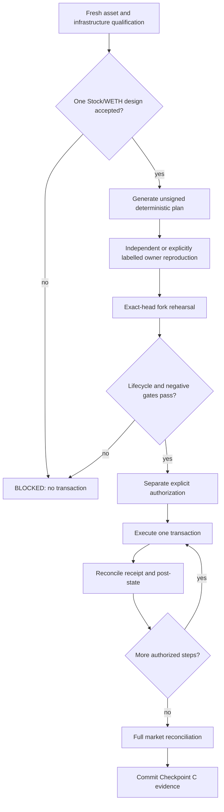

# Robinhood testnet market-genesis plan

| Field | Value |
|---|---|
| Status | Read-only candidate qualification complete; owner selection required |
| Authorization | None for pool initialization, approvals, wrapping, liquidity, swaps, market deployment, or collateral operations |
| Target checkpoint | `robinhood-testnet-sandbox-0` |
| Estimated focused engineering time | 6–10 hours, excluding faucet, RPC, or review delays |

## 1. Objective

Convert the verified shared Panoptic deployment into exactly one functioning,
valueless Robinhood testnet market:

```text
one qualified Stock Token
        + testnet WETH
        + exact no-hook Uniswap V4 PoolKey
        + bounded two-sided liquidity
        + deployed PanopticPool and two CollateralTrackers
        + two-actor collateral and lifecycle evidence
```

This phase completes Hour 24 and Checkpoint C in `plan.md`. It does not add
mainnet support, custom hooks, vaults, multiple markets, autonomous trading, or
real-value claims.

### Current progress: first read-only gate complete

At block `116408992`, the repository qualifier passed `79/79` checks across
chain identity, external and Panoptic runtimes, Stock Token controls, both
accounts, five candidate PoolIds, and factory mappings. All five candidates are
eligible. PLTR/WETH is recommended because PLTR is the only eligible Stock
Token that sorts as `currency0` against WETH. Owner acceptance, price policy,
exposure, and roles remain unresolved, and no transaction is authorized. See
the [selection record](../markets/2026-09-09-first-market-selection.md) and
[machine-readable manifest](../../manifests/markets/robinhood-testnet-market-selection-2026-09-09.json).

## 2. Entry gates already complete

- shared Panoptic V4 deployment: 16 of 16 contracts reconciled;
- exact deployed runtime identities: 16 of 16 pass;
- constructor/wiring assertions: 11 of 11 pass;
- strict chain, V4 dependency, Stock Token, WETH, and account verifier: pass;
- two encrypted testnet keystores exist outside the repository;
- both public accounts received bounded faucet ETH and all five Stock Tokens;
- local pool/liquidity/market/position lifecycle: pass at `cfaf42c...`.

## 3. Decisions required before building a transaction plan

### 3.1 Select one Stock Token by evidence

Do not choose by ticker popularity. Re-read all five candidates and select one
only after recording:

- proxy, registry/beacon, and implementation identity;
- symbol, decimals, pause/block status, multiplier, and scheduled update;
- deployer and test-actor balances;
- exact token ordering against WETH;
- whether the proposed PoolKey is currently uninitialized; and
- any available reference-price source and its limitations.

The result should be a small machine-readable asset-selection manifest. Every
other Stock Token remains out of scope for Checkpoint C.

Current result: all five pass; PLTR is technically recommended but has not been
accepted by the owner.

### 3.2 Freeze the complete PoolKey

Record and hash:

- `currency0` and `currency1` in ascending address order;
- fee;
- tick spacing;
- `hooks = address(0)`;
- derived PoolId; and
- proof that this exact PoolId is uninitialized immediately before execution.

The local `3,000` fee and `60` tick spacing are the tested starting candidate.
They are not public defaults until the asset-selection review accepts them.

### 3.3 Define a test-only initial price policy

Do not copy the local 1:1 `sqrtPriceX96 = 2^96` silently. The chosen value must
state whether it is:

- a deliberately synthetic mechanism-test price;
- derived from a qualified test feed; or
- derived from a timestamped external reference solely for valueless testing.

Record token orientation, decimal normalization, human-readable price in both
directions, tick, `sqrtPriceX96`, rounding method, source timestamp, and maximum
accepted deviation. The UI must not present a synthetic initialization price as
a live equity quote.

### 3.4 Define bounded liquidity and account roles

The balances are faucet-sized. Specify exact maximum amounts before any
approval:

- ETH to wrap;
- WETH and Stock Token to place into V4;
- slippage and deadline limits;
- amount reserved for collateral and swaps;
- amount reserved for gas; and
- which account receives the factory NFT and determines the Panoptic market
  CREATE3 salt.

The second actor should be the default LP/user. Using the deployer for market
deployment or a second trading role requires an explicit rationale because it
also holds guardian and treasurer authority.

## 4. Build the next tooling before broadcasting

### 4.1 Offline market-plan generator

Add a product-repository tool that accepts reviewed public inputs and emits an
unsigned, deterministic plan. It must have no private-key, keystore-password,
signing, or broadcast capability.

The output must bind:

- chain ID and RPC identity;
- selected Stock Token, WETH, candidate V4 contracts, PanopticFactoryV4,
  SFPM, RiskEngine, and account addresses;
- PoolKey, PoolId, initial price, ticks, salt, and predicted market/tracker
  addresses where derivable;
- every transaction target, value, calldata hash, allowance, amount, deadline,
  and expected post-state;
- source, manifest, and tool hashes; and
- explicit maximum native/token exposure.

### 4.2 Read-only market verifier

Before signing, and again after every state transition, verify:

- chain ID and latest block identity;
- all existing external and Panoptic runtime hashes;
- Stock Token health and account balances;
- exact PoolKey/PoolId initialization state;
- current allowances and token ordering;
- PoolManager slot/tick/liquidity state;
- factory mapping and expected clone emptiness before market registration;
- post-registration SFPM pool ID, PanopticPool wiring, both tracker assets, and
  RiskEngine; and
- post-deposit shares/assets, open positions, premium, solvency, and close
  state.

RPC failure, stale state, or an undecodable response is `BLOCKED`, never pass.

### 4.3 Separate one-step operator

Extend or build a new operator for this phase. Do not reuse the CREATE operator
without a fresh specification because market actions have different calldata,
allowances, values, deadlines, and postconditions.

The operator must:

- bind a reviewed market-plan hash and authorization hash;
- accept one explicitly selected transaction only;
- show account, target, value, token maximums, and decoded intent before the
  password prompt;
- run the strict verifier and step-specific preflight immediately before
  signing;
- reject unlimited approval unless the reviewed plan explicitly justifies it;
- reconcile the receipt and exact post-state; and
- stop before the next transaction.

## 5. Fork rehearsal

Fork a fresh Robinhood testnet head into local Anvil and impersonate only the
exact planned public accounts. Rehearse the final transaction order, including
all approvals and deadlines.

At minimum the rehearsal must cover:

1. wrap only the bounded ETH amount;
2. grant the exact token/Permit2/PositionManager permissions required by the
   chosen liquidity path;
3. initialize the exact no-hook PoolKey;
4. add bounded two-sided liquidity;
5. execute a small swap in both directions and reconcile deltas;
6. call `PanopticFactoryV4.deployNewPool` with the reviewed caller and salt;
7. reconcile `PoolDeployed`, factory mapping, SFPM pool ID, PanopticPool, and
   both CollateralTrackers;
8. approve and deposit tiny collateral from two distinct accounts;
9. open the minimum matched writer/buyer legs supported by the public balance;
10. observe premium movement after controlled swaps or time progression;
11. close positions and withdraw recoverable collateral; and
12. verify all balances and residuals against a scale-appropriate public-test
    budget.

The fork must also exercise at least these negative paths:

- wrong chain, PoolKey, token order, hook, fee, or tick spacing;
- already initialized pool or occupied predicted market address;
- stale/paused/blocked/multiplier-changed Stock Token;
- allowance above the plan maximum;
- expired deadline or excess slippage;
- incorrect sender or salt;
- strict verifier or runtime drift; and
- receipt success with unexpected event or post-state.

## 6. Proposed execution gates



The previous authorization ended at shared-deployment transaction index `15`.
It explicitly excluded every action in this plan. No wording in this roadmap is
authorization to broadcast.

## 7. Checkpoint C acceptance

Checkpoint C passes only when the committed public manifest contains:

- exact selected asset and full PoolKey;
- PoolId and initial-price derivation;
- all transaction hashes and canonical block identities;
- liquidity position identity, ranges, amounts, and token deltas;
- bidirectional swap evidence;
- `PoolDeployed` event and factory mapping;
- PanopticPool, both trackers, RiskEngine, SFPM, and PoolManager wiring;
- two-actor deposits and position IDs;
- premium, solvency, close, withdrawal, and residual evidence;
- strict-verifier output and a fresh-machine read-only replay;
- explicit failures/skips; and
- a statement that assets are valueless testnet assets and the stack is not
  audited, issuer-endorsed, or mainnet-ready.

Only then may the repository tag `robinhood-testnet-sandbox-0`.

## 8. Suggested focused-hour order

| Hours | Work | Exit gate |
|---:|---|---|
| 0–1 | Fresh asset, balance, PoolKey, and infrastructure qualification | One reviewed design or explicit block |
| 1–3 | Offline planner plus red/green unit tests | Deterministic unsigned plan and decoded intent |
| 3–5 | Read-only verifier and exact-head fork lifecycle | Positive and negative rehearsal evidence |
| 5–6 | Review, artifact freeze, and separate authorization | Exact hashes and maximum exposure approved |
| 6–8 | One-step-at-a-time public initialization, liquidity, and market registration | Every receipt and post-state reconciled |
| 8–10 | Two-actor lifecycle, clean replay, docs, and checkpoint commit | Checkpoint C pass or honest blocked report |

## 9. Work immediately after Checkpoint C

Do not expand to a second ticker. Build the first-user path:

1. product-local adapters around exact `@panoptic-eng/sdk@1.0.49`;
2. Solidity-to-TypeScript golden vectors for PoolKey and TokenId encoding;
3. read-only market state, collateral, premium, and solvency views;
4. simulation-first protective-put transaction construction;
5. wallet rejection/pending/replacement/failure UX;
6. independent Stock Token/V4/Panoptic health monitoring; and
7. a clean-wallet first-user acceptance run.

Docusaurus should wait until the intended deployment rounds and acceptance
evidence are complete. The Markdown source should stabilize first; the site can
then present it without obscuring what is live versus planned.
